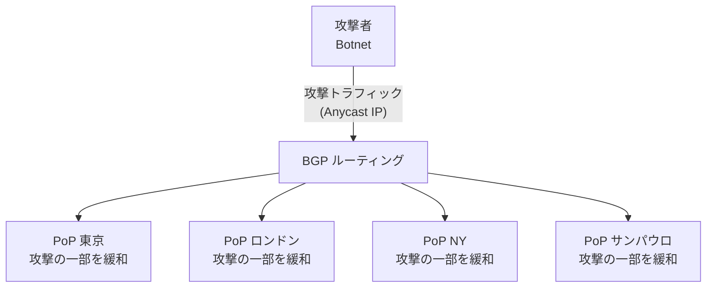
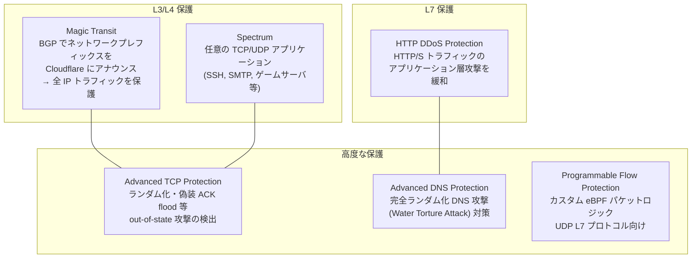
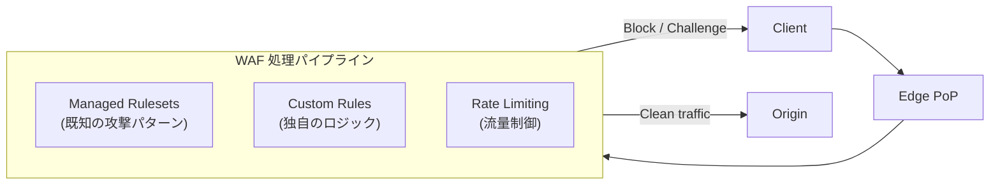
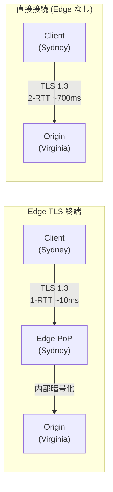
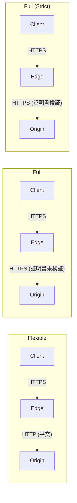
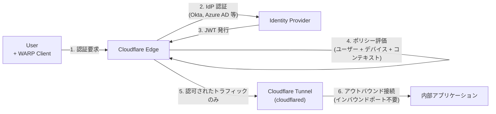
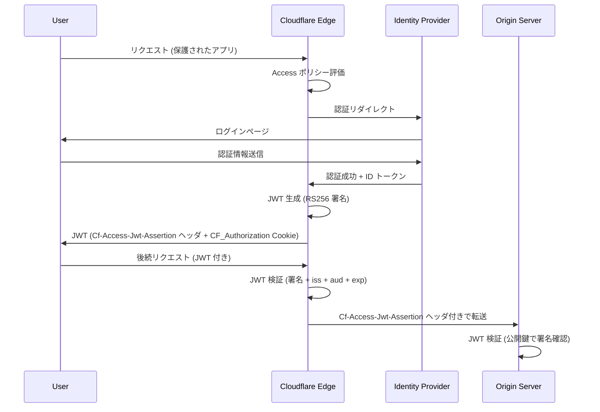
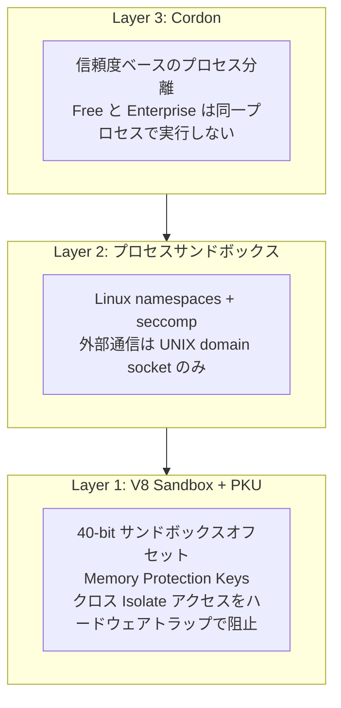
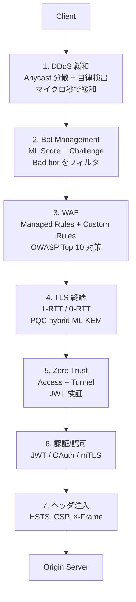

[[edge-computing|Edge Computing]] におけるセキュリティの全体像。Edge はリクエストが最初に到達する地点であり、セキュリティの最前線。DDoS 緩和、WAF、TLS 終端、Zero Trust、Bot Management、認証、Supply Chain Security、マルチテナント分離の8領域を網羅する。

## 1. DDoS 緩和 at the Edge

### DDoS 攻撃の3分類

| レイヤー | 攻撃種別 | 手法 | 目的 |
|---|---|---|---|
| L3/L4 | Volumetric | UDP flood, ICMP flood, DNS amplification | 帯域幅の飽和 |
| L3/L4 | Protocol | SYN flood, ACK flood, Fragmented packet | ステート枯渇 |
| L7 | Application Layer | HTTP flood, Slowloris, API abuse | アプリケーションリソースの枯渇 |

Volumetric 攻撃が最大規模に達するが、Application Layer 攻撃は正規トラフィックとの区別が困難で防御が最も難しい。

### Anycast による自動分散

[[anycast-cdn|Anycast]] は DDoS 防御の構造的基盤。同一 IP を 330+ PoP が BGP でアナウンスするため、攻撃トラフィックはネットワーク全体に自動分散される。



攻撃耐力 = ネットワーク全体の容量。Cloudflare: 348 Tbps、477 データセンター。1つの PoP に集中せず分散されるため、PoP 増加で耐性が線形スケールする。

### Cloudflare DDoS 防御アーキテクチャ



**Magic Transit (L3/L4)**: 顧客のネットワークプレフィックス (/24 以上) を BGP で Cloudflare にアナウンス。全 IP トラフィックが Cloudflare を通過し、クリーンなトラフィックのみ GRE トンネル / PNI (Private Network Interconnect) でオリジンに転送。

**Spectrum (L4)**: HTTP/S 以外の任意の TCP/UDP アプリケーション (SSH, SMTP, ゲームサーバ, カスタムプロトコル) を Cloudflare の L4 DDoS 防御でプロキシ。

**HTTP DDoS Protection (L7)**: 全プランで利用可能。Managed Rulesets として自律的に動作し、複数の動的緩和ルールで構成。

### 自律型検出 (ML ベース)

Cloudflare の DDoS 検出は完全自律型。人間の介入なしにマイクロ秒〜数秒で検出・緩和する。

| コンポーネント | 役割 |
|---|---|
| dosd (Denial of Service Daemon) | パケットサンプルからヒューリスティクスで異常パターンを検出。フィンガープリント順列を生成 |
| eBPF プログラム | カーネルレベル (XDP) でパケットをドロップ。ワイヤスピードで緩和 |
| Gossip プロトコル | サーバ間で脅威インテリジェンスをグローバル共有 |
| Adaptive DDoS | Enterprise 向け。ML スコア、クライアントインテリジェンス、トラフィックプロファイリングシグナル |

検出から緩和まで: シングルディジットマイクロ秒 (L3/L4 既知パターン) 〜 3秒以内 (グローバル平均)。

### Scrubbing Center vs Inline Mitigation

| 比較 | Scrubbing Center (従来型) | Inline Mitigation (Cloudflare 方式) |
|---|---|---|
| アーキテクチャ | 攻撃検出後にトラフィックを専用洗浄センターにバックホール | 全トラフィックが常時全 PoP を通過。各 PoP で即座に緩和 |
| レイテンシ | バックホールによる追加レイテンシ | 追加レイテンシなし (最寄り PoP で処理) |
| 検出速度 | 数分〜数十分 (手動介入が必要なケースも) | マイクロ秒〜3秒 (完全自律) |
| 容量 | 洗浄センターの物理容量に制限 | ネットワーク全体の容量 (348 Tbps) |
| always-on | オンデマンド型が多い | 常時オン |

Inline Mitigation が優位な理由: DDoS 攻撃の 89% (L3/L4) と 75% (HTTP) が 10分以内に終了する。バックホール型では検出と切り替えに時間がかかり、短時間の攻撃に対応できない。

### 2025-2026 攻撃トレンド

| 指標 | 数値 | 時期 |
|---|---|---|
| 年間 DDoS 攻撃数 | 47.1M | 2025年通年 (前年比 121% 増) |
| Q1 攻撃数 | 20.5M | 2025 Q1 (前年比 358% 増) |
| hyper-volumetric (>1 Tbps) | 700+ (1日平均8件) | 2025 Q1 |
| 最大帯域幅攻撃 | 7.3 Tbps | 2025年5月 (過去最大記録) |
| 最大パケットレート | 4.8 Bpps | 2025 Q1 |
| 最大リクエストレート | 205 Mrps | 2025 Q4 |
| 最大 L3/L4 攻撃 | 31.4 Tbps | 2025 Q4 (35秒間) |

**7.3 Tbps 攻撃の詳細** (2025年5月): 122,145 ソース IP、5,433 AS、161か国から発生。45秒間で 37.4 TB のデータを送信。99.996% が UDP flood。Cloudflare の自律システムが人間の介入なしに完全緩和。

**Aisuru-Kimwolf ボットネット**: 100万〜400万台の Android TV デバイスで構成。2025 Q4 に「Night Before Christmas」キャンペーンで 205 Mrps / 24 Tbps の攻撃を展開。

**新興攻撃ベクター** (2025 Q1):
- CLDAP 反射増幅: 前四半期比 3,488% 増
- ESP 反射増幅: 前四半期比 2,301% 増

### DDoS 防御の料金モデル

| プロバイダ | モデル | 特徴 |
|---|---|---|
| Cloudflare | Unmetered Mitigation | 全プラン (Free 含む) で L3-L7 DDoS 防御が無制限・無課金。攻撃規模による追加料金なし |
| AWS Shield Standard | 無料 (L3/L4 のみ) | Advanced は $3,000/月 + データ転送料 |
| Akamai Prolexic | Scrubbing Center 型 | 帯域幅ベースの従量課金。エンタープライズ契約 |

Cloudflare の unmetered mitigation は業界で異例。攻撃規模に関係なく追加料金が発生しないため、攻撃者が「課金攻撃」(Bill flooding) を仕掛けるインセンティブを排除する。

## 2. WAF (Web Application Firewall) at the Edge

### WAF とは何か

Web アプリケーションとインターネットの間に配置されるセキュリティレイヤー。HTTP/S リクエストを検査し、OWASP Top 10 に代表される一般的な Web 攻撃を検出・ブロックする。



### Edge WAF の利点

Edge WAF はオリジンに到達する**前**にリクエストをブロックするため:
1. **オリジン負荷削減**: 悪意あるリクエストがオリジンに到達しない
2. **レイテンシ**: ユーザーに近い場所で即座にブロック判定
3. **スケール**: 全 PoP でルールが実行されるため、攻撃が分散しても対応可能
4. **統一ポリシー**: 全オリジンに一貫したセキュリティポリシーを適用

### Cloudflare WAF の仕組み

#### Managed Rulesets

| ルールセット | 内容 | 更新頻度 |
|---|---|---|
| Cloudflare Managed Ruleset | Cloudflare のセキュリティチームが管理。ゼロデイ脆弱性保護を含む | 常時 (脆弱性公開後数時間以内) |
| Cloudflare OWASP Core Ruleset | OWASP ModSecurity CRS に基づく。SQL Injection, XSS, RCE 等 | 定期的 |
| Cloudflare Leaked Credentials Detection | 漏洩した認証情報を使ったログイン試行を検出 | 常時 |

OWASP Core Ruleset の **Sensitivity Score**: 各ルールがスコアに貢献し、合計スコアが閾値を超えるとアクションを実行。感度レベル (Low / Medium / High / Off) で閾値を調整可能。偽陽性を減らしながら検出率を維持するためのバランス機構。

#### Custom Rules (Wirefilter 構文)

Cloudflare の Rules Language (Wirefilter ベース) で独自のフィルタリングロジックを記述。

マッチ可能なフィールド:
- URI パス / クエリ / ホスト
- ヘッダ (User-Agent, Referer, Cookie 等)
- IP アドレス / ASN / 国
- リクエストボディ
- JA3/JA4 フィンガープリント
- Bot Score

```
# 例: 特定の国からの管理画面アクセスをブロック
(http.request.uri.path contains "/admin" and ip.geoip.country ne "JP")
```

#### Rate Limiting Rules

スライディングウィンドウ方式で特定の条件にマッチするリクエストの流量を制御。

```
# 例: 同一 IP から /api/login へ 1分間に 10回以上のリクエストをブロック
Expression: (http.request.uri.path eq "/api/login")
Characteristics: ip.src
Rate: 10 requests / 60 seconds
Action: Block (duration: 600 seconds)
```

2025年6月に旧バージョンの Rate Limiting Rules は廃止。新バージョンはゾーン単位またはアカウント単位で設定可能。

### AWS WAF, Akamai との比較

| 比較 | Cloudflare WAF | AWS WAF | Akamai App & API Protector |
|---|---|---|---|
| デプロイモデル | Edge (全 PoP) | CloudFront / ALB / API Gateway に紐付け | Edge (4,100+ PoP) |
| ルール管理 | Managed + Custom (Wirefilter) | Managed Rules + Custom (JSON) | Adaptive Security Engine |
| OWASP カバレッジ | Core Ruleset (Sensitivity Score) | OWASP Top 10 Managed Rule Group | 独自 + OWASP |
| API セキュリティ | API Shield, Schema Validation | API Gateway 統合 | API Security (WAAP の一部) |
| 料金 | Pro $20/月〜 (WAF 含む) | Pay-as-you-go ($5/ACL + $1/ルール/月) | エンタープライズ契約 |
| セキュリティ効力 (独立テスト) | 中程度 | 低 (API 攻撃 0% ブロック) | 最高 (WAAP テストで最高スコア) |
| 適性 | SMB〜Enterprise | AWS エコシステム利用者 | 大規模 Enterprise |

独立テスト (2025): Akamai は OWASP API 攻撃の 100% をブロック、Cloudflare は 28.7%、AWS は 0%。ただし Cloudflare は SMB 向けのコストパフォーマンスと DDoS 防御の統合で優位。

### Positive Security Model vs Negative Security Model

| 比較 | Negative Security (ブラックリスト) | Positive Security (ホワイトリスト) |
|---|---|---|
| デフォルト | 全て許可。既知の悪意あるパターンをブロック | 全て拒否。明示的に許可されたものだけ通過 |
| 強み | 導入が容易。既存アプリへの影響が少ない | 未知の攻撃にも対応可能 |
| 弱み | 未知の攻撃をすり抜ける。ルール肥大化 | 設定が複雑。正規トラフィックの誤ブロック |
| 実装例 | WAF Managed Rulesets (署名ベース) | API Schema Validation, Allowlist |
| 現代のアプローチ | **ハイブリッド**: Negative (Managed Rules) + Positive (API Schema) + ML 異常検出 |

### WAF Bypass テクニックとその対策

| 手法 | 説明 | 対策 |
|---|---|---|
| エンコーディング | URL エンコード、Unicode (%uXXXX)、Base64、二重エンコード | デコード正規化を多段で実施 |
| 難読化 | SQL: `sElEcT`, `SEL/**/ECT`、XSS: `` | 大文字小文字非依存 + コメント除去後の再検査 |
| HTTP パラメータ汚染 | 同一パラメータを複数回送信し、WAF とアプリで異なる値を解釈させる | パラメータのマージルールを統一 |
| フラグメンテーション | ペイロードを複数のチャンクに分割 | リアセンブル後に検査 |
| パーシング不一致 | WAF とアプリの HTTP パーサーの差異を悪用 (WAFFLED 研究, 2025) | パーサーの一致保証、ファジングテスト |
| パディング | CVE-2025-55182 等のパディング回避 | 正規化ルールの継続的更新 |

**WAFFLED** (2025年論文): ファジングで WAF とバックエンドアプリケーション間のパーシング不一致を体系的に発見する手法。全ての主要 WAF で回避可能な不一致が発見された。

### 2025-2026: AI-Powered WAF

| ベンダー | AI/ML 活用 |
|---|---|
| Cloudflare | Attack Score (ML ベース)。リクエストの悪意度を 1-99 でスコアリング。AI Security for Apps (Enterprise) |
| Akamai | Adaptive Security Engine。攻撃パターンの自動学習 |
| F5 | 署名ベース + AI/ML 行動分析のデュアルレイヤー |
| Google Cloud Armor | ML 強化型 WAF。大規模分散アプリケーション向け |
| FortiWeb | 従来署名 + ML 異常検出のデュアルモデル |

AI WAF のトレンド: 署名ベース (既知の攻撃) + ML 異常検出 (未知の攻撃) のハイブリッドが標準に。CSP ポリシーの自動生成 (Google Project Fort) も進行中。

## 3. TLS 終端 at the Edge

### なぜ Edge で TLS を終端するか



シドニー → バージニアの直接 TLS ハンドシェイク: 2 RTT ~700ms。Edge PoP でローカルに終端すれば ~10ms。CDN の最大の性能貢献の一つ ([[anycast-cdn|Anycast / CDN]] より)。

### TLS 1.3 ハンドシェイク

| 比較 | TLS 1.2 | TLS 1.3 |
|---|---|---|
| ハンドシェイク | 2-RTT | 1-RTT (30-50% レイテンシ削減) |
| 暗号スイート | 多数 (脆弱なものを含む) | 5つに厳選 (全て AEAD + PFS) |
| 0-RTT | なし | あり (再接続時) |
| 前方秘匿性 | オプション | 必須 |
| 採用率 | レガシー | ~70% (2025年中旬) |

**0-RTT (Early Data)**: TLS セッション再開時にクライアントが最初のメッセージでアプリケーションデータを暗号化して送信。ハンドシェイクレイテンシをゼロに。ただし**リプレイ攻撃**のリスクがあるため、ほとんどのサイトは 0-RTT を無効化するか冪等な GET リクエストに限定。

### Edge-to-Origin の暗号化モード (Cloudflare)



| モード | Client → Edge | Edge → Origin | 証明書要件 |
|---|---|---|---|
| Off | HTTP | HTTP | なし |
| Flexible | HTTPS | HTTP (平文) | なし (危険: オリジンは暗号化されない) |
| Full | HTTPS | HTTPS | 自己署名可。CN/SAN 不問 |
| **Full (Strict)** | HTTPS | HTTPS | **有効な証明書必須** (CA 発行 or Cloudflare Origin CA) |
| Strict (SSL-Only Origin Pull) | 常時 HTTPS 強制 | HTTPS | 有効な証明書必須 |

**推奨**: Full (Strict) 以上。Flexible は Edge-Origin 間が平文のため MITM 攻撃に脆弱。

### 証明書管理

| 方式 | 説明 |
|---|---|
| Cloudflare Universal SSL | 無料。Edge 証明書を自動発行・更新。Let's Encrypt / Google Trust Services |
| Cloudflare Origin CA | オリジン用の無料証明書。Cloudflare 独自の CA が発行。15年有効 |
| Advanced Certificate Manager | カスタム証明書のアップロード、TLS バージョン固定、証明書ピンニング等 |
| Let's Encrypt (ACME) | 90日有効。自動更新。Edge 側は Cloudflare が管理、Origin 側は certbot 等 |

**2025-2026 の重要変更**: CA/Browser Forum が TLS 証明書の有効期間を 398日 → 200日に段階的短縮 (2025年4月決定、2026年3月施行)。自動化 (ACME) が事実上必須に。

### HSTS と Certificate Transparency

**HSTS (HTTP Strict Transport Security)**: ブラウザに対して「このドメインには HTTPS でのみ接続せよ」と指示。`Strict-Transport-Security: max-age=31536000; includeSubDomains; preload`。Edge で HSTS ヘッダを注入するのが最も確実。

**Certificate Transparency (CT)**: 全ての公開 CA 発行証明書を CT ログに記録。不正な証明書の発行を検出可能にする。Cloudflare は CT ログを運営し、証明書発行の透明性を確保。

### Post-Quantum 暗号 at the Edge (2025-2026)

| 時期 | マイルストーン |
|---|---|
| 2025年3月 | Cloudflare の TLS トラフィックの 1/3 超が hybrid ML-KEM で保護 |
| 2025年9月 | ~43% に増加 |
| 2026年初頭 | 60%+ が hybrid ML-KEM (ML-KEM-768 + X25519) |
| 2026年6月 (目標) | 全 PQC 機能のロールアウト完了 |
| 2030年 (NIST) | RSA / ECC 非推奨化期限 |

Cloudflare は 600万以上のドメインをデフォルトで Post-Quantum 対応に自動アップグレード。Edge が PQC 移行の最前線。

### Edge での mTLS (Mutual TLS)

通常の TLS はサーバーのみ認証するが、mTLS はクライアントも証明書で認証する。

| ユースケース | 説明 |
|---|---|
| IoT デバイス認証 | デバイスごとにクライアント証明書を発行。証明書なしの接続を拒否 |
| API 間通信 | サービス間の相互認証。API キーより強固 |
| Zero Trust | Cloudflare Access の mTLS ポリシーでアプリケーションアクセスを制御 |

Cloudflare は PKI を提供し、クライアント証明書の発行・管理が可能。BYOCA (Bring Your Own CA) もサポート。2026年3月に RFC 9440 フォーマットの新フィールド追加。

## 4. Zero Trust at the Edge

### Zero Trust Architecture の概要

従来の境界型セキュリティ (城と堀モデル) に対し、Zero Trust は「ネットワーク内部も外部も信頼しない」原則に基づく。

| 原則 | 説明 |
|---|---|
| Never Trust, Always Verify | 全てのアクセスに認証・認可を要求。ネットワーク位置は信頼の根拠にならない |
| Least Privilege | ユーザーが必要とする最小限のリソースのみアクセスを許可 |
| Assume Breach | 侵害は既に発生していると仮定し、被害の最小化を設計 |

### BeyondCorp モデル

Google が 2014年に論文で公開した Zero Trust の実装モデル。

| 要素 | 説明 |
|---|---|
| アクセス判断基準 | ネットワーク位置ではなく、ユーザーの ID + デバイスの状態 + コンテキスト |
| VPN 不要 | 全てのアプリケーションをインターネットに公開し、アクセスプロキシで保護 |
| デバイストラスト | デバイスインベントリ、OS バージョン、パッチ状態等で信頼レベルを動的に算出 |

### ZTNA vs VPN

| 比較 | VPN | ZTNA (Zero Trust Network Access) |
|---|---|---|
| アクセス範囲 | ネットワーク全体 (過剰な権限) | アプリケーション単位 (最小権限) |
| 認証後 | ネットワーク内の全リソースにアクセス可能 | 許可されたアプリケーションのみ |
| 侵害時の影響 | 横方向移動 (Lateral Movement) が容易 | アプリケーション単位で分離。横方向移動を阻止 |
| 拡張性 | VPN コンセントレータの帯域幅に依存 | Edge 分散で無制限にスケール |

### Cloudflare Access / Cloudflare Tunnel



**Cloudflare Access**: IdP 統合型の ZTNA。ユーザー/デバイス/IP/国/mTLS 証明書等の条件でアクセスポリシーを定義。認証後に JWT (`Cf-Access-Jwt-Assertion`) を発行し、6週間ごとにキーをローテーション。

**Cloudflare Tunnel**: `cloudflared` デーモンがオリジンからアウトバウンド接続を確立。パブリック IP やインバウンドポートが不要。2026年から QUIC (HTTP/3) がデフォルト。UDP トラフィックの分離により DNS 等のレイテンシ改善。

### Edge で Zero Trust を実装するメリット

| メリット | 説明 |
|---|---|
| グローバル分散認証 | 330+ PoP で認証を実行。ユーザーに近い場所で低レイテンシ |
| DDoS + Zero Trust の統合 | DDoS 緩和と認証が同一プラットフォーム。攻撃トラフィックは認証前にブロック |
| インバウンドポート不要 | Tunnel のアウトバウンド接続により攻撃対象面を劇的に縮小 |
| ポスト量子対応 | 2026年から hybrid ML-KEM で Tunnel 通信を保護 |

## 5. Bot Management at the Edge

### Bot の分類

| 分類 | 例 | 割合 (全トラフィック) |
|---|---|---|
| Good Bots (Verified) | Googlebot, Bingbot, Slackbot | ~15% |
| Bad Bots (Known) | スクレイパー、クレデンシャルスタッフィング | ~30% |
| Advanced Bots | ブラウザ自動化、ML 回避、レジデンシャルプロキシ使用 | ~5% |
| 人間 | 正規ユーザー | ~50% |

### Bot Score / Bot Detection の仕組み

Cloudflare Bot Management は各リクエストに Bot Score (1-99) を割り当てる。

| スコア範囲 | 分類 | 説明 |
|---|---|---|
| 1 | Definite Bot | 確実に Bot (静的リソースと Verified Bot を除く) |
| 2-29 | Likely Bot | Bot の可能性が高い。少量の正規トラフィックを含む場合あり |
| 30-99 | Likely Human | 人間の可能性が高い |

検出シグナル:
- ML フィンガープリンティング (TLS フィンガープリント JA3/JA4, HTTP/2 フレーミング)
- 行動分析 (マウス移動、キーストローク、スクロールパターン)
- IP レピュテーション
- ブラウザ環境チェック (JavaScript Challenge による)
- Detection IDs で検出ロジックの種類を識別可能

### Challenge メカニズム

| Challenge | 仕組み | ユーザー体験 |
|---|---|---|
| JS Challenge | JavaScript を実行させ、ブラウザ環境を検証 | 数秒の待機画面 |
| **Managed Challenge** | 適応型。Bot Score に応じてフリクションを段階的に調整 | Bot → 不可視 Challenge / CAPTCHA。人間 → ほぼフリクションなし |
| Interactive Challenge | 明示的なユーザー操作 (旧 CAPTCHA) | 画像選択等 |
| **Turnstile** | 匿名フロー向けの軽量 Challenge。CAPTCHA なし | フォーム送信前の不可視検証。プライバシー重視 |

**Managed Challenge** が推奨。クライアントの特性に応じて最適な Challenge を自動選択し、人間のユーザーへの影響を最小化しつつ Bot を効果的にブロック。

### Cloudflare Bot プラン体系

| プラン | 機能 |
|---|---|
| Free | Bot Fight Mode (基本的なパターンマッチ) |
| Pro / Business | **Super Bot Fight Mode** (設定可能、Skip ルール対応) |
| Enterprise | **Bot Management** (Bot Score, Detection IDs, ML モデル自動更新, WAF 統合) |

Super Bot Fight Mode は 2025年に設定可能になり、Skip ルールとの併用で柔軟なデプロイが可能に。

## 6. Edge での認証・認可パターン

### JWT 検証 at the Edge

Edge で JWT を検証する最大の利点: 不正なトークンを持つリクエストがオリジンに到達しない。

```typescript
// Cloudflare Workers での JWT 検証
import { jwtVerify, createRemoteJWKSet } from 'jose'

const JWKS = createRemoteJWKSet(
  new URL('https://example.cloudflareaccess.com/cdn-cgi/access/certs')
)

export default {
  async fetch(request: Request): Promise<Response> {
    const token = request.headers.get('Cf-Access-Jwt-Assertion')
    if (!token) return new Response('Unauthorized', { status: 401 })

    try {
      const { payload } = await jwtVerify(token, JWKS, {
        issuer: 'https://example.cloudflareaccess.com',
        audience: 'aud-tag-from-dashboard',
      })
      // 検証成功 → オリジンに転送
      return fetch(request)
    } catch {
      return new Response('Forbidden', { status: 403 })
    }
  }
}
```

### JWKS キャッシュ戦略

Edge での JWKS (JSON Web Key Set) 取得はネットワーク往復が発生するため、パフォーマンスのために:
- **KV にキャッシュ**: JWKS をフェッチ後に Workers KV に保存。TTL を設定して定期更新
- **`kid` マッチング**: JWT ヘッダの `kid` (Key ID) でキーを特定。不一致時のみ JWKS を再フェッチ
- Cloudflare Access のキーローテーション: 6週間ごと。旧キーは7日間有効

### OAuth 2.0 / OIDC トークン検証

Edge での OIDC フロー:
1. Edge Middleware がリクエストの Authorization ヘッダを検査
2. Bearer トークンを抽出し、IdP の `.well-known/openid-configuration` から JWKS エンドポイントを取得
3. トークンの署名検証 + `iss`, `aud`, `exp` クレーム検証
4. 検証成功 → リクエストをオリジンに転送。失敗 → 401/403

Akamai EdgeWorkers は OIDC + Keycloak の統合パターンを提供。

### Edge での Session 管理

| 戦略 | 説明 | 適性 |
|---|---|---|
| JWT (ステートレス) | トークンに全情報を含む。Edge で検証完結 | 最も Edge 向き |
| KV バック セッション | セッション ID を Cookie で受け取り、KV から状態をルックアップ | Eventual consistency 許容時 |
| Durable Objects | セッション単位で DO を割り当て。Strong consistency | リアルタイムアプリ |

**制約**: Edge での認証はステートレス検証 (JWT 署名検証 + 有効期限チェック) に限定すべき。セッション DB への同期的ルックアップはレイテンシを発生させる ([[edge-design-patterns|Edge 設計パターン]] のアンチパターン参照)。

### Cloudflare Access の JWT 検証フロー



## 7. Supply Chain Security

### Edge ランタイムのサプライチェーンリスク

Edge で実行されるコードはサプライチェーン攻撃の新しい攻撃対象面を持つ:

| リスク | 説明 |
|---|---|
| npm 依存関係 | 悪意あるパッケージの混入。Edge で実行される Worker が汚染 |
| CDN ポイズニング | CDN から配信されるスクリプトの改ざん |
| ランタイム脆弱性 | V8 / workerd の脆弱性。パッチまでの window |
| ビルドパイプライン | CI/CD の侵害で悪意あるコードを注入 |

### SRI (Subresource Integrity)

CDN 等のサードパーティから読み込むリソースの完全性を暗号ハッシュで検証するブラウザセキュリティ機能。

```html
<script src="https://cdn.example.com/app.js"
  integrity="sha384-oqVuAfXRKap7fdgcCY5uykM6+R9GqQ8K/uxy9rx7HNQlGYl1kPzQho1wx4JwY8wC"
  crossorigin="anonymous">
</script>
```

- ハッシュ不一致 → ブラウザがスクリプト実行を拒否
- サプライチェーン攻撃の 90% を軽減可能 (2020年以降 300% 増加)
- CSP (Content-Security-Policy) との組み合わせが推奨

**Signature-based SRI**: 従来のハッシュベースに加え、署名ベースの完全性検証を追加する拡張仕様が W3C WICG で策定中。コンテンツの更新を許容しつつ、発行者の署名で正当性を保証。

### WASM モジュールのセキュリティ

WASM at the Edge のセキュリティ特性:
- 各モジュールがリニアメモリで隔離実行
- Capability-based security: 能力は明示的に付与しなければアクセス不可
- WASI のサンドボックス: ファイルシステム、ネットワーク等のアクセスは明示的な権限付与が必要

現時点で WASM モジュールの標準的な署名・検証メカニズムは確立されていないが、[[wasm-at-the-edge|WASM at the Edge]] のリニアメモリモデルが本質的な分離を提供。

## 8. Edge 固有のセキュリティ課題

### マルチテナントの分離

[[v8-isolates|V8 Isolates]] のマルチテナント環境における分離は、Cloudflare の多層防御で担保される:



**V8 Isolate のリスク**: 1プロセス内で数千のテナントが共存するため、JIT コンパイラのバグによるサンドボックスエスケープが全テナントに波及するリスクがある。V8 Sandbox (Chrome 123〜) がこのリスクを大幅に軽減: ヒープ内ポインタを 40-bit オフセットに変換し、外部メモリアクセスを間接テーブル経由に制限。

### Spectre / Meltdown

マイクロアーキテクチャ攻撃は V8 Isolates のソフトウェア分離を迂回する理論上のリスク:

| 攻撃 | 影響 | Edge での対策 |
|---|---|---|
| Spectre v1 (Bounds Check Bypass) | 投機的実行で境界外メモリを読み取り | V8 のサイトアイソレーション + タイマー無効化 |
| Spectre v2 (Branch Target Injection) | 分岐予測を操作して任意コード実行 | Retpoline, eIBRS |
| Meltdown | カーネルメモリの読み取り | KPTI (Kernel Page Table Isolation) |
| VMScape (2025) | VM エスケープの新手法 | HW 分離の強化 |

Cloudflare Workers の Spectre 対策 ([[v8-isolates|V8 Isolates]] より):
- `Date.now()` は最後の I/O 時刻を返す (リアルタイムではない) → 高精度タイミング攻撃を不可能に
- ネイティブコード実行禁止 (JS/Wasm のみ)
- 異常なパフォーマンスパターン検出時に自動的にプロセス分離
- V8 セキュリティパッチ公開から本番デプロイまで 24時間以内

### エッジノードの物理セキュリティ

Edge PoP は世界中の ISP、データセンター、IXP (Internet Exchange Point) に物理配置される。中央 DC と比べて物理セキュリティの管理が分散・困難。

| リスク | 対策 |
|---|---|
| 物理的なサーバーアクセス | コロケーション施設のセキュリティ基準 (SOC 2, ISO 27001) |
| ディスク抜き取り | 保存データの暗号化 (at-rest encryption)。暗号鍵は中央管理 |
| サプライチェーン (HW) | TPM (Trusted Platform Module) によるブート検証 |
| 内部者脅威 | 最小権限原則、監査ログ、多要素認証 |

Cloudflare は全サーバーで full-disk encryption + Secure Boot を実施。鍵は中央の KMS から配布。

### セキュリティヘッダの自動注入パターン

Edge でセキュリティヘッダを一元管理する定石パターン ([[edge-design-patterns|Edge 設計パターン]] より):

```typescript
const SECURITY_HEADERS: Record<string, string> = {
  'Strict-Transport-Security': 'max-age=31536000; includeSubDomains; preload',
  'X-Content-Type-Options': 'nosniff',
  'X-Frame-Options': 'DENY',
  'Referrer-Policy': 'strict-origin-when-cross-origin',
  'Permissions-Policy': 'camera=(), microphone=(), geolocation=()',
  'X-XSS-Protection': '0', // 無効化推奨 (CSP に置き換え)
}

export default {
  async fetch(request: Request): Promise<Response> {
    const response = await fetch(request)
    const modified = new Response(response.body, response)
    for (const [key, value] of Object.entries(SECURITY_HEADERS)) {
      modified.headers.set(key, value)
    }
    return modified
  }
}
```

**動的 CSP (Nonce ベース)**: Edge で各リクエストにランダムな nonce を生成し、CSP ヘッダと HTML の `<script nonce="...">` に注入。XSS 防御を強化しつつ、インラインスクリプトを安全に許可。

Edge でヘッダを一元管理するメリット:
- 全オリジンに一貫したポリシーを強制
- オリジンのコードを変更せずにセキュリティを追加
- ヘッダ処理のレイテンシを 89% 削減 (Edge 実行 vs Origin 実行)

## Edge Security の全体像



リクエストは Edge に到達した瞬間から7層のセキュリティを通過する。各層は独立に動作し、前段で弾かれたリクエストは後段に到達しない。これにより、オリジンには検証済みの正規トラフィックのみが到達する。

## 押さえどころ (カード化候補)

- DDoS 攻撃の3分類 → Volumetric (帯域幅飽和)、Protocol (ステート枯渇)、Application Layer (アプリリソース枯渇)。L7 攻撃は正規トラフィックとの区別が最も困難
- Anycast と DDoS 防御の関係 → 同一 IP を全 PoP が BGP 広告するため攻撃トラフィックが自動分散。PoP 増加で耐性が線形スケール。Cloudflare: 348 Tbps の容量
- Cloudflare DDoS 防御の3層 → Magic Transit (L3/L4: ネットワークプレフィックス保護)、Spectrum (L4: 任意 TCP/UDP)、HTTP DDoS (L7: アプリケーション層)。全て自律型
- Scrubbing Center vs Inline Mitigation → Scrubbing: 攻撃検出後にバックホール (数分〜)。Inline: 全トラフィックが常時全 PoP を通過しマイクロ秒〜3秒で緩和。89% の攻撃が 10分未満で終了するため Inline が圧倒的に有利
- 2025-2026 の DDoS トレンド → 年間 47.1M 件 (前年比 121% 増)。最大 7.3 Tbps (2025年5月)。Aisuru-Kimwolf ボットネット (100万〜400万台 Android TV) が 205 Mrps の HTTP 攻撃
- Cloudflare の unmetered DDoS mitigation → 全プラン (Free 含む) で無制限・無課金。攻撃規模による追加料金なし。「課金攻撃」のインセンティブを排除
- WAF の Edge 配置の利点 → オリジン到達前にブロック → 負荷削減 + レイテンシ削減 + 全 PoP でスケール + 統一ポリシー
- Cloudflare WAF の構成 → Managed Rulesets (Cloudflare Managed + OWASP Core + Leaked Credentials) + Custom Rules (Wirefilter 構文) + Rate Limiting。OWASP Core は Sensitivity Score で偽陽性とのバランスを調整
- Positive vs Negative Security Model → Negative: 全許可 + 既知攻撃をブロック (導入容易だが未知に弱い)。Positive: 全拒否 + 既知正規を許可 (強固だが設定困難)。現代はハイブリッド + ML 異常検出
- WAF Bypass の主要手法 → エンコーディング操作、難読化、HTTP パラメータ汚染、フラグメンテーション、パーシング不一致 (WAFFLED 2025)。多段デコード正規化と WAF-アプリ間のパーサー一致が対策
- Edge TLS 終端の効果 → シドニー→バージニア直接: 2 RTT ~700ms。Edge PoP でローカル終端: ~10ms。CDN の最大の性能貢献の一つ
- TLS 1.3 の 0-RTT → セッション再開時にアプリデータを最初のメッセージで送信。レイテンシゼロ。ただしリプレイ攻撃のリスクがあり、冪等な GET に限定すべき
- Cloudflare の TLS モード → Flexible (Edge→Origin 平文、危険)、Full (自己署名可)、Full Strict (有効な証明書必須、推奨)、SSL-Only Origin Pull (常時 HTTPS 強制)
- PQC at the Edge (2026) → Cloudflare トラフィックの 60%+ が hybrid ML-KEM (ML-KEM-768 + X25519) で保護。NIST の 2030年 RSA/ECC 非推奨化に向けた移行の最前線
- Edge での mTLS → クライアントも証明書で認証。IoT デバイス認証、API 間通信、Zero Trust アクセス制御に使用。Cloudflare は PKI 提供 + BYOCA サポート
- Zero Trust の3原則 → Never Trust Always Verify (全アクセスに認証認可)、Least Privilege (最小権限)、Assume Breach (侵害前提の設計)
- BeyondCorp の核心 → アクセス判断基準をネットワーク位置からユーザー ID + デバイス状態 + コンテキストに移行。VPN 不要。Google が 2014年に公開
- ZTNA vs VPN → VPN: ネットワーク全体にアクセス、横方向移動容易。ZTNA: アプリ単位の最小権限、横方向移動を阻止、Edge 分散で無制限スケール
- Cloudflare Access + Tunnel → Access: IdP 統合 ZTNA、JWT で認証。Tunnel: cloudflared のアウトバウンド接続、パブリック IP 不要。2026年から QUIC デフォルト
- Bot Score の仕組み → 1-99 のスコア。1: 確実に Bot、2-29: Bot 可能性高、30-99: 人間可能性高。ML フィンガープリント (JA3/JA4) + 行動分析 + IP レピュテーション
- Managed Challenge vs Turnstile → Managed Challenge: 適応型、Bot Score に応じてフリクションを段階調整。Turnstile: 匿名フロー向け軽量 Challenge、CAPTCHA なし
- Edge での JWT 検証パターン → Web Crypto API で署名検証。JWKS は KV にキャッシュ。kid マッチングで不要な再フェッチを回避。Cloudflare Access はキーを6週間ごとにローテーション
- Edge 認証の制約 → ステートレス検証 (署名 + 有効期限) に限定すべき。セッション DB ルックアップはレイテンシ発生。KV キャッシュか Edge Config で軽減
- SRI の仕組み → CDN から読み込むリソースの暗号ハッシュをブラウザが検証。ハッシュ不一致でスクリプト実行拒否。サプライチェーン攻撃の 90% を軽減。Signature-based SRI が W3C で策定中
- V8 Isolates のマルチテナントリスク → JIT バグによるサンドボックスエスケープが全テナントに波及。V8 Sandbox (40-bit オフセット + 間接テーブル) + PKU + Cordon の3層防御で軽減。パッチ速度 24時間以内が強み
- Edge の Spectre 対策 → Date.now() を I/O 時刻に固定 (高精度タイマー無効化)。ネイティブコード禁止。異常検出で自動プロセス分離。VMScape (2025) 等の新手法に対しても HW 分離強化で対応
- セキュリティヘッダの Edge 一元管理 → HSTS, CSP, X-Frame-Options 等を Edge で注入。全オリジンに一貫したポリシーを強制。動的 CSP (nonce ベース) で XSS 防御を強化しつつインラインスクリプトを許可
- Edge Security の7層パイプライン → DDoS 緩和 → Bot Management → WAF → TLS 終端 → Zero Trust → 認証/認可 → ヘッダ注入 → Origin。各層は独立動作し前段で弾かれたリクエストは後段に到達しない

## Links

- [Cloudflare DDoS Protection](https://developers.cloudflare.com/ddos-protection/)
- [Cloudflare Q1 2025 DDoS Threat Report](https://blog.cloudflare.com/ddos-threat-report-for-2025-q1/)
- [Cloudflare Q4 2025 DDoS Threat Report](https://blog.cloudflare.com/ddos-threat-report-2025-q4/)
- [Defending the Internet: 7.3 Tbps DDoS Attack](https://blog.cloudflare.com/defending-the-internet-how-cloudflare-blocked-a-monumental-7-3-tbps-ddos/)
- [Magic Transit Reference Architecture](https://developers.cloudflare.com/reference-architecture/architectures/magic-transit/)
- [Cloudflare WAF](https://developers.cloudflare.com/waf/)
- [Cloudflare WAF Custom Rules](https://developers.cloudflare.com/waf/custom-rules/)
- [Cloudflare Managed Rulesets](https://developers.cloudflare.com/waf/managed-rules/)
- [WAFFLED: WAF Bypass via Parsing Discrepancies (2025)](https://arxiv.org/abs/2503.10846)
- [Cloudflare SSL/TLS Encryption Modes](https://developers.cloudflare.com/ssl/origin-configuration/ssl-modes/)
- [Post-Quantum Cryptography at Cloudflare](https://developers.cloudflare.com/ssl/post-quantum-cryptography/)
- [State of the Post-Quantum Internet (2025)](https://blog.cloudflare.com/pq-2025/)
- [Cloudflare Zero Trust](https://developers.cloudflare.com/cloudflare-one/)
- [Validate Cloudflare Access JWTs](https://developers.cloudflare.com/cloudflare-one/access-controls/applications/http-apps/authorization-cookie/validating-json/)
- [Cloudflare Bot Management](https://developers.cloudflare.com/bots/get-started/bot-management/)
- [Cloudflare Turnstile](https://developers.cloudflare.com/turnstile/)
- [Subresource Integrity (MDN)](https://developer.mozilla.org/en-US/docs/Web/Security/Defenses/Subresource_Integrity)
- [Signature-based SRI (W3C WICG)](https://wicg.github.io/signature-based-sri/)
- [BeyondCorp (Google)](https://cloud.google.com/beyondcorp)
- [Cloudflare mTLS](https://developers.cloudflare.com/ssl/client-certificates/enable-mtls/)
- [HSTS at Cloudflare](https://developers.cloudflare.com/ssl/edge-certificates/additional-options/http-strict-transport-security/)
- [Fastly WAF Solutions Comparison 2025-2026](https://www.fastly.com/blog/best-waf-solutions-2025-2026)
- [Akamai WAAP Comparison Report 2025](https://www.akamai.com/lp/report/2025-waf-comparison-report)

## 関連

- [[edge-computing]] -- Edge Computing の基礎概念・歴史・市場規模
- [[anycast-cdn]] -- Anycast が DDoS 防御と TLS 終端の構造的基盤
- [[v8-isolates]] -- マルチテナント分離の詳細 (V8 Sandbox, PKU, Spectre 対策)
- [[edge-design-patterns]] -- 認証パターン、セキュリティヘッダ注入、Rate Limiting 等の実装
- [[wasm-at-the-edge]] -- WASM のリニアメモリモデルによる本質的分離
- [[distributed-consistency]] -- Edge Rate Limiting における一貫性の課題 (KV vs DO)
- [[edge-data]] -- KV, DO, D1 等の Edge データストアを認証・セッション管理に活用
