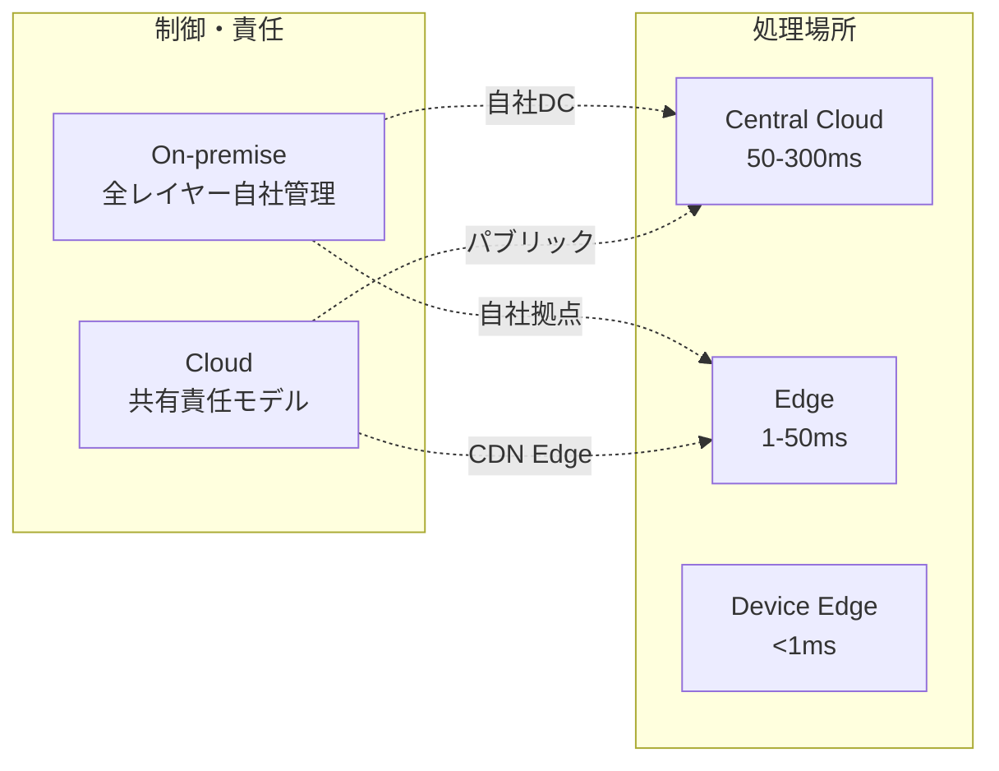
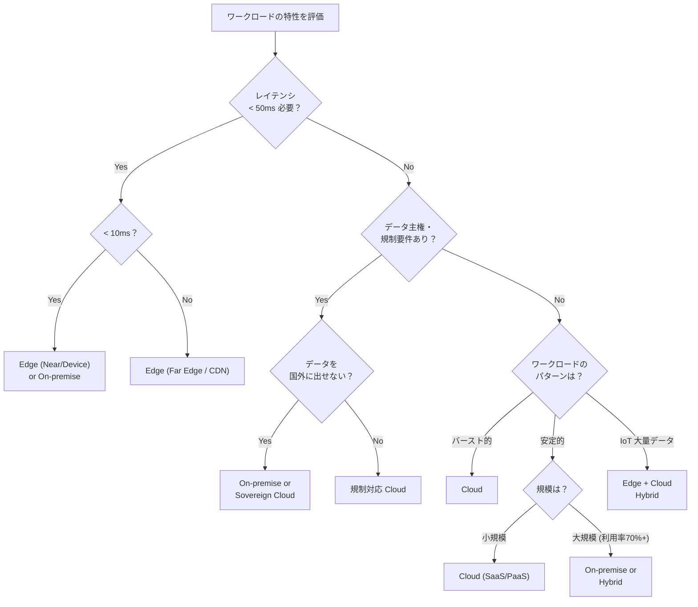
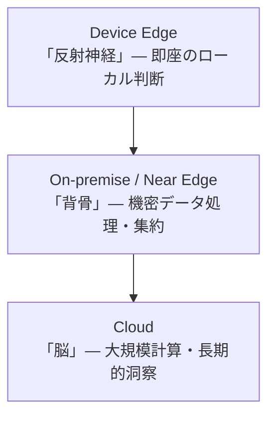

[[edge-computing|Edge Computing]]、Cloud Computing、On-premise の3つの計算配置モデルの判断軸を体系化する。2026年において、これらは二者択一ではなく、ワークロードごとの最適配置 (Workload Placement Discipline) が戦略の核心。

## 3モデルの位置づけ

| モデル | 定義 | 代表例 |
|---|---|---|
| Cloud | ネットワーク経由でオンデマンドにアクセスする共有リソースプール (NIST SP 800-145) | AWS, Azure, GCP |
| Edge | データの生成・消費場所の近くで計算。Cloud-Device 間の連続体 | Cloudflare Workers, Fastly, 5G MEC |
| On-premise | 自社施設内に物理インフラを所有・運用。全レイヤーの制御権と責任 | 自社DC、金融勘定系 |

## 判断軸の一覧

### 1. レイテンシ要件

最も明確な技術的境界線。

| 要件 | 推奨モデル | ワークロード例 |
|---|---|---|
| < 1ms | Device Edge / On-premise | 自動運転の衝突回避、HFT |
| 1-10ms | Near Edge (5G MEC) | 産業ロボット制御、AR リアルタイム |
| 10-50ms | Far Edge (CDN PoP) | クラウドゲーミング、ライブストリーミング |
| 50-200ms | Cloud | Web アプリ、SaaS、API |
| > 200ms (許容) | Cloud (任意リージョン) | メール、非同期分析 |

50ms がクラウドで対応可能な上限の目安。10ms 以下は Near Edge か Device Edge しか選択肢がない。

### 2. データ量とネットワーク帯域幅

| シナリオ | 推奨 | 理由 |
|---|---|---|
| IoT が大量の生データを生成 (GB/s) | Edge で前処理 | 全データをクラウドに送るのは帯域幅的に不可能 |
| データは少量だが処理が重い | Cloud | 弾力的なコンピュートリソースを活用 |
| 大量データの長期保存・分析 | Cloud + Edge ハイブリッド | Edge で集約、Cloud で深層分析 |
| エグレスコストが支配的 | On-premise / Edge | Cloud エグレス料金の回避 |

### 3. データ主権・コンプライアンス

| 規制 | 影響 |
|---|---|
| GDPR (EU) | EU 市民データの越境移転制限。Edge でのローカル処理、EU 内 On-premise、または Sovereign Cloud |
| HIPAA (医療) | PHI の暗号化・監査証跡。BAA 対応クラウドか On-premise |
| PCI-DSS (カード) | ネットワーク分離・暗号化。On-premise のスコープ分離か PCI 認定クラウド |
| EU Data Act (2025施行) | クラウド切替の容易化を法的に要求。ポータビリティ義務 |

2026年: 140以上の国がデータ保護法を制定。57% の IT リーダーが単一国内でのインフラ運用を必要としている。

### 4. コスト構造

| 項目 | Cloud (OpEx) | On-premise (CapEx) | Edge |
|---|---|---|---|
| 初期費用 | ほぼゼロ | 高額 | 中程度 |
| 運用費用 | 従量課金 (予測困難) | 人件費・電力 (予測可能) | 分散管理コスト |
| 隠れたコスト | エグレス料金、アイドルリソース (21% が無駄) | IT 人材、3-5年更新 | デバッグ困難性、分散運用 |
| TCO 損益分岐 | - | 安定 WL では 2-3年で逆転 | ワークロード依存 |

Cloud エグレス料金の実態: 10TB で GCP $1,127、Cloudflare R2 $0。Cloud 請求は予測を 30-40% 超過する傾向。

### 5. セキュリティ

| モデル | 特性 |
|---|---|
| Cloud | 共有責任モデル。インフラはプロバイダ、データ/アプリは顧客 |
| On-premise | 全レイヤー自社管理。完全制御だが全責任も負う |
| Edge | 攻撃面が広い (数千ノード)。Zero Trust Architecture の適用が主流 |

### 6. スケーラビリティ

| モデル | 特性 |
|---|---|
| Cloud | ほぼ無限の弾力性。分単位スケール。バーストに最適 |
| On-premise | 物理的制約。調達に数週間〜数ヶ月 |
| Edge | 地理的スケールは容易。各ノードのリソースに制約 (CPU, メモリ) |

### 7. 運用負荷

| モデル | 負荷 |
|---|---|
| Cloud | 低〜中。PaaS/SaaS なら最小。ただし FinOps が必須に |
| On-premise | 高。専任チーム、24/7 監視、パッチ適用 |
| Edge | 高。分散ノード管理、地域依存バグのデバッグ困難性 |

## ディシジョンツリー

## ワークロード別の推奨

| ワークロード | 推奨 | 理由 |
|---|---|---|
| Web アプリ (SaaS) | Cloud | 弾力性、グローバルリーチ |
| 自動運転リアルタイム制御 | Device Edge | 1-10ms + オフライン動作必須 |
| 製造ラインの品質検査 AI | IoT Edge + Cloud | Edge で推論、Cloud でモデル再訓練 |
| 金融取引システム | On-premise / Near Edge | 超低レイテンシ + 規制 |
| 動画配信 | Cloud + CDN Edge | Cloud でエンコード、Edge でキャッシュ |
| AI モデル訓練 | Cloud or On-premise GPU | 安定利用なら On-premise が TCO 有利 |
| AI 推論サービング | Edge + Cloud | Edge で低レイテンシ推論 |

## ハイブリッドアーキテクチャのパターン

### Edge-first with Cloud Backend

例: Tesla Autopilot。車載 Edge で判断、Cloud でモデル再訓練。

### Cloud-first with Edge Offload

Cloud がメインの処理基盤。Edge は CDN キャッシュ、認証、A/B テストのオフロード。

例: Netflix。AWS でバックエンド、Open Connect (自社 CDN) で配信。

### Bursting Model

通常時は On-premise、ピーク時のみ Cloud にバースト。

例: EC サイトのセール時。

### 3層ハイブリッド

Gartner: 2026年に 40% の企業がミッションクリティカルワークフローでハイブリッドを採用。

## Cloud Repatriation (2026年トレンド)

クラウドからの部分的回帰が加速している。

- 86% の CIO がパブリッククラウドワークロードの一部を回帰させる計画
- 67% の企業が既にワークロードを回帰済み
- Broadcom 分析: モダンなプライベートクラウドは安定ワークロードで 40-50% 低い TCO
- ただしパブリッククラウド支出は $723.4B (2025) と成長継続。「回帰」は「放棄」ではなく「成熟」

「Cloud-first」から「Right-place-first」へ — ワークロード特性に基づいて最適な配置を選ぶ時代。

## 実際の選択事例

| 企業 | 選択 | 理由 |
|---|---|---|
| Netflix | Cloud (AWS) + Edge (Open Connect) | グローバルスケール + ISP 内配信 |
| Tesla | Device Edge + Cloud | リアルタイム制御 + モデル再訓練 |
| 銀行 (勘定系) | On-premise | 規制、超低レイテンシ、データ主権 |
| Dropbox | Cloud → On-premise (回帰) | エクサバイト規模で年間数千万ドルのコスト削減 |
| 37signals | Cloud → On-premise (回帰) | AWS 全削除。ベアメタルで大幅コスト削減 |

## 押さえどころ（カード化候補）

- レイテンシによる境界線 → 50ms 超: Cloud で対応可能。10-50ms: Far Edge (CDN)。1-10ms: Near Edge (5G MEC)。<1ms: Device Edge / On-premise。物理的にクラウド往復では不可能な領域がある
- コスト構造の本質的違い → Cloud は OpEx (従量課金、予測困難)、On-premise は CapEx (初期投資後は安価)。安定ワークロードでは 2-3年で On-premise が TCO 逆転する傾向
- Cloud エグレス料金問題 → Cloud 請求の 6-12% がデータ転送費。10TB で GCP $1,127 vs Cloudflare R2 $0。Cloud 請求は予測を 30-40% 超過する傾向
- データ主権が On-premise を選ばせる → GDPR, HIPAA, PCI-DSS 等の規制で越境データ移転に制限。140以上の国がデータ保護法制定。Sovereign Cloud が急成長
- ハイブリッドが「ほとんどの場合の正解」 → Cloud/Edge/On-premise の3つは二者択一ではなく、ワークロードごとの最適配置。Gartner: 2026年に 70%+ がハイブリッド採用
- Cloud Repatriation の意味 → 86% の CIO が部分回帰を計画。Cloud の「放棄」ではなく「成熟」。安定 WL は On-premise、バースト WL は Cloud という使い分けの最適化
- Edge-first with Cloud Backend パターン → Edge で即時判断 (推論、フィルタリング)、Cloud で長期分析・モデル訓練。Tesla、製造 AI で採用
- 3層ハイブリッドの比喩 → Device Edge = 反射神経 (即座の判断)、On-premise = 背骨 (機密処理)、Cloud = 脳 (大規模計算・長期洞察)
- スケーラビリティによる使い分け → バースト的で変動が大きい: Cloud。安定的で利用率70%+: On-premise が TCO 有利。地理的スケール: Edge
- Right-place-first → Cloud-first から Right-place-first への転換。ワークロード特性 (レイテンシ、データ量、規制、コスト、スケールパターン) に基づいて最適配置を選ぶ

## Links

- [NIST SP 800-145: Cloud Computing Definition](https://csrc.nist.gov/publications/detail/sp/800-145/final)
- [LF Edge - Open Glossary of Edge Computing](https://github.com/State-of-the-Edge/glossary)

## 関連

- [[edge-computing]] — Edge Computing の全体像
