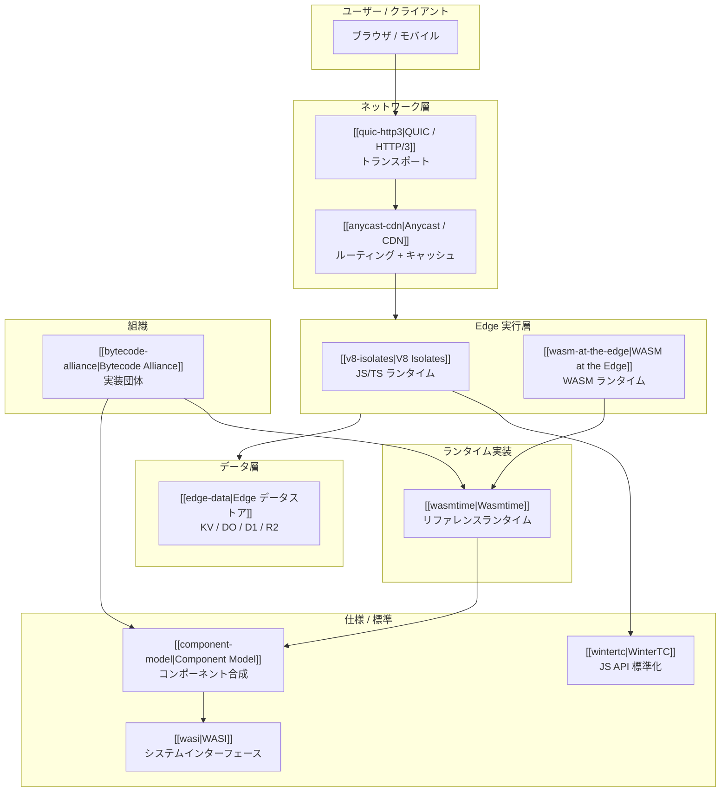
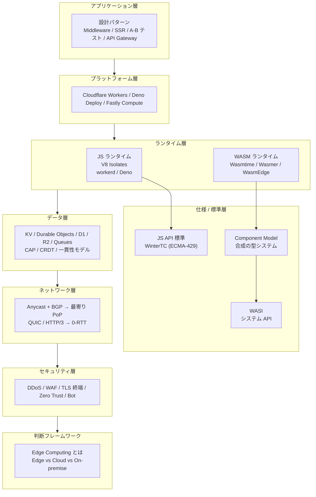
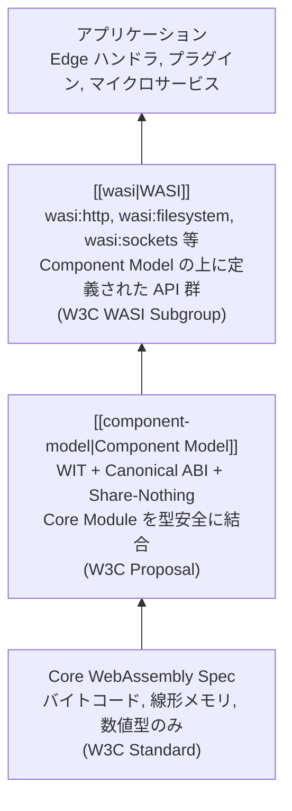
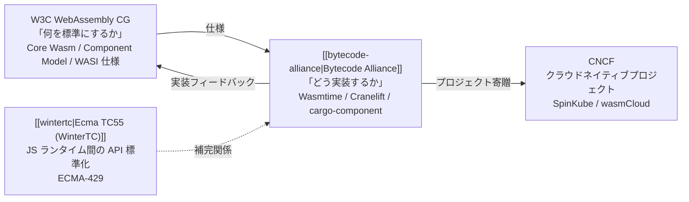
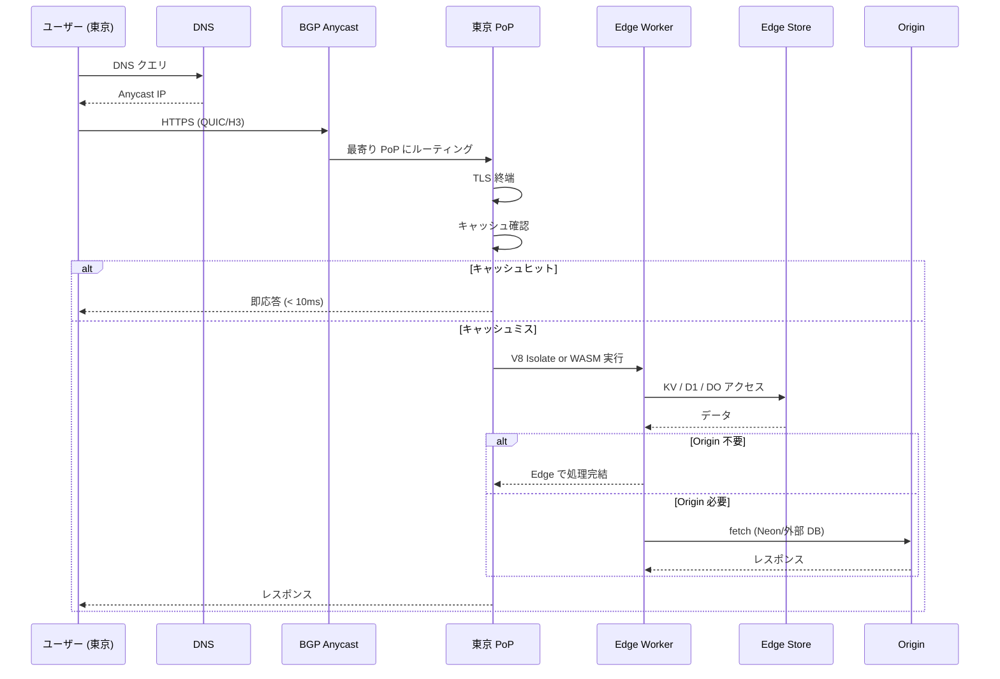
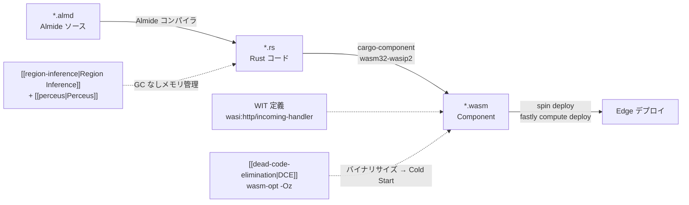
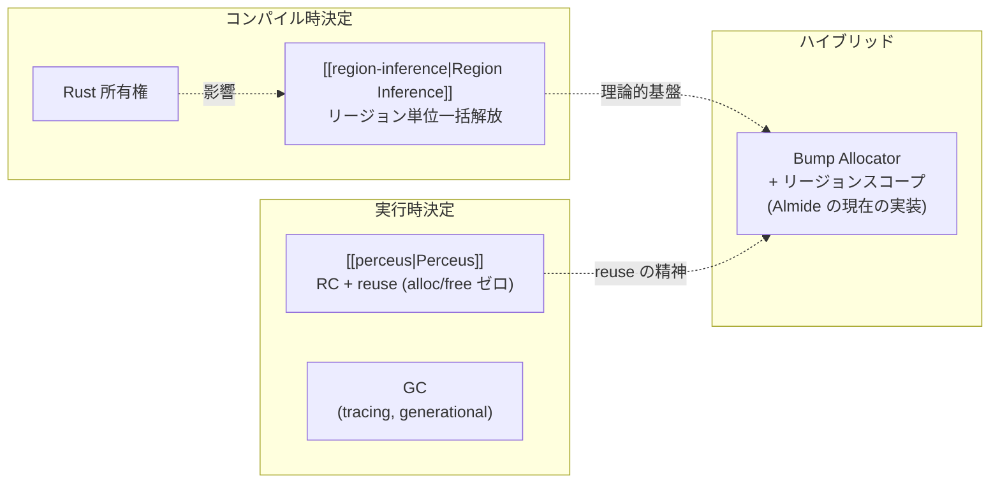

Edge Computing と WebAssembly エコシステムの全体構成を俯瞰するマップ。各ノートがどのレイヤーに属し、何と何が接続するかを示す。

## 全体アーキテクチャ

## レイヤー構成

## WASM 仕様の階層

Component Model がどこに位置するかを明確にする。

| 層 | 何を定義するか | 誰が策定 | 状態 |
|---|---|---|---|
| Core Wasm | バイトコード、線形メモリ、4つの数値型 | W3C | Standard (3.0, 2025年9月) |
| [[component-model]] | WIT (IDL) + Canonical ABI + メモリ隔離。Core Module を型安全に結合 | W3C Proposal | 実装済 (Wasmtime)、標準化途中 |
| [[wasi]] | Component Model 上のシステム API (http, fs, sockets 等) | W3C WASI Subgroup | P2 安定、P3 RC、1.0 は 2026末-2027 |

ポイント: Component Model は WASI ではない。WASI は Component Model の「ユーザー」。Component Model はプラグインシステムや多言語ライブラリ共有にも WASI なしで使える。

## 標準化組織の役割分担

## JS ランタイム vs WASM ランタイム

## データフロー: リクエストの旅

## Almide → Edge パイプライン

## メモリ管理戦略の位置づけ

## ノート間の関連マップ

| ノート | 属するレイヤー | 主な接続先 |
|---|---|---|
| [[edge-computing]] | 概念 | 全ノートの起点 |
| [[edge-vs-cloud-vs-onprem]] | 判断 | edge-computing |
| [[v8-isolates]] | ランタイム | edge-platforms, wintertc |
| [[wasm-at-the-edge]] | ランタイム | wasmtime, wasi, component-model |
| [[wasmtime]] | ランタイム実装 | wasi, component-model, bytecode-alliance |
| [[component-model]] | 仕様 | wasi (上位), Core Wasm (下位), wasmtime (実装) |
| [[wasi]] | 仕様 | component-model (基盤), wasmtime (実装), wasm-at-the-edge (利用) |
| [[wintertc]] | 仕様 | v8-isolates, edge-platforms |
| [[bytecode-alliance]] | 組織 | wasmtime, wasi, component-model |
| [[edge-platforms]] | プラットフォーム | v8-isolates, wasm-at-the-edge, edge-data |
| [[edge-data]] | データ | distributed-consistency, edge-platforms |
| [[distributed-consistency]] | 理論 | edge-data |
| [[anycast-cdn]] | ネットワーク | quic-http3, edge-security |
| [[quic-http3]] | プロトコル | anycast-cdn |
| [[edge-security]] | セキュリティ | anycast-cdn, v8-isolates |
| [[edge-design-patterns]] | パターン | edge-platforms, edge-data |
| [[dead-code-elimination]] | コンパイラ | wasm-at-the-edge (バイナリサイズ → Cold Start) |
| [[region-inference]] | メモリ管理 | perceus, wasm-at-the-edge |
| [[perceus]] | メモリ管理 | region-inference, rust |

## Links

- [[edge-computing]] — 全体の起点
- [[component-model]] — WASM 仕様の中間層 (よく混同される)

## 関連

全ノートへのリンクはこのノート自体がマップとして機能する。
