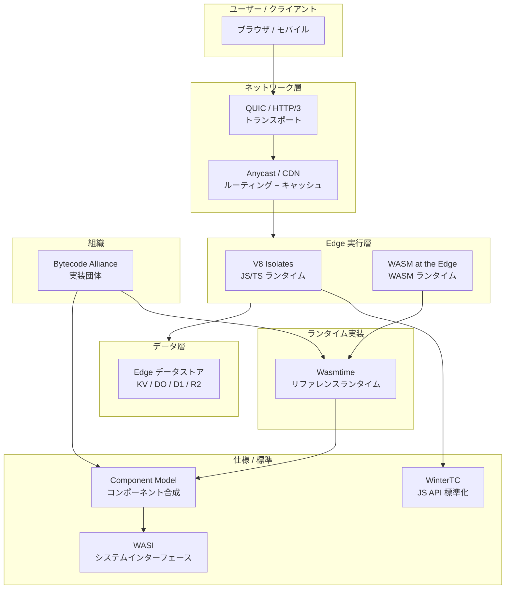
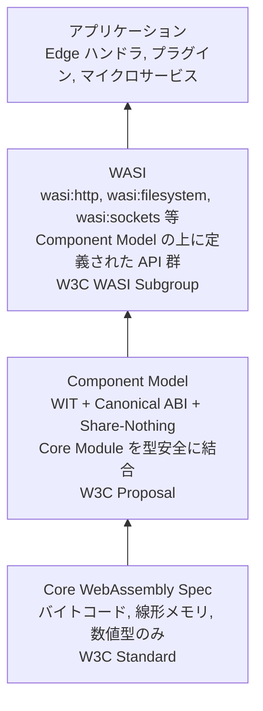
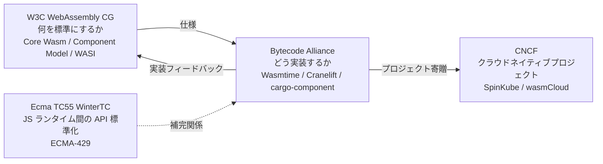
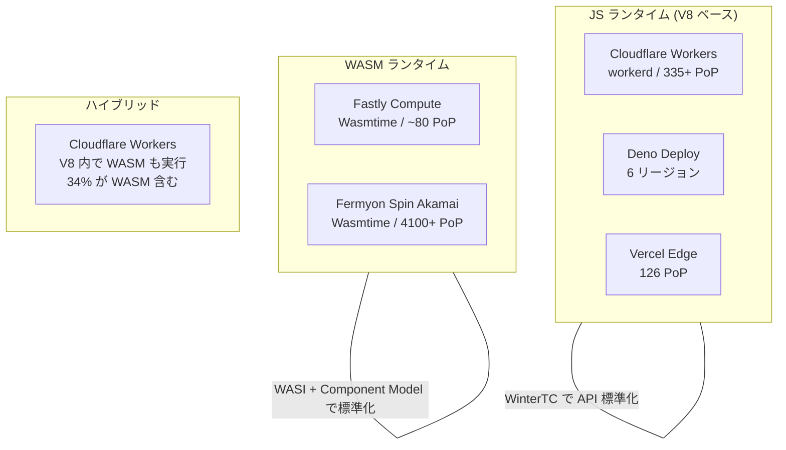
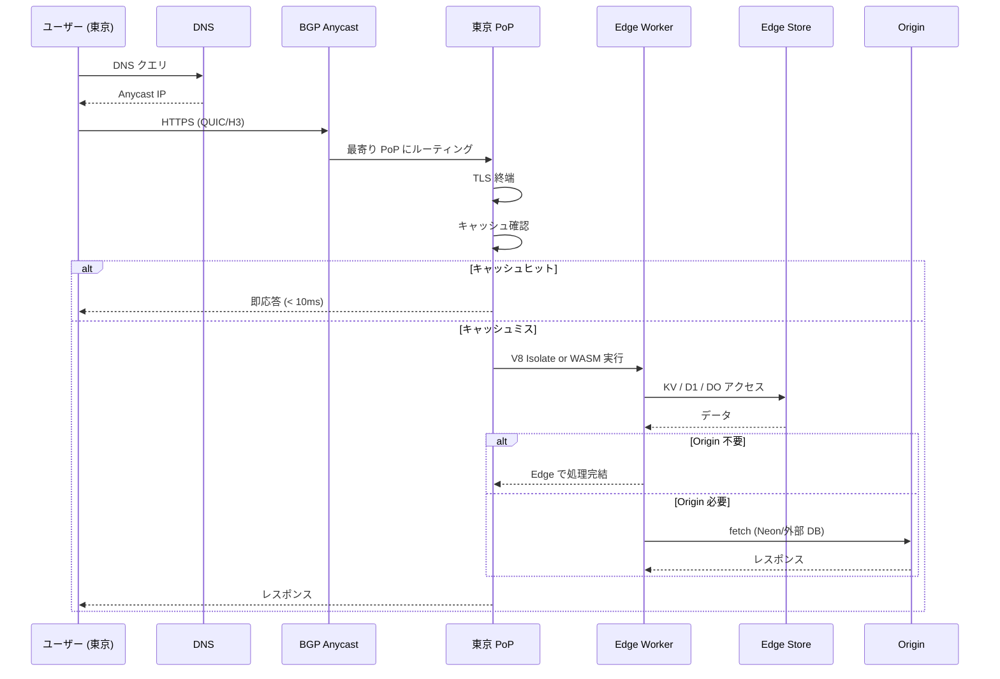
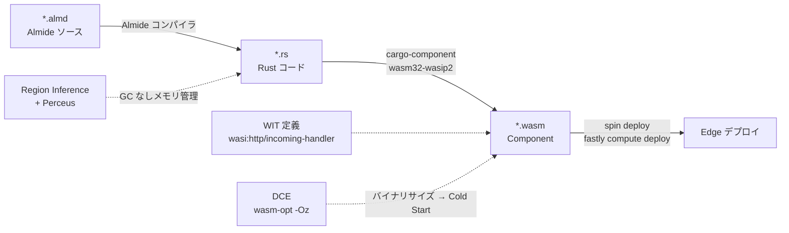
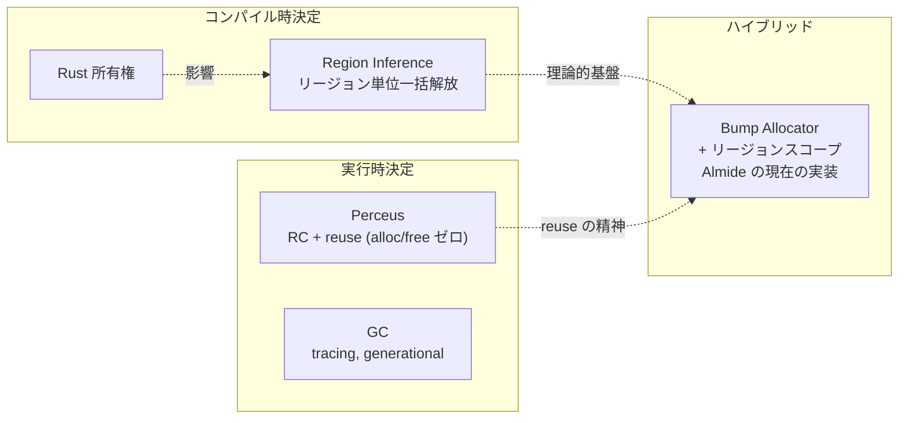

Edge Computing と WebAssembly エコシステムの全体構成を俯瞰するマップ。各ノートがどのレイヤーに属し、何と何が接続するかを示す。

## 全体アーキテクチャ

## レイヤー構成

## WASM 仕様の階層

Component Model がどこに位置するかを明確にする。

| 層 | 何を定義するか | 誰が策定 | 状態 |
|---|---|---|---|
| Core Wasm | バイトコード、線形メモリ、4つの数値型 | W3C | Standard (3.0, 2025年9月) |
| [[component-model]] | WIT (IDL) + Canonical ABI + メモリ隔離。Core Module を型安全に結合 | W3C Proposal | 実装済 (Wasmtime)、標準化途中 |
| [[wasi]] | Component Model 上のシステム API (http, fs, sockets 等) | W3C WASI Subgroup | P2 安定、P3 RC、1.0 は 2026末-2027 |

ポイント: Component Model は WASI ではない。WASI は Component Model の「ユーザー」。Component Model はプラグインシステムや多言語ライブラリ共有にも WASI なしで使える。

## 標準化組織の役割分担

## JS ランタイム vs WASM ランタイム

## データフロー: リクエストの旅

## Almide → Edge パイプライン

## メモリ管理戦略の位置づけ

## ノート間の関連マップ

| ノート | 属するレイヤー | 主な接続先 |
|---|---|---|
| [[edge-computing]] | 概念 | 全ノートの起点 |
| [[edge-vs-cloud-vs-onprem]] | 判断 | edge-computing |
| [[v8-isolates]] | ランタイム | edge-platforms, wintertc |
| [[wasm-at-the-edge]] | ランタイム | wasmtime, wasi, component-model |
| [[wasmtime]] | ランタイム実装 | wasi, component-model, bytecode-alliance |
| [[component-model]] | 仕様 | wasi (上位), Core Wasm (下位), wasmtime (実装) |
| [[wasi]] | 仕様 | component-model (基盤), wasmtime (実装), wasm-at-the-edge (利用) |
| [[wintertc]] | 仕様 | v8-isolates, edge-platforms |
| [[bytecode-alliance]] | 組織 | wasmtime, wasi, component-model |
| [[edge-platforms]] | プラットフォーム | v8-isolates, wasm-at-the-edge, edge-data |
| [[edge-data]] | データ | distributed-consistency, edge-platforms |
| [[distributed-consistency]] | 理論 | edge-data |
| [[anycast-cdn]] | ネットワーク | quic-http3, edge-security |
| [[quic-http3]] | プロトコル | anycast-cdn |
| [[edge-security]] | セキュリティ | anycast-cdn, v8-isolates |
| [[edge-design-patterns]] | パターン | edge-platforms, edge-data |
| [[dead-code-elimination]] | コンパイラ | wasm-at-the-edge (バイナリサイズ → Cold Start) |
| [[region-inference]] | メモリ管理 | perceus, wasm-at-the-edge |
| [[perceus]] | メモリ管理 | region-inference, rust |

## WebAssembly 用語集

この文脈で出てくる主要な用語と、vault 内のどこに詳細があるかの索引。

### 仕様・標準

| 用語 | 説明 | 詳細 |
|---|---|---|
| Core Wasm | WebAssembly のバイトコード仕様。線形メモリ、4つの数値型 (i32/i64/f32/f64)。W3C Standard (3.0) | -- |
| Component Model | Core Module を型安全に結合する仕様。WIT + Canonical ABI + Share-Nothing Linking | [[component-model]] |
| WIT (WebAssembly Interface Types) | Component Model の IDL。package/interface/world でコンポーネントの契約を定義。record, variant, enum, flags, resource 等の型システム | [[component-model]] の「WIT」セクション |
| Canonical ABI | WIT の高水準型 (string, record 等) と Core Wasm の低水準表現 (i32 + 線形メモリ) の変換規則。lift (低→高) / lower (高→低) | [[component-model]] の「Canonical ABI」セクション |
| WASI (WebAssembly System Interface) | Component Model の上に定義されたシステム API 群 (http, filesystem, sockets 等)。Capability-based security | [[wasi]] |
| WASI Preview 1 | 45個のフラット C ABI 関数。ネットワーキングなし。レガシー。Rust ターゲット: `wasm32-wasip1` | [[wasi]] |
| WASI Preview 2 (0.2) | Component Model ベース。WIT で定義。wasi:http, wasi:sockets 追加。2024年1月安定版。Rust ターゲット: `wasm32-wasip2` | [[wasi]] |
| WASI Preview 3 (0.3) | native async (stream/future)。2026年 RC。WASI 1.0 への途上 | [[wasi]] |
| WasmGC | WebAssembly 3.0 の一部。GC 言語 (Java, Kotlin, Dart) をネイティブコンパイル可能に。ブラウザ対応済、サーバーサイドは限定的 | -- |
| SIMD (128-bit) | WebAssembly 2.0 の一部。v128 型で 16レーン同時演算。SSE2/NEON の共通部分集合 | [[wasm-simd]] |
| Relaxed SIMD | SIMD の決定性要件を緩和。FMA, dot product 等。WebAssembly 3.0 | [[relaxed-simd]] |

### ツールチェーン

| 用語 | 説明 | 詳細 |
|---|---|---|
| cargo-component | Rust で WASM Component をビルドする Cargo サブコマンド | [[component-model]] |
| wit-bindgen | WIT からゲスト言語バインディングを自動生成。Rust, C, Go 等に対応 | [[component-model]] |
| WAC (WebAssembly Composition) | 複数コンポーネントを合成するツール。`wac plug` で未解決 import を依存の export で充足 | [[component-model]] の「コンポーネントの合成」セクション |
| wasm-tools | WASM モジュールの低レベル操作 CLI。`wasm-tools component wit` で WIT 検査、`component new` で Core → Component 変換 | [[component-model]] |
| wasm-opt (Binaryen) | WASM バイナリの最適化ツール。`-Oz` でサイズ最適化。DCE を含む | [[dead-code-elimination]] |
| wasm-pkg-tools (wkg) | OCI / Warg レジストリへのコンポーネント publish/fetch | [[component-model]] |
| ComponentizeJS | ESM (JavaScript) → WASM Component 変換。SpiderMonkey 埋め込み | [[component-model]] |
| componentize-py | Python → WASM Component 変換 | [[component-model]] |
| jco | JavaScript 用 Component Model ツールチェーン。トランスパイル + 実行 | [[component-model]] |
| Javy | JavaScript → WASM 変換 (QuickJS 埋め込み) | [[bytecode-alliance]] |

### ランタイム

| 用語 | 説明 | 詳細 |
|---|---|---|
| Wasmtime | Bytecode Alliance のリファレンスランタイム。WASI P2 / Component Model の世界初完全実装 | [[wasmtime]] |
| Cranelift | Wasmtime 内のコンパイラバックエンド。SSA IR, aegraph 最適化, ISLE DSL | [[wasmtime]] の「Cranelift」セクション |
| Winch | Wasmtime 内のベースラインコンパイラ。シングルパスで高速コンパイル。Cold start 最小化用 | [[wasmtime]] |
| Pooling Allocator | Wasmtime の事前確保メモリプール。malloc なしのインスタンス化。CoW メモリイメージ | [[wasmtime]] |
| Wasmer | 代替ランタイム。WASIX (独自 POSIX 拡張) に注力。ロックインリスク | [[wasmtime]] の比較セクション |
| WasmEdge | CNCF Sandbox。Edge AI 特化 (WASI-NN, TensorFlow Lite)。最小メモリ | [[wasmtime]] の比較セクション |
| WAMR | 組み込み/IoT 向け超軽量ランタイム (インタプリタ) | [[bytecode-alliance]] |
| V8 | Google の JS/WASM エンジン。Chrome/Node.js/Deno/Cloudflare Workers の基盤。Component Model 非対応 | [[v8-isolates]] |
| workerd | Cloudflare Workers の OSS ランタイム。V8 ベース | [[v8-isolates]] |

### プラットフォーム

| 用語 | 説明 | 詳細 |
|---|---|---|
| Cloudflare Workers | V8 Isolates ベース。335+ PoP。D1/R2/KV/DO の統合エコシステム | [[edge-platforms]] |
| Fastly Compute | WASM-native (Wasmtime)。~80 PoP。per-request isolation | [[edge-platforms]] |
| Fermyon Spin | Component Model ベースの WASM FaaS。Akamai が買収。CNCF | [[edge-platforms]] |
| SpinKube | Kubernetes 上で Spin アプリを実行。CNCF Sandbox | [[wasm-at-the-edge]] |
| Deno Deploy | V8 Isolates (Deno 2.0)。6 リージョン。TypeScript ファースト | [[edge-platforms]] |
| wasmCloud | CNCF Incubating。NATS バックボーンの分散 WASM ランタイム | [[wasm-at-the-edge]] |

### Component Model の概念

| 用語 | 説明 | 詳細 |
|---|---|---|
| world | コンポーネントの完全な契約。import (必要なもの) と export (提供するもの) のセット | [[component-model]] |
| interface | 型と関数の名前付きコレクション。world 内で import/export される | [[component-model]] |
| package | `namespace:name@version`。同一ディレクトリの全 .wit が1パッケージ | [[component-model]] |
| resource | コンポーネント外部エンティティへの偽造不可能なハンドル。own (所有) / borrow (借用) | [[component-model]] |
| Share-Nothing Linking | コンポーネントはメモリを export できない。データ交換は Canonical ABI でのコピーのみ | [[component-model]] |
| lift / lower | lift: Core Wasm → Component (低→高)。lower: Component → Core Wasm (高→低) | [[component-model]] |
| cabi_realloc | flat 化上限 (パラメータ16個, 結果1個) を超えた場合にメモリ確保する関数 | [[component-model]] |
| reuse token | [[perceus]] の概念。RC==1 のオブジェクトのメモリを同サイズの新オブジェクトとして直接再利用 | [[perceus]] |

### WASI のインターフェース

| 用語 | 説明 | 状態 |
|---|---|---|
| wasi:http | HTTP incoming/outgoing handler | Phase 3 (安定) |
| wasi:filesystem | ファイル/ディレクトリ操作 (capability-based) | Phase 3 |
| wasi:sockets | TCP/UDP ソケット | Phase 3 |
| wasi:cli | コマンドライン (args, env, stdio) | Phase 3 |
| wasi:io | ストリーム、ポーリング | Phase 3 |
| wasi:clocks | wall-clock, monotonic-clock | Phase 3 |
| wasi:random | 暗号的安全乱数 | Phase 3 |
| wasi:nn | ML 推論 (ONNX, TF Lite, GGML) | Phase 2 |
| wasi:keyvalue | KV ストア | Phase 1 |
| wasi:sql | SQL データベース | Phase 1 |
| wasi:blob-store | オブジェクトストレージ | Phase 1 |
| wasi:messaging | メッセージング/Pub-Sub | Phase 1 |
| wasi:threads | スレッドサポート | Phase 1 |
| WASIX | Wasmer 独自の POSIX 拡張 (fork, pthreads, BSD sockets)。公式 WASI 標準ではない | Wasmer 限定 |

### ネットワーク / セキュリティ

| 用語 | 説明 | 詳細 |
|---|---|---|
| Anycast | 同一 IP を複数拠点が BGP で広告。最寄り PoP にルーティング | [[anycast-cdn]] |
| BGP | AS 間の経路情報交換プロトコル。Anycast の基盤 | [[anycast-cdn]] |
| PoP (Point of Presence) | CDN のエッジ拠点。キャッシュ + TLS 終端 + コンピュート | [[anycast-cdn]] |
| QUIC | UDP 上の暗号化トランスポート。0-RTT, Connection ID によるコネクションマイグレーション | [[quic-http3]] |
| HTTP/3 | HTTP over QUIC。HoL Blocking 解消。QPACK ヘッダ圧縮 | [[quic-http3]] |
| Origin Shield | CDN キャッシュ階層の L3。全リージョナルミスを集約し、Origin への同時リクエストを1つに結合 | [[anycast-cdn]] |
| TLS 終端 | PoP でクライアントとの TLS ハンドシェイクを終端。Origin への往復レイテンシ排除 | [[edge-security]] |
| WAF | Web Application Firewall。OWASP Top 10 対策。Edge で攻撃をブロック | [[edge-security]] |

### 組織

| 用語 | 説明 | 詳細 |
|---|---|---|
| Bytecode Alliance | WASM エコシステムの実装団体 (非営利)。Wasmtime, Cranelift, cargo-component 等 | [[bytecode-alliance]] |
| W3C WebAssembly CG | WASM コア仕様・Component Model・WASI の策定 | [[bytecode-alliance]] の比較セクション |
| WinterTC (Ecma TC55) | JS ランタイム間の Web API 標準化。ECMA-429 | [[wintertc]] |
| CNCF | クラウドネイティブプロジェクトホスティング。SpinKube, wasmCloud | [[wasm-at-the-edge]] |

## Links

- [[edge-computing]] — 全体の起点
- [[component-model]] — WASM 仕様の中間層 (よく混同される)

## 関連

全ノートへのリンクはこのノート自体がマップとして機能する。
