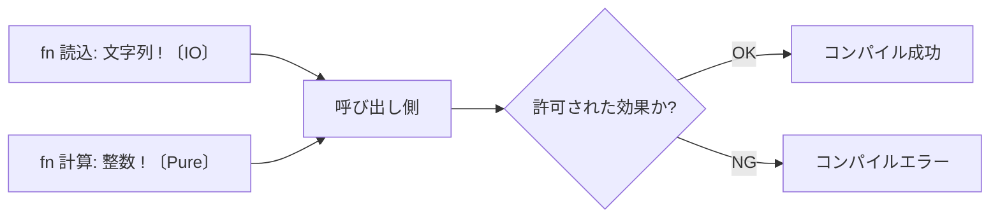

プログラムが「外の世界に何をするか」を型として明示し、コンパイル時に管理する仕組み。

## 何ができる？／なぜ重要？

会社で「社外秘の文書を持ち出してよい人」と「持ち出してはいけない人」が決まっていて、入り口の警備員がそれをチェックする、というルールがあるとします。誰が・どんな書類を・どこへ持ち出すかを最初から記録しておけば、情報漏れが起きにくくなりますね。Effect System は、この「持ち出しルール」をプログラムの型レベルで表現する仕組みです。

ふつうの型は「整数を返す関数」「文字列を返す関数」のように、何を返すかしか書きません。Effect System を入れた型は、「整数を返す。ただしファイル書き込みをする」「文字列を返す。ただしネット通信を行う」のように、副作用まで含めて宣言します。すると「ネット通信が許されないこの場所で、ネット通信する関数を呼んだ」というミスを、コンパイラが書く前に止められます。AI がコードを生成する時代では、この型の縛りが「やってはいけないこと」を機械的に教えてくれるので、暴走の予防にも役立ちます。

## 仕組み

各関数は通常の戻り値型に加えて、効果（IO、Net、Random など）を型として持ちます。呼び出し側はその効果を受け入れる文脈であるかをコンパイラが照合し、許可されない効果が混ざっていれば、その場で弾きます。

## 用語

- **Effect / 効果**: ファイル、ネット、乱数、状態変化など、外界とのやり取り。
- **Pure（純粋）**: 効果を持たない関数。同じ入力なら必ず同じ出力。
- **副作用**: 戻り値以外に世界へ与える影響。
- **Effect Polymorphism**: どの効果でも受け取れる柔軟な多相性。
- **Algebraic Effects**: 効果をハンドラで切り替えられる仕組み。
- **Capability**: 「この効果を使ってよい権利」を渡し合うモデル。
- **Monad**: 効果を抽象化する古典的なやり方。
- **MSR**: AI による連続修正の成功率。効果が型で縛られていると上がる。

## vault 内での使われ方

- [[almide]] — Effect System を中核に据えた言語設計
- [[almide-grammar]] — 効果を表現する文法
- [[almide-docs]] — 効果システムの解説資料
- [[almide-bindgen]] — 外部呼び出しの効果を型で扱う
- [[almide-wasm-bindgen]] — Wasm 経由の効果伝搬
- [[almide-examples]] — Effect System を活かした事例集
- [[bonsai-almide]] — Almide 派生の小さな実験
- [[almide-dojo]] — 効果に関する練習問題集
- [[agentic-coding]] — エージェント向け言語設計の文脈で重要

## 関連概念

- [[sandbox]] — 効果システムは「言語レベルのサンドボックス」
- [[dependency-injection]] — 効果の置き場を外に出す発想と近い
- [[ir]] — 効果情報を IR 上で運ぶ設計
- [[ddd]] — ドメイン層を純粋に保つための支え

## Links

- [Wikipedia: Effect system](https://en.wikipedia.org/wiki/Effect_system)
- [Algebraic Effects (Eff Lang)](https://www.eff-lang.org/)
