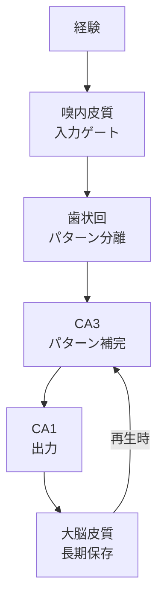

「いつ・どこで・何を経験したか」の記憶。海馬が書き込みを担い、大脳皮質に長期保存される。LLM には原理的に存在せず、RAG やベクトル DB はこの代替技術にあたる。

## 海馬系の構造

| 領域 | 機能 |
|---|---|
| 海馬 (hippocampus) | 新しい経験を長期記憶に符号化 (encoding)。再生 (retrieval) のインデックス |
| 嗅内皮質 (entorhinal cortex) | 海馬への入力ゲート。空間と時間の格子表現 (grid cells) |
| 歯状回 (dentate gyrus) | パターン分離 — 似た記憶を区別して干渉を防ぐ |
| CA3 | パターン補完 — 部分的な手がかりから全体を復元 |

## 記憶の固定化 (consolidation)

海馬は一時的なバッファであり、睡眠中のリプレイ（sharp-wave ripple）を通じて記憶を大脳皮質に移す。この過程が**記憶の固定化**。

- **標準固定化理論**: 時間が経つと海馬は不要になる
- **多重痕跡理論**: エピソード記憶は常に海馬が関与し続ける

## LLM との対応

| 海馬の機能 | LLM | 代替技術 | ギャップ |
|---|---|---|---|
| 経験の書き込み | 事前学習で凍結。推論時の「体験」は残らない | RAG、長期メモリ | 外部ストレージへの明示的な書き込み。自動的な符号化ではない |
| パターン分離 | なし | ベクトル DB の距離計算 | 似た記憶の干渉に弱い。embedding 空間での分離精度に依存 |
| パターン補完 | in-context learning で部分的に | few-shot prompting | 手がかりからの想起ではなく、パターンマッチング |
| 固定化 | なし | fine-tuning | 推論中にリアルタイムで進行しない。事後的な別プロセス |

## なぜ RAG は海馬の代替として不完全か

1. **受動的取得**: RAG は明示的なクエリで検索する。海馬は文脈に応じて自動的に関連記憶を活性化する
2. **符号化の不在**: RAG のデータは事前に構造化して格納する必要がある。海馬は経験をそのまま書き込む
3. **感情による重み付け**: 海馬は扁桃体と連携し、感情的に重要な記憶を優先的に固定化する。RAG にはこの機構がない
4. **時間的文脈**: エピソード記憶は「いつ」の情報を持つ。ベクトル DB は意味的類似度のみ

## Links

- [Dissociating language and thought in large language models (Mahowald et al., 2024)](https://arxiv.org/abs/2301.06627)

## 関連

- [[formal-vs-functional-competence|形式的 vs 機能的言語能力]] — エピソード記憶は機能的言語能力の基盤の一つ
