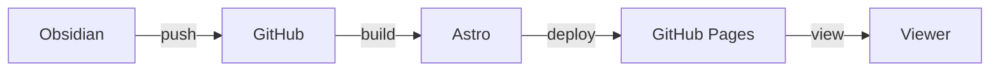
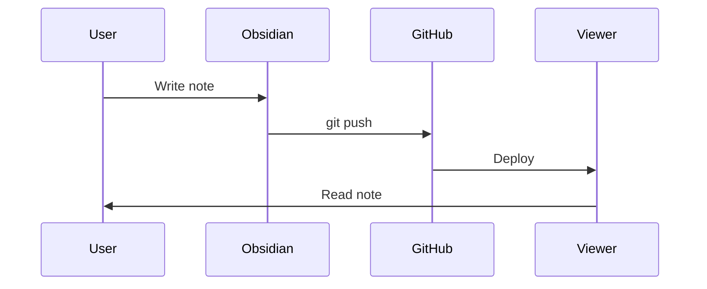

This is an example note demonstrating features.

## Wikilinks

You can link to other notes like [[index|Home]] or [[Getting Started]].

## Code Blocks

```python
def hello():
    print("Hello, World!")
```

## Formatting

- **Bold text**
- *Italic text*
- `inline code`

> Blockquotes work too.

## Mermaid Diagrams




