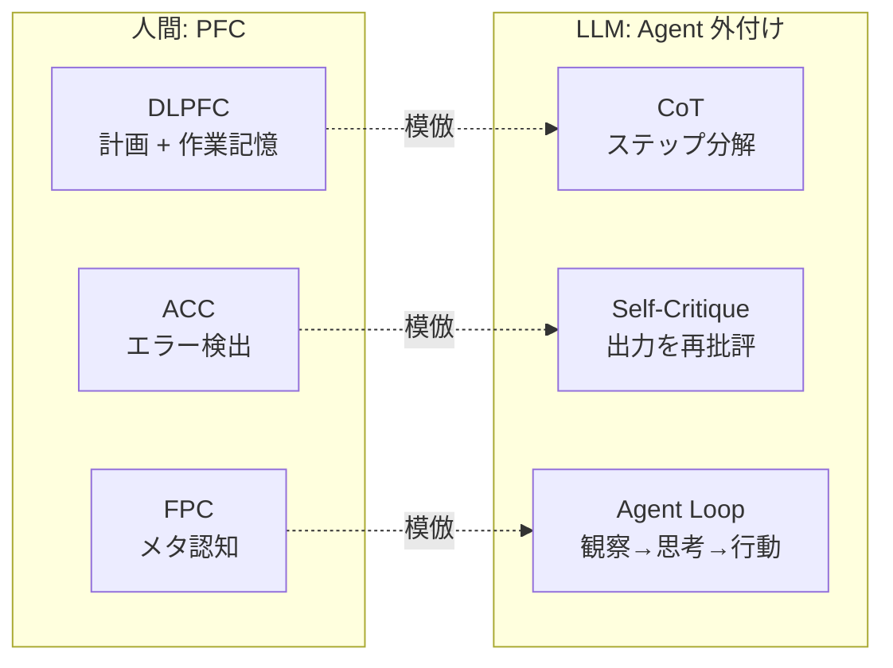

目標に向かって行動を計画・制御・監視する認知機能の総称。前頭前皮質 (PFC) が中核を担う。LLM に原理的に欠けている機能であり、agent ループや CoT はこの外付け模倣にあたる。

## PFC の主要領域と機能

| 領域 | 略称 | 機能 | 日常での例 |
|---|---|---|---|
| 背外側前頭前皮質 | DLPFC | 作業記憶、複数ステップ計画、注意の維持 | 料理で3品を並行して作る |
| 前頭極 | FPC (BA10) | メタ認知、サブゴール管理 | 「今やってることを保留して別のことをする」 |
| 前帯状皮質 | ACC | エラー検出、葛藤モニタ | 「これ間違ってるかも」の検知 |
| 眼窩前頭皮質 | OFC | 価値評価、選択肢の比較 | どの店で食べるか迷う |

## LLM との対応

LLM の Transformer は実行制御を持たない。一度の forward pass でトークン列を生成するだけで、「立ち止まって計画を見直す」「間違いに気づいてやり直す」機構がアーキテクチャに内在しない。

| PFC 機能 | LLM での代替技術 | 限界 |
|---|---|---|
| 作業記憶 (DLPFC) | コンテキストウィンドウ | 固定長。人間の作業記憶は注意で動的に管理 |
| 計画 (DLPFC) | CoT (Chain of Thought) | 計画を「言語化」して autoregressive に実行。真の先読みではない |
| メタ認知 (FPC) | self-critique, reflection | 出力を再入力して批評する。追加推論コストが必要 |
| エラー検出 (ACC) | self-consistency, majority vote | 複数出力の比較で間接的に検出。リアルタイム監視ではない |
| 価値評価 (OFC) | RLHF / reward model | 学習済みの選好。文脈依存の柔軟な価値判断ではない |

## なぜ「外付け」は本物と違うか

人間の PFC は**常時稼働のモニタ**であり、行動の途中でもエラーを検出して即座に修正できる（ACC の N400 / ERN 反応）。LLM の self-critique は「一旦全部出力してから振り返る」ため、生成途中での軌道修正ができない。この遅延が hallucination や論理破綻の根本原因の一つ。

## Links

- [Dissociating language and thought in large language models (Mahowald et al., 2024)](https://arxiv.org/abs/2301.06627)

## 関連

- [[formal-vs-functional-competence|形式的 vs 機能的言語能力]] — 実行機能は機能的言語能力の中核
- [[theory-of-mind|心の理論]] — 社会認知も PFC (mPFC) が関与
