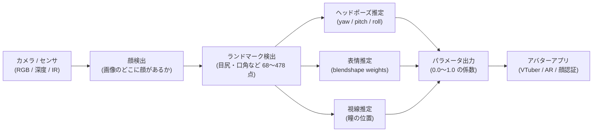
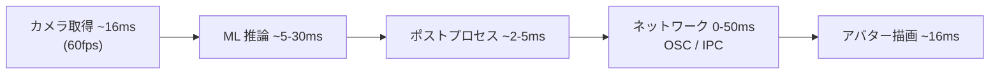
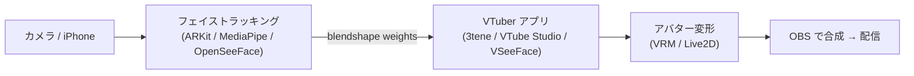

カメラやセンサで **人間の顔の位置・向き・表情を実時間で数値化**する技術。VTuber アバターの顔がカメラ越しに動く仕組みも、iPhone の Face ID も Animoji も、Zoom のバーチャルメイクも全部これが核心。1990 年代の研究から始まり、深層学習と TrueDepth カメラの登場でここ数年で実用品質に到達した。

## 何のためにあるか

「画面の向こうの自分」を **デジタルキャラに重ねる** ためには：

1. 顔がどこにあるか
2. 顔がどっちを向いているか
3. どんな表情をしているか
4. 口がどう動いているか
5. 視線がどこへ向いているか

を **毎フレーム** 推定して、アバターのパラメータに変換する必要がある。フェイストラッキングはこの **「カメラ画像 → 数値パラメータ」** の変換器。VTuber アプリ（3tene / VTube Studio / VSeeFace 等）の心臓部。

## 基本パイプライン

## 主要な検出方式

| 方式 | 入力 | 強み | 弱み |
|---|---|---|---|
| **2D ランドマーク** | 普通の Web カメラ（RGB） | 機材ゼロ、誰でも使える | 暗所・横向きに弱い、深度なし |
| **3D ランドマーク (深度センサ)** | iPhone TrueDepth、RealSense | 高精度、暗所に強い、Z 方向取れる | デバイス必須 |
| **Blendshape Inference (深層学習)** | 普通の RGB | ML モデルが直接 blendshape weights を出す | モデルバイアス、特殊表情に弱い |
| **赤外線 + 構造化光** | 専用センサ | 表情を直接 3D で取れる | プロ機材、高価 |
| **マーカー貼付** | カメラ + 顔マーカー | 映画品質 | 顔にシール、リアルタイム配信向きでない |

VTuber 用途は **2D RGB ランドマーク** が圧倒的多数。iPhone X 以降の **TrueDepth** がプレミア選択。

## ARKit Blendshapes（52 表情の標準）

Apple が iPhone X で導入し、現在 **業界事実上の標準** になっている表情パラメータセット：

- **眉**: `browDown_L/R`, `browInnerUp`, `browOuterUp_L/R`
- **目**: `eyeBlink_L/R`, `eyeWide_L/R`, `eyeSquint_L/R`, `eyeLook[Up/Down/In/Out]_L/R`
- **口**: `mouthSmile_L/R`, `mouthFrown_L/R`, `mouthOpen`, `jawOpen`, `mouthFunnel`, `mouthPucker`, `mouthRoll[Upper/Lower]` …
- **頬**: `cheekPuff`, `cheekSquint_L/R`
- **鼻**: `noseSneer_L/R`
- **舌**: `tongueOut`

合計 **52 個の 0.0–1.0 係数** で人間の表情をほぼ表現できる。VRM 1.0 の表情パラメータも基本ここに揃えられている。

## 主要なライブラリ・SDK

| ライブラリ | 提供元 | 入力 | 特徴 |
|---|---|---|---|
| **ARKit** | Apple | iPhone TrueDepth | 52 blendshapes、超高精度、iOS 限定 |
| **MediaPipe Face Mesh / Face Landmarker** | Google | RGB | 478 点 3D ランドマーク + 52 blendshapes、OSS、クロスプラットフォーム |
| **dlib (68 landmarks)** | Davis King | RGB | 古典 (HOG + SVM)、精度は中、教材で頻出 |
| **OpenCV face detection** | OSS | RGB | 顔検出のみ、軽量 |
| **OpenSeeFace** | OSS (Emiliana) | RGB Web カメラ | VTuber 向け、VSeeFace の中核 |
| **AvatarKit / VTubeKit** | 各社 | RGB / TrueDepth | iOS の VTuber アプリ向け SDK |

`OpenSeeFace` は VSeeFace の心臓部で、VTuber 文脈に最適化されている（軽量・低遅延・blendshape 直出し）。

## 遅延（latency）と精度のトレードオフ

- **目標**: 100ms 以下（人間の知覚で「自然」に感じるリミット）
- **VTuber 用途**: 30〜80ms 程度なら違和感なし
- **遅延の主因**: ML モデルの重さ（lightweight モデルでは 5ms、高精度モデルでは 30ms 超）
- **精度 vs 速度**: ノートPC の Web カメラ + 軽量モデル = 速いがガクガク、iPhone TrueDepth + ARKit = 遅いが滑らか

## VTuber エコシステムでの位置

VTuber アプリは **トラッキング部分を内製するか外部 SDK（ARKit / MediaPipe）に委ねるか** で性格が変わる：

- **3tene PRO**: iPhone TrueDepth → ARKit → 3tene、または Web カメラ → 内製トラッカー
- **VTube Studio**: 内製の Live2D 向けトラッカー、または iPhone（VTS-iPhone アプリ）→ ARKit
- **VSeeFace**: OpenSeeFace を統合、Web カメラのみで完結
- **iFacialMocap / Face Mocap 等**: iPhone を「トラッキング送信機」として使い、PC のアプリに OSC や独自プロトコルで送る別アプリ

## VTuber 以外の応用

- **AR エフェクト** — Snapchat / Instagram フィルタ、Animoji
- **顔認証** — Face ID（TrueDepth + Neural Engine）
- **アクセシビリティ** — 顔ジェスチャでマウス代替（macOS のヘッドトラッキング）
- **オンライン会議** — Zoom / Google Meet の「美顔」「視線補正」
- **車内モニタ** — 居眠り検知、視線で機器操作
- **学術** — 表情心理学、自閉症スペクトラム研究

## プライバシーと倫理

- カメラ映像は本来 **生体情報**。一度デジタル化された顔ランドマークから個人が再特定可能
- **オンデバイス処理が原則** — iPhone の ARKit はクラウドに送らない
- ブラウザ越しのトラッキング（MediaPipe in WebAssembly）も local-first を志向
- **悪用懸念**: ディープフェイク制作、なりすまし、感情監視 → 各国で規制が進む

## 押さえどころ（カード化候補）

- フェイストラッキングが解決する課題 → **カメラ画像から「顔の位置・向き・表情・視線」を実時間で数値化し、アバターやアプリに渡せるパラメータ列に変換すること。VTuber アプリ・AR フィルタ・顔認証の中核**
- フェイストラッキングの基本パイプライン → **画像取得 → 顔検出 → ランドマーク検出 (68〜478 点) → ヘッドポーズ推定 / 表情推定 / 視線推定 → 0〜1.0 の係数として出力**
- 検出方式の主要4系統 → **2D ランドマーク (RGB Web カメラ)、3D ランドマーク (TrueDepth/RealSense 深度)、Blendshape Inference (深層学習で直接)、赤外線/構造化光 (専用センサ・プロ機材)**
- ARKit blendshapes の概要 → **Apple が iPhone X で導入した 52 個の 0.0〜1.0 表情係数の標準。眉/目/口/頬/鼻/舌をカバーし、VRM 1.0 もこれに揃えている。業界事実上の標準**
- フェイストラッキングの主要ライブラリ → **ARKit (Apple、iOS のみ高精度)、MediaPipe (Google、OSS でクロスプラットフォーム)、OpenSeeFace (VSeeFace 内蔵、VTuber 特化)、dlib (68 点ランドマークの古典)**
- 遅延の許容ラインと VTuber での実態 → **100ms 以下が人間の知覚限界、VTuber では 30〜80ms 程度なら自然。軽量 ML モデルなら 5〜10ms、高精度モデルだと 30ms 超になる**

## Links

- [Apple ARKit Face Tracking](https://developer.apple.com/documentation/arkit/content_anchors/tracking_and_visualizing_faces)
- [MediaPipe Face Landmarker](https://developers.google.com/mediapipe/solutions/vision/face_landmarker)
- [OpenSeeFace (VSeeFace の中核)](https://github.com/emilianavt/OpenSeeFace)
- [ARKit Blendshapes 一覧](https://developer.apple.com/documentation/arkit/arfaceanchor/blendshapelocation)

## 関連

- [[3tene]] — フェイストラッキングでアバターを駆動する VTuber アプリ
- [[vrm|VRM]] — ARKit Blendshapes を表情定義に採用した 3D アバター規格
- [[live2d|Live2D]] — 2D キャラクターのフェイストラッキング駆動
- [[obs|OBS Studio]] — トラッキング済みアバターを配信に合成する出口
