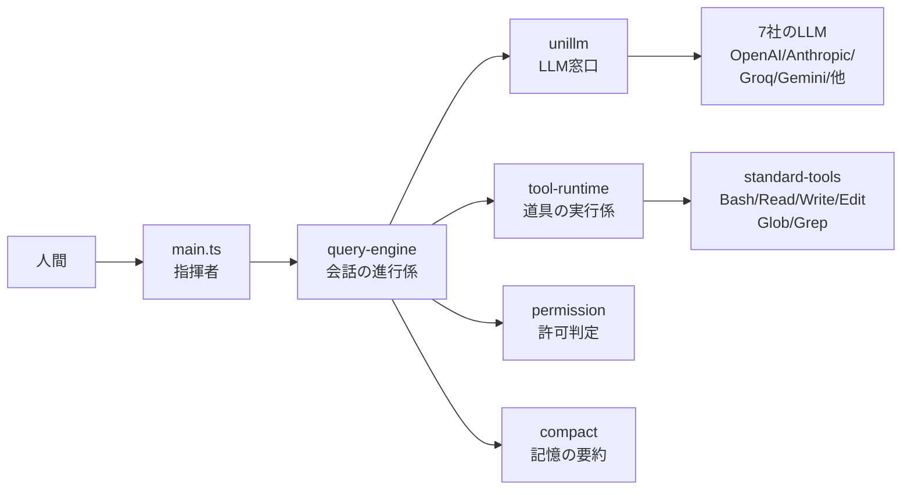

[[famulus2]] の前身。Claude Code 互換の CLI エージェントを ~2,000 行で実現するため、Aid-On の小さなパッケージ群を組み合わせて構築する第一世代。

## 何ができる？

「コードを書いてくれる助手」を、自分の手元で動かせる小さなプログラムにしたものです。市販品（Claude Code）が大きな完成品の家だとすれば、famulus は同じ間取りを Lego ブロックで小さく組み直したミニチュアハウスです。中身は数千行とコンパクトですが、ちゃんと指示を理解してファイルを直したりコマンドを実行したりしてくれます。

嬉しい点は、自分で部品を入れ替えられること。たとえば「この仕事は安い助手に、こっちは賢い助手に」と相手を選べたり、新しい道具を追加したりできます。出来合いの製品では届かない細かい好みに合わせられます。

## 用語

- **CLI エージェント**: 黒い画面（ターミナル）から文字で話しかけると作業してくれる助手プログラム。
- **LLM**: 大量の文章を学んだ「言葉のしくみを覚えた大きなモデル」。会話や文章生成ができる。
- **プロバイダ**: LLM を提供する会社（OpenAI、Anthropic など）。電力会社のように、契約する相手を選ぶイメージ。
- **DI (Dependency Injection)**: 部品を外から差し込めるようにする組み立て方。「電池を後から入れるおもちゃ」のような設計。
- **ツール (Tool)**: エージェントが使える道具。ファイル読み書き、コマンド実行、検索など。
- **ストリーミング**: 全部できあがってから渡すのではなく、できた所からどんどん流して見せる方式。お皿に盛らず、寿司屋のレーンのように流す。
- **トークン**: 文章を機械が数える最小単位。1〜2文字で1トークン。料金や容量の計算単位。
- **コンテキスト**: 助手が今の会話で覚えている内容全部。短期記憶のようなもの。
- **Auto-compact**: 会話が長くなり過ぎたら、過去のやりとりを要約してスッキリさせる機能。古いノートをまとめ直すイメージ。
- **Permission System**: 「これはやってよい / 確認してから / 絶対ダメ」を決めるルール。
- **Retry with backoff**: 失敗したら少し待ってやり直す。間隔を1秒→3秒→8秒と長くしていき、相手に迷惑をかけない再試行。
- **モノリス**: 全部を1つの大きな塊で作ったソフト。逆は「小さな部品の組み合わせ」。

## 仕組み



main.ts は「配線するだけ」の指揮者で、ロジックは持ちません。LLM への問い合わせ、道具の実行、許可判定、記憶の整理、それぞれが独立した部品になっていて、必要に応じて差し替えられる作りです。Lego ブロックのように小さな部品を組み合わせて、Claude Code とほぼ同じ機能を 1/256 のコード量で実現しています。

## Core Idea

「Claude Code を 1/256 のサイズで再現する」。512K 行のモノリスではなく、`@aid-on/unillm` `@aid-on/tool-runtime` `@aid-on/standard-tools` を DI で組み立てて、~2K 行に収める。

```
famulus v0.0.1

> show me package.json
[Read] { "name": "@aid-on/famulus", "version": "0.0.1", ...

> fix the bug in src/calc.ts
[Read] ...
[Edit] Successfully edited src/calc.ts

> /model deepseek:deepseek-v4-flash
Model set to: deepseek:deepseek-v4-flash
```

## Claude Code との比較

| | Claude Code | famulus |
|---|---|---|
| Providers | Anthropic only | **7 providers** (OpenAI, Anthropic, Groq, Gemini, Cloudflare, DeepSeek, Kimi) |
| Architecture | 512K-line monolith | **~2K lines** + 再利用パッケージ |
| Tools | 内蔵・閉じている | `@aid-on/standard-tools` で拡張可能 |
| Token efficiency | なし | [[rtk]] inspired filtering (60-90%) |
| Model lock-in | Claude のみ | タスク・プロジェクトごとに切替 |
| Codebase | プロプライエタリ | Open |

## Features

- **Streaming + native tool_use** — テキストはリアルタイム、ツールは構造化 API 呼び出し
- **7 LLM providers** — `/model deepseek:deepseek-v4-flash` で切替。すべて [[unillm]] 経由
- **6 built-in tools** — Bash, Read, Write, Edit, Glob, Grep。並列実行対応
- **Output filtering** — git status, test output, npm install を LLM 入力前に圧縮 ([[rtk]] 着想)
- **Permission system** — Read/Glob/Grep auto-allow、Bash/Write/Edit 確認、`rm -rf` 等の dangerous pattern 検出
- **Retry with backoff** — 429/503/529 で 1s → 3s → 8s
- **Auto-compact** — context limit 接近時に自動圧縮
- **Concurrent tool execution** — 読取専用は `Promise.all`
- **Structured tool results** — Claude Code の `tool_use`/`tool_result` パターン踏襲

## Architecture

```
main.ts (conductor — composes modules, holds zero logic)
  │
  ├── @aid-on/unillm           ← LLM provider abstraction (7 providers)
  ├── @aid-on/tool-runtime     ← Tool execution engine + permission types
  ├── @aid-on/standard-tools   ← Bash/Read/Write/Edit/Glob/Grep + filters
  │
  ├── query-engine             ← Streaming + tool loop + retry + compact
  ├── api-client               ← unillm wrapper (rich messages, tool_use)
  ├── permission               ← 4-layer resolution + dangerous patterns
  ├── context                  ← Git status + CLAUDE.md + system prompt
  ├── memory                   ← MEMORY.md + topic files
  ├── compact                  ← Token estimation + LLM summarization
  ├── coordinator              ← Multi-agent (planned)
  └── task                     ← Task management (planned)
```

すべて DI コンテナで注入。`main.ts` は配線のみ。

## 構成パッケージ

| Package | 役割 |
|---|---|
| [[unillm]] | edge-native unified LLM interface |
| @aid-on/tool-runtime | universal tool execution runtime (Zod validation, permissions) |
| @aid-on/standard-tools | Bash/Read/Write/Edit/Glob/Grep + rtk-inspired filters |
| [[nagare]] | reactive streaming (Web Streams API) |

## Commands

| Command | Description |
|---|---|
| `/model [spec]` | モデル表示 / 設定 (`deepseek:deepseek-v4-flash`) |
| `/tools` | tool 一覧 |
| `/trust [mode]` | permission mode (`default` / `accept-edits` / `bypass`) |
| `/clear` | 会話履歴クリア |
| `/help` | コマンド一覧 |
| `/exit` | 終了 |

## Token Efficiency

[[rtk]] 着想の出力フィルタ:

| Command | Savings |
|---|---|
| `git status` (50 files) | 76% |
| `npm install` | 77% |
| `git diff` (large) | 70-80% |
| Test output | 90% |

スマート truncation: head 70% + tail 20% を保持。

## Testing

```bash
npm test  # 36 tests, ~450ms
```

すべて real module 経由 (no mocks, no stubs)。LLM API はスクリプト化された test 実装が同じインターフェースを満たす。

```
@aid-on/tool-runtime     13 tests
@aid-on/standard-tools   35 tests
@aid-on/famulus           36 tests
────────────────────────────
Total                    84 tests
```

## Roadmap

1. Agent core 抽出 → `@aid-on/famulus-agent-core`
2. Smart model routing — intent-based、簡単なタスクには cheap モデル
3. Session 永続化
4. Memory 統合 (auto-extract, vector search)
5. Multi-agent (coordinator + worker)

## [[famulus2]] との関係

famulus は第一世代。`tool_use` 構造ベースのエージェントループと output filtering を確立した。

[[famulus2]] では:
- **Code Graph** ([[codopsy]] tree-sitter) を追加 — ソース全文を読まない
- **AST Gate** を追加 — 生成コードの構文検証
- **Test Feedback** ループ — 自動テスト連動
- LLM 依存を更に削減し、決定論的処理に置き換える方向へ

## 関連

- [[famulus2]] — 後継。決定論寄りに進化
- [[unillm]] — provider 抽象 (7 プロバイダ)
- [[nagare]] — streaming
- [[rtk]] — output filtering の着想元
- [[claude-code]] — 比較対象
- [[agentic-coding]] — 体現するパラダイム

## Links

- [GitHub](https://github.com/Aid-On/famulus)
