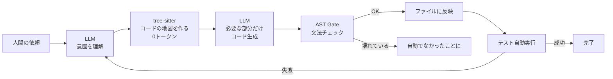
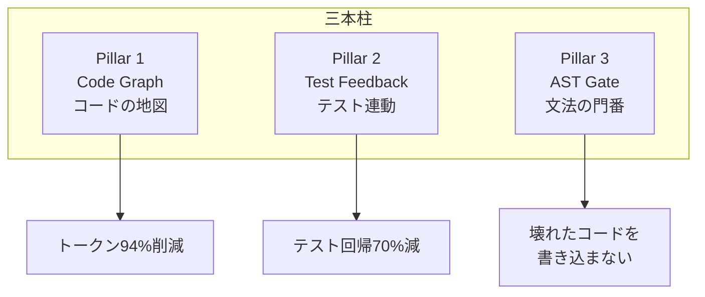

ハイブリッド AI コーディングエージェント。LLM は判断だけ、実行は決定論的に。

## 何ができる？

賢いけれどお金がかかる助手（AI）に、なんでもかんでも任せるのをやめた、新しい仕事の進め方をするコード作成プログラムです。家計簿で例えると、これまでは「全部の計算を頭で暗算してください」と AI にお願いしていたのを、「足し算引き算は計算機に任せて、何を買うかの判断だけ AI にしてもらう」ように分担し直しました。判断は AI、実行は確実な機械。これで早く・安く・間違いなく仕事が進みます。

嬉しい点は3つ。出来上がりが正確（壊れたコードを書きにくい）、お金が安い（AI に頼む量が9割減る）、速い（機械処理は一瞬）。さらに「テストを自動で動かして失敗したら直す」までやってくれます。

## 用語

- **LLM**: 大量の文章を学んだ「言葉のしくみを覚えた巨大なモデル」。会話や文章生成ができる。
- **エージェント**: 指示を受けて自分で考え、必要な作業を順番にこなす助手プログラム。
- **決定論的処理**: 同じ入力なら必ず同じ結果が返る、ブレない計算。電卓の足し算のようなもの。
- **tree-sitter**: プログラムの文章を「文法的な骨組み」として解析する道具。文章の構造図を作る機械。
- **AST (構文木)**: プログラムの骨組みを枝分かれの図にしたもの。「主語＋述語＋目的語」のような構造図。
- **Code Graph**: ソースコードの中身を「関数」「クラス」「呼び出し関係」の地図にしたもの。全文を読まなくても、地図を見れば構造がわかる。
- **AST Gate**: AI が書いたコードを「文法的に壊れていないか」自動チェックする門番。壊れていたら通さず、なかったことにする。
- **Test Feedback**: 書き換え後にテスト（動作確認）を自動で動かし、失敗したら原因を AI に伝えて直してもらう仕組み。
- **トークン**: 文章を機械が数える最小単位。1〜2文字で1トークン。料金と覚えられる量の単位。
- **DI コンテナ**: 部品を外から差し込めるようにする組み立て箱。「電池を後から入れるおもちゃ」のような設計。
- **MCP**: AI 助手と外部ツールをつなぐ共通の差込口。USB のような統一規格。
- **プロバイダ**: LLM を提供する会社（OpenAI、Anthropic、DeepSeek など）。
- **Rust**: 速くて安全なプログラミング言語。重い処理を一瞬で終わらせるのに向く。

## 仕組み



LLM（赤い処理＝高い・遅い・ブレる）を最小限にし、機械的処理（緑＝安い・速い・確実）を最大限にしています。



3本柱で「読む・直す・確かめる」を分担。家計簿で言えば、Code Graph が「家計の見取り図」、AST Gate が「電卓で再検算」、Test Feedback が「実際に支払えるか試す」です。

## Core Idea

「LLM に全部やらせる」のではなく、LLM が本当に必要な部分だけ LLM を使い、残りはプログラムが確実にやる。

```
従来: ユーザー → LLM → LLM → そのまま書き込み → 検証なし
famulus2: ユーザー → LLM(意図理解) → tree-sitter(0トークン) → LLM(コード生成) → AST Gate → テスト → 完了
```

赤（LLM処理）を最小化し、緑（決定論的処理）を最大化する。

## 3本柱

### Pillar 1: Code Graph

tree-sitter で 25 言語のコードをパースし、関数・クラス・型・依存関係を JSON 出力。LLM はソースコード全文ではなく構造情報だけ読む。

バックエンドは Rust 製の [codopsy](https://github.com/O6lvl4/codopsy)。rayon で並列処理。

**トークン削減効果:**

- 関数検索: 1,672 → 30 tokens (98%)
- インタフェース検索: 4,223 → 80 tokens (98%)
- 全 export 一覧: 14,992 → 1,445 tokens (90%)
- 合計: 25,986 → 1,597 tokens (**94% 削減**)

根拠: [Codebase-Memory (2026)](https://arxiv.org/abs/2603.27277) — 31リポジトリで評価

### Pillar 2: Test Feedback

テストコマンドをプロジェクト構成ファイル (package.json, Cargo.toml, go.mod, pyproject.toml) から自動検出。LLM がコード修正 → テスト自動実行 → 失敗ならエラーをフィードバック → 修正ループ。

根拠: [TDAD (2026)](https://arxiv.org/html/2603.17973v1) — テスト回帰 70% 削減

### Pillar 3: AST Gate

LLM が生成したコードを tree-sitter で構文チェック。壊れたコードはファイルに適用されず自動 revert。

根拠: [FORGE '26 (2026)](https://arxiv.org/abs/2601.19106) — 検出精度 90%、偽陽性ゼロ

## 出力フィルタリング

[[rtk|RTK]] に着想を得たコマンド出力フィルタ。ANSI 除去、コマンド種別判定、失敗テストのみ抽出。

## Architecture

```
src/
├── main.ts           # 指揮者
├── container.ts      # DI コンテナ
└── modules/
    ├── query-engine/  # LLM ストリーミング + ツール実行ループ
    ├── tool-runtime/  # Bash, Read/Write/Edit, Glob/Grep
    ├── code-graph/    # codopsy 連携 (CodeAnalyze/Search/Validate)
    ├── test-runner/   # テスト自動実行
    ├── compact/       # コンテキスト圧縮
    ├── memory/        # セッション記憶
    ├── permission/    # allow/ask/deny 制御
    ├── api-client/    # HTTP クライアント
    ├── cli/           # REPL インターフェース
    └── mcp/           # MCP プロトコル対応
```

~2,500 行。53 テスト、モック・スタブなし、本物のモジュールを DI で組み立て。

## 対応プロバイダ (7社)

@aid-on/unillm で統一インターフェース:

- **DeepSeek V4 Flash** — 日常使い ($0.07/M入力、最安)
- **DeepSeek V4 Pro** — コーディング (Opus 級品質で 1/20 価格)
- **Kimi K2.6** — エージェント的コーディング
- OpenAI, Anthropic, Groq, Gemini, Cloudflare

## [[claude-code|Claude Code]] との違い

- コード量: 512,000 行 vs ~2,500 行
- LLM 依存度: 全処理 vs 判断のみ
- 構文検証: なし vs AST Gate
- コード理解: LLM 丸投げ vs tree-sitter (0トークン)
- プロバイダ: Anthropic のみ vs 7社
- トークン効率: 94% 削減

## 関連

- [[rtk|RTK]] — 出力フィルタリングの着想元
- [[agentic-coding|Agentic Coding]] — famulus2 が体現するパラダイム
