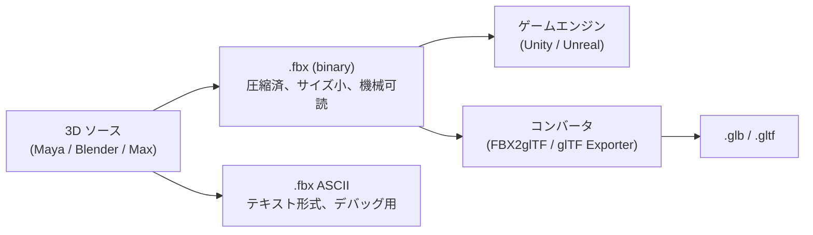
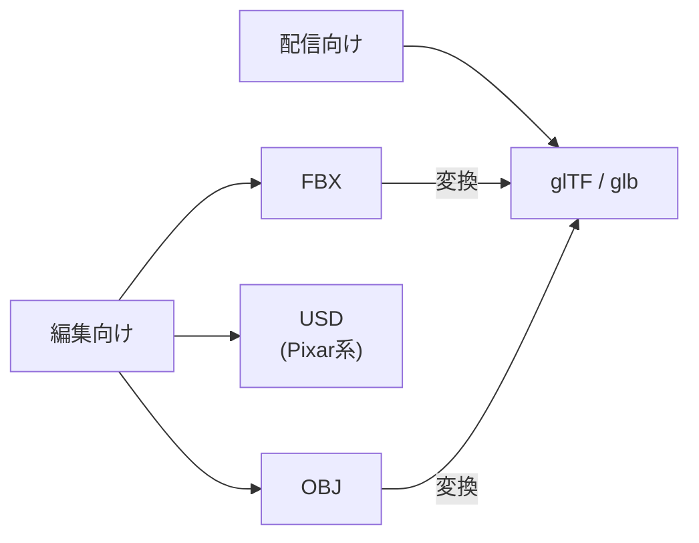

3D モデル・アニメーションの **DCC ツール間交換フォーマット**。Filmbox が起源、現在は **Autodesk が所有**するクローズド規格。Maya / 3ds Max / Blender / Unity / Unreal の事実上の共通言語で、3D 制作パイプラインの "土管" になっている。

## 何のためにあるか

3D 制作は典型的に複数のツールを跨ぐ：

- ZBrush でハイポリ造形
- Maya / Blender でリトポ + リギング + アニメーション
- Substance Painter でテクスチャ
- Unity / Unreal でゲームエンジン統合

このとき **「メッシュ + ボーン + アニメーション + マテリアル参照を一束で渡せる」** フォーマットが必要。FBX はこの役を 20 年以上担ってきた。Autodesk が 2006 年に Kaydara を買収して以降、Maya / 3ds Max のネイティブ書き出しが FBX 中心に振られたことで、業界標準になった。

## バイナリと ASCII の二形式

| 形式 | 拡張子 | 用途 |
|---|---|---|
| **Binary** | `.fbx` | デフォルト。圧縮されてサイズが小さく、読み込みも速い |
| **ASCII** | `.fbx`（中身は人間可読） | diff / 手動確認 / バージョン互換性のデバッグ用。サイズは数倍 |

ファイル拡張子は両方 `.fbx` なので、開いて中身が "Kaydara FBX Binary" で始まれば binary、`; FBX 7.4.0 project file` で始まれば ASCII。

## FBX が保持できるもの

- **メッシュ** — 頂点・インデックス・UV・法線・接線
- **マテリアル参照** — Phong / Lambert（PBR は近年の拡張で対応）
- **テクスチャ参照** — 別ファイル参照（FBX 内には埋め込まないことが多い）
- **スケルトン** — ボーン階層 + バインドポーズ
- **スキン** — ボーンウェイト（4 ボーン/頂点が普通）
- **アニメーション** — キーフレーム、複数クリップ収録可
- **モーフターゲット**（ブレンドシェイプ）
- **カメラ / ライト** — シーン要素も入る
- **メタデータ** — フレームレート、単位系など

注: テクスチャは「参照」だけで、FBX ファイル単体では絵として完結しない（PNG / JPG が別途必要）。エンジン側で **Embed** オプションを使うと内蔵もできる。

## バージョンの悩み

FBX SDK にはバージョンがあり（FBX 6.1, 7.4, 7.7, 2020 系列…）、**書き出した側と読み込む側のバージョン不一致でアニメや法線が壊れる**ことがある。トラブルの典型：

- Maya 2024 で書き出した FBX が古い Unity で読めない
- Blender の FBX エクスポータは Autodesk 公式実装ではないので微妙な差異がある
- バージョンを下げて書き出す（FBX 2014 / 2018 形式）が現実解

実運用では **「FBX 2020」** か **「FBX 2018」** 形式を選ぶのが無難。

## 主要ツールの対応

| ツール | 役割 | 備考 |
|---|---|---|
| **Autodesk Maya / 3ds Max** | ネイティブ書き出し | FBX SDK 公式、最も信頼できる |
| **Blender** | エクスポート/インポート | 公式 SDK 非搭載のため独自実装、互換性の微妙な穴あり |
| **Unity** | インポート | 主要 3D 形式、ドラッグ&ドロップで取り込み |
| **Unreal Engine** | インポート | 主要 3D 形式、Skeletal Mesh / Animation Sequence に変換 |
| **Substance Painter** | インポート（マテリアル付与）| FBX → SP → re-export FBX or glTF |
| **FBX2glTF** | 変換 | Facebook が公開したコマンドラインコンバータ |

Unity-chan のような **Unity 公式キャラ素材** は FBX で配布されているのが典型的（メッシュ + リグ + 表情モーフ + 数十個のアニメーションクリップ）。

## FBX vs OBJ vs [[gltf|glTF]]

| 形式 | 立ち位置 | 強み | 弱み |
|---|---|---|---|
| **FBX** | 編集向け業界標準 | アニメーション・スケルトンを丸ごと運べる | クローズド、バージョン不整合、サイズ大 |
| **OBJ** | 古典的、シンプル | テキストで読める、超軽量 | アニメーション・ボーンなし、メッシュとマテリアルだけ |
| **glTF** | ランタイム配信標準 | オープン仕様、PBR 標準、Web 親和 | 編集中の往復には情報が足りない |
| **USD** | 映画・大規模シーン | レイヤ・参照・大量データに強い | Pixar 系で重厚 |

- **編集中**: FBX（or USD/blend）
- **完成・配信**: glTF（or USDZ）
- **形だけほしい**: OBJ

## ライセンスと SDK

- **FBX SDK**: Autodesk が無償提供（公式 C++ SDK）。商用利用も可、ただしソース公開はされていない
- **読み書きを実装するなら**: Autodesk SDK を呼ぶか、サードパーティ実装（`fbx-conv`、Blender の Python エクスポータ、`@picode/three-fbx-loader` など）を使う
- **オープンフォーマットではない** — これが glTF が押している理由のひとつ

## 押さえどころ（カード化候補）

- FBX の正式名称と所有者 → **Filmbox。元々 Kaydara が開発、2006 年に Autodesk が買収して以降クローズド規格として所有**
- FBX の二形式 → **Binary (.fbx) と ASCII (中身がテキスト) の2形式。拡張子は両方 .fbx**
- FBX が保持できる情報 → **メッシュ、マテリアル参照、テクスチャ参照、スケルトン、ボーンウェイト、アニメーションクリップ、モーフ、カメラ、ライト**
- FBX と glTF の使い分け → **FBX は編集向け（DCC ツール間の交換）。glTF はランタイム配信向け（Web/エンジンで描画）**
- FBX バージョンの悩み → **書き出し側と読み込み側でバージョンが合わないとアニメや法線が壊れる。実運用は FBX 2018 か 2020 形式に揃えるのが無難**
- FBX vs OBJ → **FBX はアニメ・ボーンを含む業界交換標準。OBJ はメッシュとマテリアルだけのシンプル形式（古典）**

## Links

- [Autodesk FBX SDK](https://www.autodesk.com/developer-network/platform-technologies/fbx-sdk-2020-3-7)
- [FBX2glTF (Facebook 製コンバータ)](https://github.com/facebookincubator/FBX2glTF)
- [Blender FBX エクスポータ仕様](https://docs.blender.org/manual/en/latest/addons/import_export/scene_fbx.html)
- [Unity FBX インポート](https://docs.unity3d.com/Manual/HOWTO-importObject.html)
