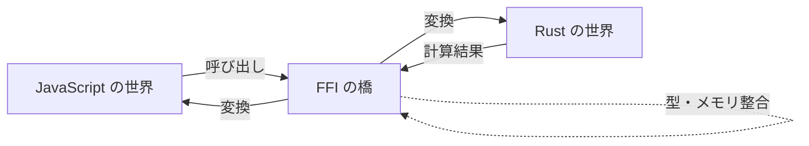

ある言語で書いたプログラムを、別の言語から呼び出すための「橋渡し」の仕組み。

## 何ができる？／なぜ重要？

世界には日本語、英語、フランス語といろんな言語があるように、プログラミングの世界にも C、Rust、JavaScript、Python と数多くの言語があります。それぞれ得意なことが違うので、「速さは Rust に任せて、画面表示は JavaScript に任せる」といった分業が便利です。FFI は、そのときに必要な「通訳官」の役割をします。

たとえば日本人とフランス人が直接話せなくても、両方の言語が分かる通訳がいれば会議が成り立ちますね。あるいは、海外のお店に国際電話をかけるとき、電話会社が間に入って音声を運んでくれます。FFI も同じで、「Rust で書いた処理を JavaScript から呼びたい」というとき、両者が理解できる形にデータを変換して受け渡しします。これがあるおかげで、得意分野の異なる言語の良いところ取りができるのです。

## 仕組み

JavaScript 側からの呼び出しは、いったん FFI の橋（バインディング層）で「Rust が分かる形」に変換されます。Rust が処理を終えたら、その結果をまた JavaScript の形に戻して返します。データの型やメモリの取り扱いを正しく合わせることが、橋を架ける仕事の中心です。

## 用語

- **FFI**: Foreign Function Interface の略。「外国の関数を呼び出すための取り決め」。
- **バインディング**: 一方の言語から別の言語の機能を使えるようにする「接続コード」。
- **ABI**: 機械レベルで関数をどう呼ぶかを決めた約束事。「電話のかけ方マニュアル」のようなもの。
- **マーシャリング**: データを言語間で運べる形に詰め直す作業。引っ越しの梱包に近い。
- **共有ライブラリ**: 複数のプログラムから呼び出せる「共有部品集」。
- **WebAssembly (Wasm)**: ブラウザでも動く、言語をまたぐ共通の実行形式。
- **ヘッダファイル**: 関数の名前や型だけを書いた「目次」。橋を架けるときに参照する。
- **ネイティブ呼び出し**: 機械語に直接近い形で関数を呼ぶこと。

## vault 内での使われ方

- [[almide-bindgen]] — Almide の cdylib + byte-buffer プロトコルで 21 言語向け FFI スキャフォールディングを生成するライブラリ
- [[almide-wasm-bindgen]] — Almide を WASM linear memory ABI 経由で JS/TS から呼ぶための ESM/d.ts/wit/package.json 生成器
- [[almide-lander]] — `--lang python,go,...` または `--target wasm` で almide-bindgen と almide-wasm-bindgen を統括する CLI

## 関連概念

- [[ir]] — 言語間で共通の中間表現を経由する設計

## Links

- [Wikipedia: Foreign function interface](https://en.wikipedia.org/wiki/Foreign_function_interface)
- [WebAssembly](https://webassembly.org/)
