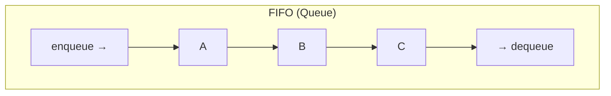
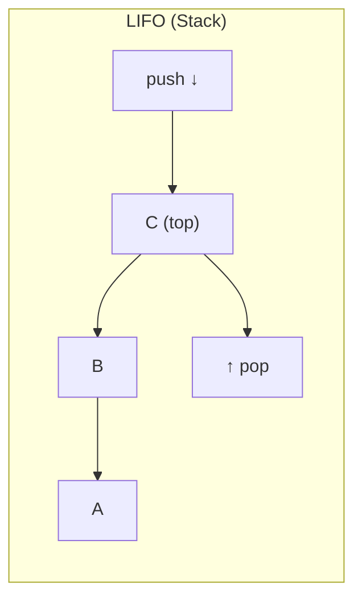
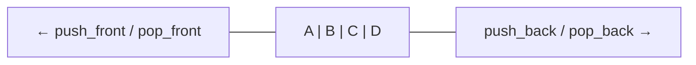

データの挿入と取り出しの順序を定める二つの基本原則。あらゆるバッファ、スケジューラ、メモリ管理の設計基盤になる。

## 定義

| 略称 | 正式名 | 順序 | 対応するデータ構造 |
|---|---|---|---|
| FIFO | First In, First Out | 先入れ先出し | キュー (Queue) |
| LIFO | Last In, First Out | 後入れ先出し | スタック (Stack) |





FIFO は「行列」。先に並んだ人が先にサービスを受ける。LIFO は「皿の積み重ね」。最後に載せた皿を最初に取る。

## 計算量

| 操作 | FIFO (Queue) | LIFO (Stack) |
|---|---|---|
| 挿入 | O(1) | O(1) |
| 取り出し | O(1) | O(1) |
| 先頭/末尾の参照 | O(1) | O(1) |
| 任意要素の探索 | O(n) | O(n) |

どちらも挿入・取り出しは O(1)。違いは順序だけ。

## 実装の変種

### FIFO の実装

| 実装 | 特徴 |
|---|---|
| リングバッファ | 固定長。配列ベースでキャッシュ効率が高い |
| 連結リスト | 動的長。head から dequeue、tail に enqueue |
| `VecDeque` (Rust) | リングバッファベースの両端キュー |
| `std::collections::LinkedList` (Rust) | 双方向連結リスト。通常 VecDeque を推奨 |

### LIFO の実装

| 実装 | 特徴 |
|---|---|
| 配列/Vec | 末尾に push/pop。最もシンプルで高速 |
| 連結リスト | 先頭に push/pop |
| コールスタック | CPU が関数呼び出しに使うハードウェアスタック |

### 両端キュー (Deque)

FIFO と LIFO の両方を統合した構造。両端から挿入・取り出しが可能。



- FIFO として使う: 一端で push、反対端で pop
- LIFO として使う: 同じ端で push/pop
- [[work-stealing]] では deque の両面性を活用: オーナーは LIFO、スティーラーは FIFO

## 使われている場所

### FIFO

| 用途 | 例 |
|---|---|
| タスクスケジューリング | OS のプロセスキュー、ジョブキュー |
| メッセージパッシング | チャネル、メッセージキュー (RabbitMQ, SQS) |
| バッファリング | I/O バッファ、パイプ、ネットワークパケットキュー |
| BFS (幅優先探索) | グラフ探索でキューを使用 |
| プリンタキュー | 先に送った印刷ジョブが先に印刷される |

### LIFO

| 用途 | 例 |
|---|---|
| 関数呼び出し | コールスタック。最後に呼んだ関数が最初に返る |
| Undo 操作 | 操作履歴をスタックに積み、Undo で pop |
| 構文解析 | 括弧の対応、式の評価 (逆ポーランド記法) |
| DFS (深さ優先探索) | グラフ探索でスタックを使用 |
| メモリ管理 | スタック領域の確保・解放 |
| ブラウザの戻るボタン | 履歴をスタックとして管理 |

### FIFO + LIFO の組み合わせ

| 用途 | 構造 | 説明 |
|---|---|---|
| [[work-stealing]] | Deque | オーナーは LIFO (キャッシュ局所性)、スティーラーは FIFO (大タスク獲得) |
| 優先度付きキュー | ヒープ | FIFO でも LIFO でもなく、優先度順。別の原則 |

## Rust での使い分け

```rust
use std::collections::VecDeque;

// FIFO (Queue)
let mut queue = VecDeque::new();
queue.push_back(1);    // enqueue
queue.push_back(2);
queue.push_back(3);
let first = queue.pop_front();  // dequeue → Some(1)

// LIFO (Stack) — Vec で十分
let mut stack = Vec::new();
stack.push(1);         // push
stack.push(2);
stack.push(3);
let last = stack.pop();         // pop → Some(3)

// Deque (両端)
let mut deque = VecDeque::new();
deque.push_back(1);
deque.push_front(0);
deque.pop_back();      // LIFO 的
deque.pop_front();     // FIFO 的
```

Rust では LIFO (スタック) には `Vec` を使うのがイディオマティック。FIFO やデックには `VecDeque`。

## 押さえどころ（カード化候補）

- FIFO と LIFO の違い → FIFO (First In, First Out) は先に入れたものを先に出す (キュー)。LIFO (Last In, First Out) は後に入れたものを先に出す (スタック)
- FIFO の代表的な用途 → タスクスケジューリング、メッセージキュー、I/O バッファ、BFS。「公平な順序」が必要な場面
- LIFO の代表的な用途 → コールスタック (関数呼び出し)、Undo、構文解析、DFS。「最後の操作を最初に戻す」場面
- Deque が FIFO と LIFO を統合する → 両端から挿入・取り出し可能。work-stealing ではオーナーが LIFO、スティーラーが FIFO として同一 deque の異なる端を使う
- Rust での FIFO/LIFO の使い分け → LIFO (スタック) は Vec の push/pop。FIFO (キュー) は VecDeque の push_back/pop_front
- FIFO/LIFO の計算量 → どちらも挿入・取り出しは O(1)。違いは順序だけ。任意要素の探索は O(n)

## 関連

- [[work-stealing]] — Deque の FIFO/LIFO 両面性を活用する並列スケジューリング
