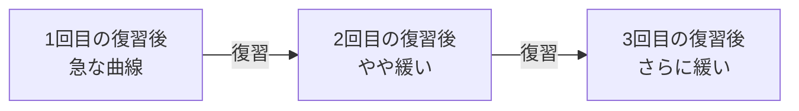

Ebbinghaus が1885年に測った、時間とともに保持が落ちる曲線。名前の知名度に比べて、**何を主張していないか**が知られていない。曲線は減衰の記述であって復習法ではなく、広く出回る「20分後・1日後・1週間後に復習」は彼の推奨でもない。さらに縦軸が1本しかないため、復習で曲線が寝ていく現象を表現できない。現代版は変数を2つに割った DSR モデルで、[[learning-system|FSRS]] として Anki に実装されている。

## Ebbinghaus が実際に見つけたもの

1885年の自己実験(材料は無意味綴り)で、彼は3つを出している。

| 発見 | 内容 |
|---|---|
| **忘却曲線** | 時間とともに保持が落ちること |
| **節約法** | 再学習にかかる時間の短縮で、残っている量を測る手法 |
| **分散効果** | 「相当数の反復を行う場合、時間的に分散させるほうが1回にまとめるより明らかに有利」と本人が書いている |

**分散学習の出所は彼で正しい**。間隔を空けて復習する、という発想は Ebbinghaus に遡る。

節約法も重要で、これは「完全に思い出せなくなった素材でも、覚え直しは初回より速い」という観測を測定手続きにしたもの。忘却が消去ではないことを示す最初の証拠になっている。

## よくある誤解

| 誤解 | 実際 |
|---|---|
| 忘却曲線は復習法である | 減衰の**記述**であって、いつ復習すべきかを何も言っていない |
| 「20分後・1日後・1週間後に復習」は彼の推奨 | それは彼が**測定した**時点(20分/1時間/9時間/1日/2日/6日/31日)。「いつ測ったか」が「いつ復習すべきか」に化けている |
| 間隔反復は彼が考案した | 復習スケジュールの早い提案は C.A. Mace (1932) の 1日/2日/4日/8日。方法として体系化したのは Woźniak (SuperMemo) |
| 曲線が下がるのを防ぐために復習する | 下がりきる直前まで待つほうが、1回の復習で得られるものが大きい |

最後の行が実務上いちばん効く。

## 防ぐか、利用するか

同じ曲線を見ても、立場が2つに分かれる。

| 立場 | 曲線をどう見るか | 運用 |
|---|---|---|
| 流通している解釈 | 下がるのを**防ぐ**もの | 忘れる前に復習する |
| [[retrieval-practice\|想起練習]]の立場 | 下がるのを**利用する**もの | 忘れかけるまで待ってから思い出す |

分かれ目は、記憶を2つの量に分けて見るかどうかにある。

- **今すぐ思い出せる度合い** — 時間で減る
- **どれだけ深く入っているか** — 減らない。学習と想起でしか増えない

後者の増分は、**そのときの前者が低いほど大きい**。忘れる前に復習すると前者が高いままなので、後者はほとんど増えない。「防ぐ」運用は今のアクセスを延命しているだけで、深さのほうは伸びていないことになる。詳細は [[retrieval-practice]] を参照。

## 忘却曲線は1軸である

より根本的な限界がここにある。曲線の縦軸は保持率1本で、上の2つの量を区別できない。

曲線が1本だと「復習すると曲線がリセットされる」としか言えない。ところが実際には、復習のたびに**曲線の傾きが緩くなる**。

この「曲線が寝ていく」現象こそ、深さのほうが効いている姿になる。曲線1本では表現できない。

## 現代版 — DSR と FSRS

限界を埋めたのが Woźniak の **DSR モデル**で、FSRS として実装され Anki 23.10 以降に標準搭載されている。曲線を変数に分けている。

| 変数 | 意味 | 2量との対応 |
|---|---|---|
| **R** (Retrievability) | 今この瞬間に想起できる確率 = **曲線上の現在位置** | 今すぐ思い出せる度合い |
| **S** (Stability) | R が 90% に落ちるまでの日数 = **曲線の寝かたを決める形状** | どれだけ深く入っているか |
| **D** (Difficulty) | 項目固有の覚えにくさ (1–10) | 対応物なし。経験的に足された第3項 |

**曲線の形が状態変数になった**点が更新の核心になる。Ebbinghaus の曲線が固定の1本だったのに対し、現代版は項目ごとに1本あり、復習のたびに S が更新されて曲線が寝ていく。

S の定義の仕方にも注目したい。「深さ」は直接測れないので、**減衰の遅さそのものを定義にしている**。測れない量を、測れる帰結で置き換える手口になる。

### 関数形の変遷

減衰は指数関数よりべき関数のほうが実データに合う(Wixted & Carpenter, 2007)。FSRS もそれに合わせて更新されてきた。

| 版 | 曲線 |
|---|---|
| v3 | 指数関数 |
| v1–4 | `R(t,s) = (1 + t/(9s))^(-1)` |
| v4.5–6 | `R(t,s) = (1 + factor·t/s)^decay` |
| v6 | 利用者ごとに最適化できるパラメータを追加 |
| v7 | 2つのべき曲線の加重合成 |

母数も違う。Ebbinghaus は被験者が自分1人で材料は無意味綴りだった。FSRS は実利用のレビューログでパラメータを推定している。

## 押さえどころ

- **忘却曲線が言っていること** → 時間とともに保持が落ちる、という減衰の記述
- **言っていないこと** → いつ復習すべきか。曲線は処方箋を含まない
- **「20分後・1日後」の正体** → 彼が測定した時点であって、推奨スケジュールではない
- **間隔反復の出所** → 分散効果の発見は Ebbinghaus、スケジュールの提案は Mace (1932)、体系化は Woźniak
- **運用の分かれ目** → 曲線が下がるのを防ぐか、利用するか。防ぐ側に立つとアクセスの延命に終わる
- **1軸であることの限界** → 復習のたびに曲線が寝ていく現象を表現できない
- **現代版** → DSR モデル。R が曲線上の現在位置、S が曲線の形。**曲線の形自体が状態変数になった**
- **関数形** → 指数関数よりべき関数のほうが実データに合う

## 制限

- Ebbinghaus の原実験は被験者1名・無意味綴りで、そのままの数値を一般の学習材料に当てはめられない。ただし Murre & Dros (2015) による追試で曲線自体は再現されている
- FSRS の関数形とパラメータは実データへの当てはめであって、記憶の機構を主張するものではない
- D (Difficulty) は理論的な裏づけを持たず、経験的に足された調整項

## Links

- [Murre & Dros (2015) — Ebbinghaus 忘却曲線の追試](https://pmc.ncbi.nlm.nih.gov/articles/PMC4492928/)
- [SuperMemo — 間隔反復の歴史と Ebbinghaus をめぐる神話](https://www.supermemo.com/en/blog/history-of-spaced-repetition)
- [A technical explanation of FSRS — 曲線の関数形の変遷](https://expertium.github.io/Algorithm.html)
- [FSRS Scheduler Implementation (Anki)](https://deepwiki.com/ankitects/anki/4.1-fsrs-scheduler-implementation)

## 関連

- [[retrieval-practice]] — 2つの量に分ける理論側。「下がるのを利用する」運用の根拠と導出
- [[learning-system]] — FSRS を自作せず既存実装に任せる判断。S を減衰の遅さで定義する手口の位置づけ
- [[cue-reduction]] — 間隔と並ぶもう一方のツマミ(手がかりの量)。どちらも思い出しにくさを上げる操作
