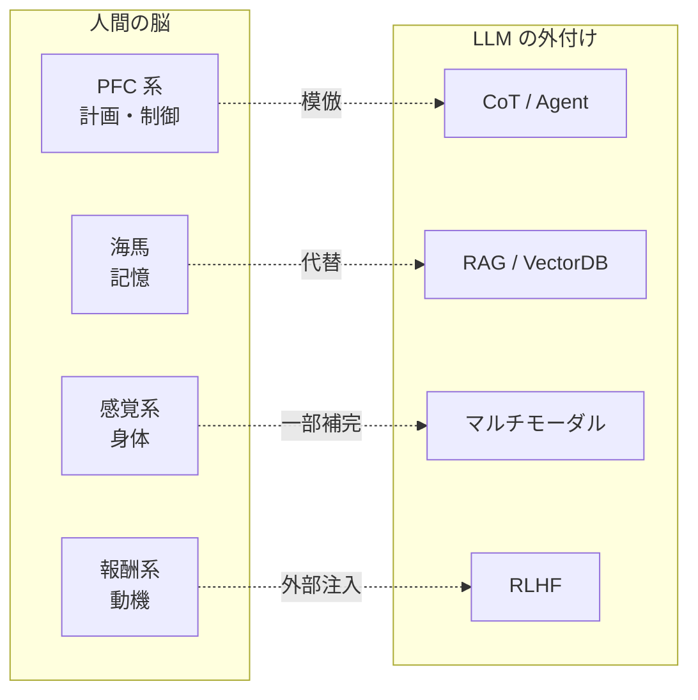

LLM の「喋りは達者だが推論はイマイチ」問題を神経科学から説明する枠組み。人間の脳でも**言語野と思考の領域は別物**であり、失語症患者は言葉を失っても論理や心の理論を保てる。LLM は前者（形式的言語能力）の良いモデルだが、後者（機能的言語能力）は本質的に欠いている。

Mahowald et al., "Dissociating language and thought in large language models" (2024)。

## 2つの言語能力

| | 形式的言語能力 (Formal) | 機能的言語能力 (Functional) |
|---|---|---|
| 定義 | 言語の規則・パターンの知識 | 言語を使って行う思考・推論 |
| 脳の担当 | 言語野（Broca 野、Wernicke 野） | 前頭前皮質、頭頂葉、海馬 等 |
| 失語症の影響 | 失われる | 保たれる |
| LLM の達成度 | 高い | 低い（外付けで補っている） |

## 脳の機能系と LLM の対応

人間の脳が持ち LLM が持たない機能系を整理すると、現在の LLM 拡張技術が「何の代替なのか」が明確になる。

### 実行制御・計画 — 前頭前皮質 (PFC) 系

| 脳領域 | 機能 |
|---|---|
| 背外側前頭前皮質 (DLPFC) | 作業記憶、複数ステップ計画、注意の維持 |
| 前頭極 (FPC, BA10) | メタ認知、サブゴール管理 |
| 前帯状皮質 (ACC) | エラー検出、葛藤モニタ |
| 眼窩前頭皮質 (OFC) | 価値評価、選択肢の比較 |

**LLM の代替**: agent ループ、CoT (Chain of Thought)、self-critique — すべて PFC 系の外付け模倣。

### エピソード記憶 — 海馬・側頭葉内側部

| 脳領域 | 機能 |
|---|---|
| 海馬 | 新しい経験を長期記憶に書き込む |
| 嗅内皮質・歯状回 | パターン分離（似た記憶を区別する） |

LLM は事前学習で凍結され、推論時の「体験」は残らない。

**LLM の代替**: RAG、ベクトル DB、長期メモリ。

### グラウンディング — 身体・感覚系

| 脳領域 | 機能 |
|---|---|
| 一次感覚野 (V1, A1, S1) | 生の感覚入力 |
| 後部頭頂葉 | 空間認知、自己と物体の位置関係 |
| 小脳 | 運動制御、タイミング、認知の予測モデル |
| 島皮質 | 内受容感覚（自分の身体状態のモニタ） |

**LLM の代替**: マルチモーダル化で一部補えるが、能動的な探索・身体経験は原理的にない。

### 動機・情動系

| 脳領域 | 機能 |
|---|---|
| 扁桃体 | 情動的顕著性、危険検知 |
| 視床下部 | 恒常性、欲求（空腹・睡眠・性欲） |
| VTA + 側坐核 (ドパミン報酬系) | 報酬予測、好奇心の駆動 |
| 手綱核 | 負の報酬、回避学習 |

**LLM の代替**: RLHF は外から好みを教え込んでいるだけ。内発的動機はゼロ。

### 社会認知 — 心の理論

| 脳領域 | 機能 |
|---|---|
| 内側前頭前皮質 (mPFC) + 側頭頭頂接合部 (TPJ) | 他者の心の状態の推定 |
| 上側頭溝 (STS) | 意図・視線・社会的手がかり |

LLM は言語経由で代理的にこなすが、専門ネットワークではない。

### 自己モデル・主体性

| 脳領域 | 機能 |
|---|---|
| デフォルトモードネットワーク (DMN) | 自伝的自己、内省、未来シミュレーション |
| 島皮質 + 前帯状皮質 | 「これは自分だ」の感覚 |

永続的な自己がないので、会話間で「私」が連続しない。

### 恒常性・学習

| 機能 | 脳の仕組み | LLM |
|---|---|---|
| 覚醒・生命維持 | 脳幹、自律神経系 | 「疲れる」「飽きる」が原理的に存在しない |
| リアルタイム学習 | シナプス可塑性 (LTP/LTD) | 重みは推論中に変わらない。in-context learning は作業記憶レベルの代替 |

## LLM 拡張技術の神経科学的対応

## Links

- [Dissociating language and thought in large language models (Mahowald et al., 2024)](https://arxiv.org/abs/2301.06627)

## 関連

- [[executive-function|実行機能]] — PFC 系。agent ループ・CoT の神経科学的対応物
- [[episodic-memory|エピソード記憶]] — 海馬系。RAG・ベクトル DB の対応物
- [[symbol-grounding|記号接地問題]] — 身体・感覚系の欠如がもたらす根本問題
- [[reward-system|報酬系と内発的動機]] — ドパミン報酬系。RLHF の対応物
- [[theory-of-mind|心の理論]] — 社会認知。LLM が言語経由で代理する構造
- [[human-vs-ai-text|人間の文章 vs AI 文章]] — 形式的能力は高いが機能的能力を欠くことが "AIっぽさ" として表れる
- [[llm-social-simulation|LLM ソーシャルシミュレーション]] — 内的心理の欠如が、人間集団シミュレーションの妥当性の天井になる
- [[error-messages-for-ai-agents]] — 識別子を全消ししてもモデルがアルゴリズムを再構築＝形式から機能を引き出す能力の実証
