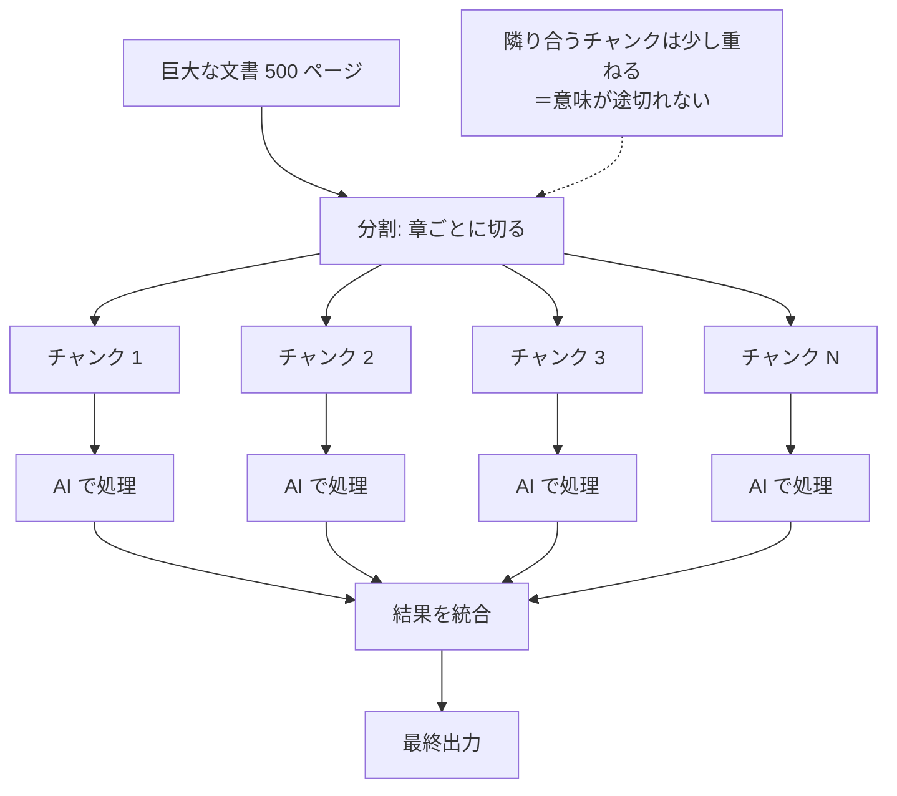

FractoP (Fractal Processor) — LLM のコンテキスト上限を超えるテキストを fractal に分割・並列処理・統合する。500 ページの PDF や 10,000 ファイルのコードベースを単一の fluent pipeline で処理。

## 何ができる？

長すぎて AI が一度に読めない文書（500 ページの PDF など）を、AI が読める大きさに自動で切り分けて、複数を同時並行で処理し、最後に結果をまとめ直します。マトリョーシカ人形のように「大きな箱を開けると小さな箱、それを開けるとさらに小さな箱」と分割し、各サイズで同じ手順で処理して合体させるイメージです。料理に例えると「丸ごとの牛 1 頭はまな板に乗らないので、ブロックに分け、班ごとに並行調理し、最後に盛り付ける」流れです。これにより、本一冊の要約や数千件のレビュー分析を 1 回の指示で済ませられます。

## 用語

- **LLM**: 文章を読んで答える AI（ChatGPT の中身）
- **コンテキスト上限**: AI が一度に読める文字数の限界。人間で言う「一息で読める量」
- **トークン**: AI が文章を数える単位。日本語だと 1 文字 ≒ 1〜2 トークンが目安
- **チャンク**: 大きな文書を切り分けた一片。本でいうと「章」や「節」
- **オーバーラップ**: チャンクの繋ぎ目で前後を少し重ねること。文の途中で切れて意味が分からなくならないようにする保険
- **fractal（フラクタル）**: 全体と部分が同じ形をしている構造。マトリョーシカ人形やブロッコリーのイメージ
- **並列処理**: 複数のチャンクを同時に処理すること。1 人で順番にやるより速い
- **マージ（統合）**: 分割処理した結果を 1 つにまとめ直す作業
- **retry**: 失敗したらやり直す機能。電話が繋がらなかったら掛け直す
- **circuit breaker**: 障害が続くと一時停止する安全装置。ブレーカーのように落ちる
- **rate limit**: AI 業者が決めた「1 分あたり何回まで」の上限
- **fluent pipeline**: 処理の手順を文章のように繋げて書く方式

## 仕組み



大きな入力を小さな塊に切り → 並列で AI に処理させ → 結果を 1 つに統合する、という Map-Reduce 的な流れです。失敗時は自動で再試行し、業者の処理上限を超えないよう同時実行数を制御します。

## Core Idea

GPT-4 は 128K、Claude は 200K、Gemini ですら 2M で頭打ち。500 ページの PDF や百万件のレビューを直接 LLM に渡すと失敗する。FractoP は context-preserving overlap 付きでチャンク化し、並列処理し、結果をマージする。

```ts
// 失敗
await llm.process(entire500PagePDF); // Error: Context length exceeded

// 成功
await fractop()
  .withLLM(llm)
  .chunking({ size: 3000, overlap: 300 })
  .parallel(5)
  .run(entire500PagePDF);
```

## 設計方針

- **Fluent API** — チェーン可能な pipeline 構築
- **Smart Chunking** — overlap でコンテキスト保持
- **Parallel Processing** — 並列度を `.parallel(n)` で制御
- **Reliability** — timeout, retry, circuit breaker
- **[[unillm|UnillM]] 統合** — 任意のプロバイダで動作
- **Streaming** — [[nagare]] の `Stream<T>` ベース

## API

```ts
fractop<T>()
  .withLLM(fn | unillmConfig)
  .chunking({ size: 3000, overlap: 300 })
  .parallel(5)
  .retry(3, 1000)
  .timeout(30000)
  .context(asyncFn)         // 全文からグローバル文脈を生成
  .process(asyncFn)          // チャンク + 文脈で処理
  .merge(strategy | fn)      // 結果統合
  .minResults(50)
  .run(text);
```

## 使用例

### UnillM 統合

```ts
const entities = await fractop<Entity[]>()
  .withLLM({
    model: 'anthropic:claude-3-5-haiku',
    credentials: { anthropicApiKey: process.env.ANTHROPIC_API_KEY },
    messages: (chunk) => [
      { role: 'system', content: 'Extract entities as JSON.' },
      { role: 'user', content: chunk }
    ],
    transform: (response) => JSON.parse(response.text)
  })
  .run(document);
```

### Streaming with [[nagare]]

```ts
import { fractopStream } from '@aid-on/fractop';

const stream = fractopStream(largeDocument)
  .withLLM(processChunk)
  .chunking({ size: 2000, overlap: 200 })
  .parallel(3)
  .stream();

await stream
  .map(result => result.toUpperCase())
  .filter(result => result.length > 100)
  .take(10)
  .collect();
```

### Batch Processing

```ts
const results = await fractopBatch(documents)
  .withLLM(summarize)
  .chunking({ size: 2000 })
  .collectAll();
// Map<string, T[]>
```

## デフォルト設定

```ts
{
  chunkSize: 3000,
  overlapSize: 300,
  concurrency: 3,
  maxRetries: 2,
  retryDelay: 1000,
  chunkTimeout: 30000
}
```

## 性能チューニング

- **chunk size**: 2000-4000 (LLM token limit とのバランス)
- **overlap**: chunk size の 10-20%
- **concurrency**: プロバイダの rate limit に合わせて 3-5
- **streaming**: 100KB 超は `fractopStream`
- **batching**: 複数文書は `fractopBatch`

## 関連

- [[unillm]] — LLM プロバイダ抽象
- [[nagare]] — Streaming pipeline
- [[templex]] / [[iteratop]] — 同じ Aid-On *oP 系列
- [[memory-rag]] — チャンク + retrieval 軸の対比

## Links

- [GitHub](https://github.com/Aid-On/fractop)
- [npm](https://www.npmjs.com/package/@aid-on/fractop)
