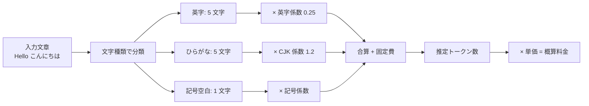

軽量・高速な fuzzy トークン推定ライブラリ。CJK (中国語・日本語・韓国語) の混在テキストに対して、tokenizer を呼ばず文字種別の統計から推定する。

## 何ができる？

AI に文章を送る前に「この文章を処理したらいくら掛かるか」を素早く見積もる電卓です。タクシーに乗る前にメーターの目安を確認するようなもので、本物の計算（正確な料金計算機）より軽くて速い「概算ツール」です。特に日本語・中国語・韓国語は、英語に比べて 1 文字あたりの料金が高くなりやすいので、見積もりを甘くすると予算オーバーします。fuzztok は文字の種類（漢字、ひらがな、英字、記号）ごとに違う係数を掛けて、本格計算なしで近い値を出します。月額予算の管理や「長すぎる文章を送る前に止める」用途に向いています。

## 用語

- **トークン**: AI が文章を扱う単位。英語は単語に近く、日本語は 1 文字 ≒ 1〜2 トークン
- **トークナイザ**: 文章を正確にトークンに切り分ける本格的な道具。重い
- **fuzzy（ファジー）**: 「だいたい」「おおよそ」の意味。完璧でなく十分近い値
- **CJK**: 中国語（C）・日本語（J）・韓国語（K）の総称。漢字圏の文字
- **tiktoken**: OpenAI が公式に出している正確なトークン計算機。Python 製で重い
- **エッジ環境**: ユーザーに近い軽量サーバ。重いライブラリは載せにくい
- **pre-flight check**: 出発前の事前チェック。実際に AI を呼ぶ前の確認
- **DI (依存注入)**: 部品を外から差し込める設計。料金表を後から付け替えられる
- **streaming（ストリーミング）**: 流れてくる文章を順次処理すること
- **batch（バッチ）**: 複数まとめて一括処理すること
- **overhead（オーバーヘッド）**: 本文以外に必ず掛かる固定費。手紙の封筒代のようなもの
- **Unicode**: 世界の文字を統一的に番号付けした規格

## 仕組み



文章を文字の種類ごとに分け、それぞれに違う係数を掛けて足し合わせるだけのシンプルな見積もり方式です。本物のトークナイザを呼ばないので、ブラウザでもエッジサーバでも軽快に動きます。

## Core Idea

OpenAI 公式の tiktoken は速いが Python 系で重い。エッジ環境や Pre-flight チェックでは「正確な値」より「軽くて十分近い値」が欲しい。fuzztok は文字種別 (英字 / CJK / 数字 / 記号 / 空白) ごとの係数で素早く推定する。

## Features

- **CJK サポート** — 簡体・繁体中国語、ひらがな・カタカナ・漢字、ハングル
- **DI ベース** — モデル設定を ModelConfigProvider で注入
- **Detailed Analysis** — 文字種別の breakdown
- **Batch / Streaming** — まとめ推定とストリーミング対応
- **Cost Calculation** — トークン → コスト換算
- **Debug Tools** — 推定内訳の可視化

## 使用例

### Basic

```ts
import { createSimpleFuzzyEstimator } from '@aid-on/fuzztok';

const modelConfigs = {
  'gpt-3.5-turbo': {
    charsPerToken: 4,
    overhead: 10,
    cjkTokensPerChar: 1.2,
    mixedTextMultiplier: 1.05,
    numberTokensPerChar: 3.5,
    symbolTokensPerChar: 2.5,
    whitespaceHandling: 'compress'
  }
};

const estimator = createSimpleFuzzyEstimator(modelConfigs, 'gpt-3.5-turbo');

const tokens = estimator.estimate('Hello, world! こんにちは！');
const detailed = estimator.estimateDetailed('Hello, world! こんにちは！');
```

### Custom Model Provider

```ts
import { FuzzyTokenEstimator } from '@aid-on/fuzztok';

class CustomModelProvider {
  getConfig(modelName) {
    return {
      charsPerToken: 4,
      overhead: 10,
      cjkTokensPerChar: 1.2,
      mixedTextMultiplier: 1.05
    };
  }

  getSupportedModels() {
    return ['custom-model-1', 'custom-model-2'];
  }
}

const estimator = new FuzzyTokenEstimator(new CustomModelProvider());
```

### Cost Calculation

```ts
import { TokenCostCalculator } from '@aid-on/fuzztok';

class MyCostProvider {
  getCost(model) {
    return { input: 0.0015, output: 0.002 }; // per 1K tokens
  }
}

const calculator = new TokenCostCalculator(new MyCostProvider());
const cost = calculator.calculate('gpt-3.5-turbo', 1000, 500);
console.log(cost.formattedTotal); // "$2.25"
```

### Streaming

```ts
async function* textStream() {
  yield "Hello ";
  yield "world ";
  yield "こんにちは！";
}

for await (const result of estimator.estimateStream(textStream())) {
  console.log(`chunk=${result.chunk}, tokens=${result.tokens}, total=${result.total}`);
}
```

## Configuration

```ts
interface FuzzyModelConfig {
  charsPerToken: number;          // base ratio
  overhead: number;                // base overhead
  cjkTokensPerChar: number;        // CJK 係数
  mixedTextMultiplier: number;     // 混在テキスト補正
  numberTokensPerChar?: number;
  symbolTokensPerChar?: number;
  whitespaceHandling?: 'ignore' | 'count' | 'compress';
}
```

## CharacterClassifier

```ts
CharacterClassifier.isCJKCharacter(char);
CharacterClassifier.getCharacterType(char);
CharacterClassifier.analyzeTextComposition(text);
```

CJK Extension A-G、互換漢字、ハングル互換まで対応。

## 関連

- [[llm-throttle]] — `estimatedTokens` の入力として利用
- [[llm-queue-dispatcher]] — `tokenInfo.estimated` の算出
- [[unillm]] — LLM 呼び出し前の pre-flight check

## Links

- [GitHub](https://github.com/Aid-On/fuzztok)
- [npm](https://www.npmjs.com/package/@aid-on/fuzztok)
