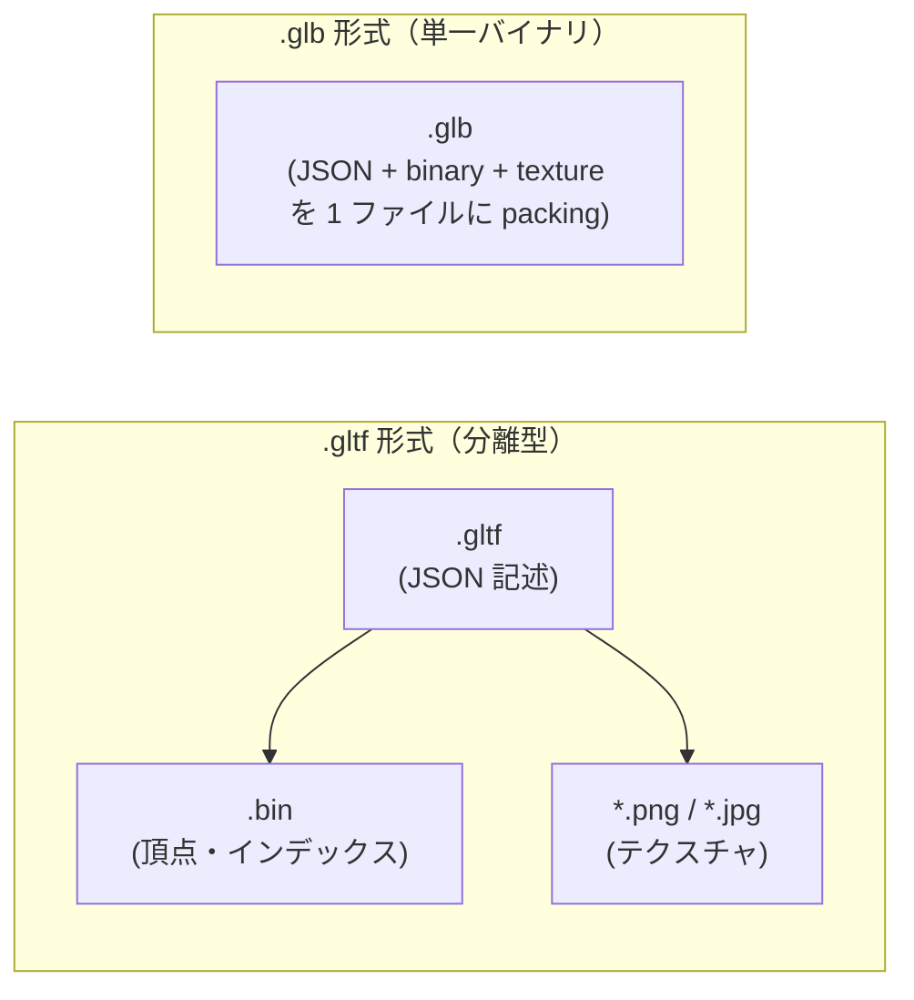
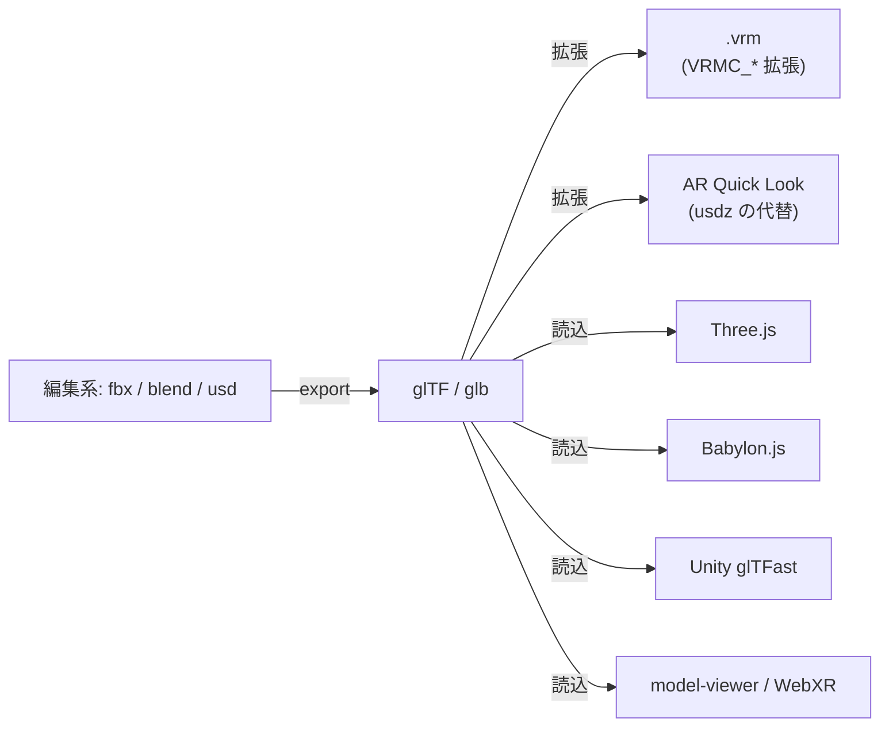

3D シーンとモデルの **ランタイム配信向け** オープン標準。Khronos Group が策定し、しばしば **「3D の JPEG」** と呼ばれる。現行は **glTF 2.0**（2017 公開、以後拡張で進化）。Web・モバイル・AR/VR の事実上のデファクト。

## 何のために作られたか

3D ファイルフォーマットは大きく二系統に分かれる：

| 系統 | 例 | 用途 |
|---|---|---|
| **編集向け（オーサリング）** | `.fbx`, `.blend`, `.max`, `.usd(z)` | 制作の途中、ツール間の往復、編集情報の保存 |
| **配信向け（ランタイム）** | **`.gltf` / `.glb`** | アプリ起動時にロード・即描画。サイズ最適、パース高速 |

glTF は「制作データを編集できる形」ではなく、「**できあがった成果物を最短で読んで描画する**」ことに振り切った規格。Three.js / Babylon.js / Unity glTFast / Apple Quick Look / Blender / Substance / model-viewer 等、ほぼすべてが対応。

## 2 種類のファイル形式

| 拡張子 | 中身 | 利点 | 欠点 |
|---|---|---|---|
| `.gltf` | JSON + 別ファイルの .bin + テクスチャ | テキストエディタで JSON が読める、CDN に分散配信できる | 複数ファイルの取り回しが面倒 |
| `.glb` | 上記すべてを 1 ファイルに binary 連結 | 配布が楽、HTTP リクエスト 1 回で済む | エディタで中身を見にくい |

実運用では **`.glb` が主流**（特に Web / VR で配布する際）。

## glTF 2.0 が標準で持っているもの

- **メッシュ**（頂点・法線・UV・接線・スキニング weights）
- **マテリアル** — **PBR メタリック・ラフネス**モデル（baseColor / metallic / roughness / normal / occlusion / emissive）
- **アニメーション** — キーフレーム（移動 / 回転 / スケール / モーフターゲット）
- **スケルトン**（スキン + ボーン階層）
- **カメラ** / **シーングラフ**
- **モーフターゲット**（表情の差分メッシュ）
- **テクスチャ**（PNG / JPG）

注: 物理演算・コリジョン・ゲームロジックは含まれない。それらは拡張または上位レイヤの仕事。

## 拡張システム（核心）

glTF の真の強さは **拡張** にある。仕様コアを最小に保ち、用途別の機能は `extensions` フィールドで追加する。

| プレフィックス | 意味 |
|---|---|
| `KHR_*` | Khronos 公式（仕様レビュー済み） |
| `EXT_*` | マルチベンダ採用 |
| `<VENDOR>_*` | ベンダ固有（例: `MSFT_*`, `ADOBE_*`, `VRMC_*`）|

代表的な KHR 拡張：

- `KHR_materials_clearcoat` — 車塗装などのクリアコート
- `KHR_materials_transmission` — 半透明・ガラス
- `KHR_materials_volume` — 体積散乱
- `KHR_materials_unlit` — ライティング無視（アニメ調・UI 向け）
- `KHR_draco_mesh_compression` — Draco 圧縮（ファイルサイズ削減）
- `KHR_texture_basisu` — Basis Universal テクスチャ圧縮
- `KHR_lights_punctual` — シーン内のライト
- `KHR_animation_pointer` — アニメ対象を任意プロパティに拡張

**`VRMC_*` は VRM 1.0 が定義したベンダ拡張**。glTF 標準にヒューマノイドアバター用の意味（ボーンマッピング、表情、揺れ、ライセンス）を追加して `.vrm` を成立させている。

## PBR メタリック・ラフネス

glTF が「これだけでとりあえず見られる」ようにするため、デフォルトのマテリアルモデルとして **PBR Metallic-Roughness**（pbrMetallicRoughness）を採用：

- `baseColor` — ベースの色（RGBA）
- `metallic` — 金属度（0=非金属、1=金属）
- `roughness` — 粗さ（0=つるつる、1=ざらざら）
- `normal` — 法線マップ
- `occlusion` — アンビエントオクルージョン
- `emissive` — 自己発光

統一的な物理ベースなので、Substance や Blender で書き出したモデルが Three.js で同じ見た目になる、という相互運用性の根拠。

## glTF と類似フォーマットの位置関係

- **fbx**: Autodesk の編集向け。glTF への変換は Blender や FBX2glTF で行う
- **usd / usdz**: Pixar 起源。映画・大規模シーン記述に強く、Apple AR 標準。ランタイム配信は usdz（AR Quick Look） vs glTF（Web 全般）の住み分け
- **VRM**: glTF + ヒューマノイド拡張（vrm ノート参照）

## 押さえどころ（カード化候補）

- glTF が解決した課題 → **3D シーンの「ランタイム配信」を標準化した。編集向け fbx 等とは目的が違う**
- `.gltf` と `.glb` の違い → **`.gltf` は JSON + 別の .bin + テクスチャの分離型。`.glb` は全部 1 ファイルにバイナリ連結したもの**
- glTF 2.0 のデフォルトマテリアル → **PBR Metallic-Roughness（baseColor / metallic / roughness）**
- glTF の拡張プレフィックス → **`KHR_*`(Khronos公式)、`EXT_*`(マルチベンダ)、`<VENDOR>_*`(ベンダ固有)**
- 「3D の JPEG」と呼ばれる理由 → **配信に最適化された 1 ファイルで、どのランタイムでもほぼ同じ見た目で開けるデファクト形式だから**
- glTF と VRM の関係 → **VRM は glTF 2.0 をベースに `VRMC_*` ベンダ拡張でヒューマノイド情報を載せたもの**

## Links

- [glTF 公式 (Khronos)](https://www.khronos.org/gltf/)
- [glTF 2.0 仕様](https://registry.khronos.org/glTF/specs/2.0/glTF-2.0.html)
- [Khronos glTF 拡張一覧](https://github.com/KhronosGroup/glTF/tree/main/extensions)
- [glTF サンプルモデル集](https://github.com/KhronosGroup/glTF-Sample-Models)

## 関連

- [[vrm|VRM]] — glTF 2.0 + VRMC 拡張によるヒューマノイドアバター規格
- [[nendo]] — Almide で glTF/VRM をパース・レンダリングするプロジェクト
- [[fbx|FBX]] — DCC ツール間の交換フォーマット。glTF はランタイム配信向け
- [[blender|Blender]] — glTF インポート/エクスポートに対応
