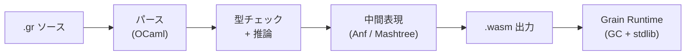
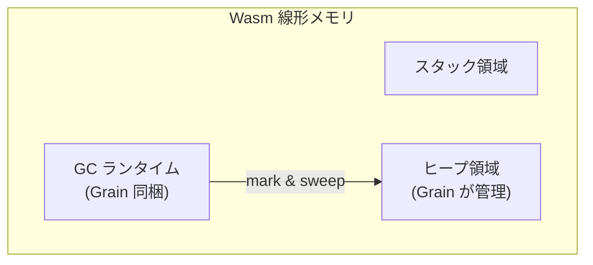

**WebAssembly をネイティブターゲットとする関数型プログラミング言語。** 既存言語を Wasm に移植するのではなく、最初から Wasm 専用として設計された点が特徴。Oscar Spencer と Philip Blair が開発、OSS (MIT)。

## なぜ Grain が存在するか

多くの言語は「既存の言語 → Wasm バックエンド追加」というアプローチ（Rust, C++, Go など）。この場合 Wasm は二次ターゲットであり、言語設計自体は Wasm の制約を考慮していない。

Grain は逆方向：**Wasm の実行モデルに合わせて言語を設計**した。線形メモリ、関数テーブル、モジュール境界といった Wasm の構造を言語側から自然に活用できる。

## 言語の特徴

| 特徴 | 内容 |
|---|---|
| 型システム | 静的型付け、Hindley-Milner ベースの型推論 |
| パラダイム | 関数型主体（式ベース）、命令的スタイルも可 |
| データ型 | 代数的データ型（enum / record）、パターンマッチング |
| モジュール | ファイル = モジュール。`from` / `use` で import |
| GC | 独自 GC を Wasm 線形メモリ上で実行 |
| コンパイラ | OCaml 実装 → Wasm バイナリを直接出力（LLVM 不使用） |
| 拡張子 | `.gr` |

## コード例

```grain
// 再帰で階乗
let rec factorial = (n) => {
  if (n <= 1) 1
  else n * factorial(n - 1)
}

print(factorial(10))
```

```grain
// 代数的データ型とパターンマッチング
enum Shape {
  Circle(Number),
  Rectangle(Number, Number),
}

let area = (shape) => {
  match (shape) {
    Circle(r) => Float64.mul(3.14159, Float64.mul(r, r)),
    Rectangle(w, h) => Float64.mul(w, h),
  }
}
```

```grain
// モジュールシステム: provide で公開、from/use で取り込み
module Main

from "list" use List
from "option" use Option

provide let double = (xs) => {
  List.map((x) => x * 2, xs)
}

print(double([1, 2, 3])) // [2, 4, 6]
```

## コンパイルパイプライン



LLVM を経由せず、**独自の中間表現から直接 Wasm バイナリを生成**する。コンパイラ自体は OCaml で書かれている。

## メモリ管理

Grain は Wasm の線形メモリ上に**独自の GC ランタイム**を載せている。WasmGC (Wasm ネイティブの GC 提案) ではなく、従来のアプローチ。

- ヒープは線形メモリ内に確保
- GC ランタイムが Wasm モジュールに同梱される
- バイナリサイズにオーバーヘッドがある（最小でも数十 KB の GC ランタイム込み）



## ツールチェイン

| コマンド | 用途 |
|---|---|
| `grain compile file.gr` | `.gr` → `.wasm` コンパイル |
| `grain run file.gr` | コンパイル + 即実行 |
| `grain doc file.gr` | ドキュメント生成 |
| `grain format file.gr` | コードフォーマッタ |
| `grain lsp` | LSP サーバ（エディタ補完・診断） |

`grain run` は内部で Wasmtime を使って実行する。ブラウザ向けには `.wasm` を書き出して JavaScript から `WebAssembly.instantiate` で読み込む。

## Wasm を一次ターゲットにした言語たち

| 言語 | パラダイム | GC | コンパイラ実装 |
|---|---|---|---|
| **Grain** | 関数型 | 自前 GC（線形メモリ） | OCaml |
| **AssemblyScript** | TypeScript 風 | 自前 GC（線形メモリ） | TypeScript |
| **Moonbit** | 関数型 + OOP | WasmGC | Rust |
| [[almide\|Almide]] | LLM 最適化 | なし（Rust 経由で所有権） | Rust |

Grain と Moonbit は同じ「Wasm ネイティブ関数型」だが、GC 戦略が異なる。Moonbit は WasmGC を採用し、Grain は自前 GC。WasmGC 対応ランタイム（V8, SpiderMonkey）では Moonbit が有利だが、WasmGC 非対応環境では Grain のアプローチが動く。

## 制限・課題

- **バイナリサイズ**: GC ランタイム同梱のため、最小でも数十 KB。AssemblyScript や Rust (wasm-bindgen) と比較して不利
- **エコシステム**: 若い言語のためライブラリが少ない。npm や crates.io のような大規模パッケージレジストリはまだない
- **Wasm 専用**: ネイティブバイナリを出力できない。CLI ツールや OS レベルのプログラムを書く用途には向かない
- **WasmGC 未対応**: 線形メモリ上の自前 GC は、WasmGC 対応ランタイムの最適化（ホスト GC との統合、escape analysis）を活用できない
- **デバッグ**: Wasm のデバッグツール自体がまだ発展途上。ソースマップ対応は限定的

## 押さえどころ（カード化候補）

- Grain は何か → **Wasm を唯一のターゲットとして設計された関数型言語。既存言語の移植ではなく、Wasm の実行モデルに合わせて言語を設計**
- コンパイラの特徴 → **OCaml で実装、LLVM を使わず独自 IR (Anf / Mashtree) から直接 Wasm バイナリを生成**
- GC 戦略 → **Wasm 線形メモリ上に独自 GC ランタイムを載せる。WasmGC ではなく従来アプローチ。バイナリサイズにオーバーヘッド**
- 型システム → **静的型付け、Hindley-Milner ベースの型推論。代数的データ型 + パターンマッチング**
- モジュールシステム → **ファイル = モジュール。`provide` で公開、`from "module" use Module` で取り込み**
- Moonbit との違い → **どちらも Wasm ネイティブ関数型だが、Grain は自前 GC（広い互換性）、Moonbit は WasmGC（ホスト最適化を活用）**

## Links

- [Grain 公式](https://grain-lang.org/)
- [GitHub (grain-lang/grain)](https://github.com/grain-lang/grain)
- [Grain Standard Library](https://grain-lang.org/docs/stdlib/pervasives)

## 関連

- [[wasm-core|WebAssembly Core]] — Grain のコンパイルターゲット
- [[functional-programming|関数型プログラミング]] — Grain の属するパラダイム
- [[almide|Almide]] — 同じく Wasm をターゲットとする言語（設計思想は異なる）
- [[wasmtime]] — `grain run` が内部で使う Wasm ランタイム
- [[programming-language|プログラミング言語]] — 言語一覧
