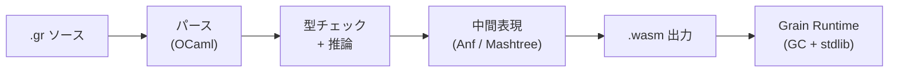

**WebAssembly をネイティブターゲットとする関数型プログラミング言語。** 既存言語を Wasm に移植するのではなく、最初から Wasm 専用として設計された点が特徴。Oscar Spencer と Philip Blair が開発、OSS (MIT)。

## なぜ Grain が存在するか

多くの言語は「既存の言語 → Wasm バックエンド追加」というアプローチ（Rust, C++, Go など）。この場合 Wasm は二次ターゲットであり、言語設計自体は Wasm の制約を考慮していない。

Grain は逆方向：**Wasm の実行モデルに合わせて言語を設計**した。線形メモリ、関数テーブル、モジュール境界といった Wasm の構造を言語側から自然に活用できる。

## 言語の特徴

| 特徴 | 内容 |
|---|---|
| 型システム | 静的型付け、Hindley-Milner ベースの型推論 |
| パラダイム | 関数型主体（式ベース）、命令的スタイルも可 |
| データ型 | 代数的データ型（enum / record）、パターンマッチング |
| モジュール | ファイル = モジュール。`from` / `use` で import |
| GC | 独自 GC を Wasm 線形メモリ上で実行 |
| コンパイラ | OCaml 実装 → Wasm バイナリを直接出力（LLVM 不使用） |
| 拡張子 | `.gr` |

## コード例

```grain
// 再帰で階乗
let rec factorial = (n) => {
  if (n <= 1) 1
  else n * factorial(n - 1)
}

print(factorial(10))
```

```grain
// 代数的データ型とパターンマッチング
enum Shape {
  Circle(Number),
  Rectangle(Number, Number),
}

let area = (shape) => {
  match (shape) {
    Circle(r) => Float64.mul(3.14159, Float64.mul(r, r)),
    Rectangle(w, h) => Float64.mul(w, h),
  }
}
```

## コンパイルパイプライン



LLVM を経由せず、**独自の中間表現から直接 Wasm バイナリを生成**する。コンパイラ自体は OCaml で書かれている。

## メモリ管理

Grain は Wasm の線形メモリ上に**独自の GC ランタイム**を載せている。WasmGC (Wasm ネイティブの GC 提案) ではなく、従来のアプローチ。

- ヒープは線形メモリ内に確保
- GC ランタイムが Wasm モジュールに同梱される
- バイナリサイズにオーバーヘッドがある（最小でも数十 KB の GC ランタイム込み）

## Wasm を一次ターゲットにした言語たち

| 言語 | パラダイム | GC | コンパイラ実装 |
|---|---|---|---|
| **Grain** | 関数型 | 自前 GC（線形メモリ） | OCaml |
| **AssemblyScript** | TypeScript 風 | 自前 GC（線形メモリ） | TypeScript |
| **Moonbit** | 関数型 + OOP | WasmGC | Rust |
| [[almide\|Almide]] | LLM 最適化 | なし（Rust 経由で所有権） | Rust |

Grain と Moonbit は同じ「Wasm ネイティブ関数型」だが、GC 戦略が異なる。Moonbit は WasmGC を採用し、Grain は自前 GC。WasmGC 対応ランタイム（V8, SpiderMonkey）では Moonbit が有利だが、WasmGC 非対応環境では Grain のアプローチが動く。

## Links

- [Grain 公式](https://grain-lang.org/)
- [GitHub (grain-lang/grain)](https://github.com/grain-lang/grain)
- [Grain Standard Library](https://grain-lang.org/docs/stdlib/pervasives)

## 関連

- [[wasm-core|WebAssembly Core]] — Grain のコンパイルターゲット
- [[almide|Almide]] — 同じく Wasm をターゲットとする言語（設計思想は異なる）
- [[programming-language|プログラミング言語]] — 言語一覧
