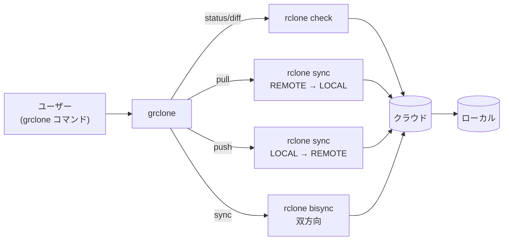

`rclone`（クラウドストレージ同期ツール）の上に乗った薄い git 風 CLI。`git fetch / pull / push` の感覚でクラウドフォルダを操作できる。

## 何ができる？

クラウド上のフォルダ（Google Drive など）と手元の PC のフォルダを、Git みたいなノリで同期できます。「サーバから持ってくる」が `pull`、「サーバに送る」が `push`、「両方の差分を確認」が `status`。普段 git を使い慣れている人なら、新しいコマンド体系を覚える必要なく、クラウド同期もこなせるのが嬉しいところ。

裏側では `rclone` という万能同期ツールが動いていますが、そちらの細かい引数を知らなくても、6 つの動詞（status / pull / push / sync / resync / log）だけで日常のフォルダ同期が完結します。

## 用語

- **rclone**: 複数のクラウドストレージ（Google Drive, S3, Dropbox 等）を統一的に扱える同期ツール。コマンドが豊富すぎる代わりに学習コストが高い。
- **bisync**: 両方向同期。両方の変更を相手に反映する。
- **sync (片方向)**: 片方の状態を相手にコピーして、相手側の差分を消す。
- **dry-run**: 実際には何も変更せず、「もし実行したら何が起きるか」だけ表示するモード。
- **remote**: rclone が知っている同期先の名前（例: `gdrive:somefolder`）。事前に `rclone config` で登録しておく。
- **shell out**: 自分は処理をせず、別のコマンド（ここでは `rclone`）に渡して実行すること。

## 仕組み

`grclone` 自体は状態を持たず、内部で `rclone` を呼び出すだけのラッパー。設定（`GRCLONE_LOCAL`、`GRCLONE_REMOTE`）と動詞だけ理解すれば動く。

## コマンド対応表

| grclone | rclone 相当 | 用途 |
|---|---|---|
| `status` / `fetch` | `check` | 差分一覧 |
| `diff` | `check --combined -` | 詳細な diff |
| `pull` | `sync REMOTE LOCAL` | 取得 |
| `push` | `sync LOCAL REMOTE` | 送信 |
| `sync` | `bisync LOCAL REMOTE` | 双方向同期 |
| `resync` | `bisync ... --resync` | 双方向同期の基準を再構築 |
| `log` | bisync ログ tail | ログ確認 |

## Companion

- [[keiri]] — 経理書類整理 CLI。grclone でクラウド同期したフォルダを keiri で整える運用が想定されている

## 関連

- [[cli|CLI]] — git ライクなコマンド体系
- [[homebrew-tap]] — 将来的に formula 配布予定

## Links

- [GitHub](https://github.com/O6lvl4/grclone)
- [rclone 公式](https://rclone.org/)
