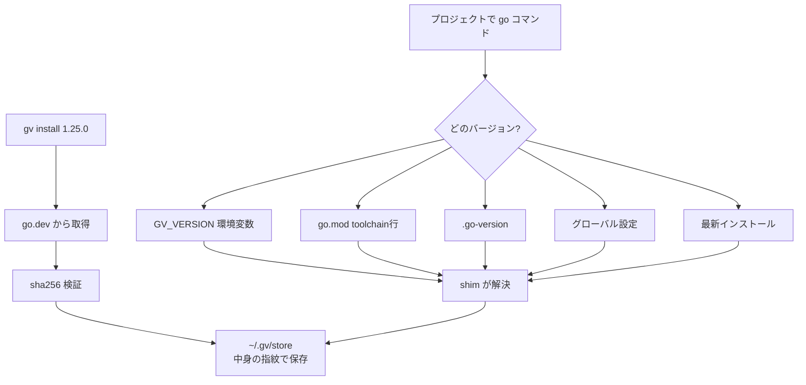

Go のバージョン & ツールチェインマネージャ。uv 級の速度、シングルバイナリ、再現性。

## 何ができる？

Go というプログラミング言語の「バージョン切り替え便利屋」です。仕事用のプロジェクトでは Go 1.25、別の趣味のプロジェクトでは Go 1.21、というふうに同じパソコンで複数バージョンを使い分けたいとき、フォルダごとに「ここではこのバージョン」と自動で切り替えてくれます。Python の pyenv、Node.js の nvm、Python の uv と同じ役目を、Go のためにこなすツールです。

何が嬉しいかというと、新しいメンバーがプロジェクトに参加してもコマンド一発で全員が同じバージョンを使える状態になり、「私のパソコンでは動くのに」というトラブルが起きにくくなる点です。

## 用語

- **Go**: Google が作ったプログラミング言語。サーバーソフトの開発で人気。
- **toolchain**: 「コンパイラ・標準ライブラリ・ビルド道具」一式。Go ではバージョンごとに一式存在する。
- **uv**: Python 用の超高速バージョン管理ソフト。gv はその Go 版を目指している。
- **シングルバイナリ**: 「実行ファイル一つだけ」で動くこと。インストールが楽。
- **go.mod**: Go プロジェクトの「使うバージョンと依存ライブラリ」を書いたファイル。
- **content-addressed store**: ファイルを「中身の指紋」で管理する保存方式。同じ内容なら一度しか保存しないので無駄が減る。
- **シェルアクティベーション**: ターミナルを開くたびに環境変数を書き換える方式。遅くなる原因になるので gv は避けている。
- **shim**: IDE などから呼ばれたとき、適切なバージョンに振り分ける仲介役プログラム。
- **`gv.lock`**: 全員が同じツール群を使えるよう、確定したバージョンを記録したファイル。
- **CI**: コード変更のたびに自動でテストや検査を走らせる仕組み。`--frozen` を付けるとロック内容と完全一致する状態を強制できる。

## 仕組み



利用者が `gv install` で Go を入れると、中身の指紋で識別される保管庫に置かれます。`go` コマンドが呼ばれた時、シムが「今いる場所」「環境変数」「設定ファイル」を順に見て、どのバージョンを使うか自動判定します。シェルを汚さないので動作が高速です。

## Core Idea

`gv` は Go にとっての `uv` — Rust 製の単一バイナリがツールチェイン・プロジェクトツール・再現可能インストールを所有する。シェルアクティベーションのオーバーヘッドや shell 汚染なし。

## Why gv

- **`go.mod` の `toolchain` 行を一級のソースとして読む。** 既存マネージャは無視する。`gv` はこれを正典化する。移行コストゼロ
- **`go install` をグローバルツールで置き換え。** `gopls`, `golangci-lint`, `dlv`, `mockgen`, `sqlc` を `gv.toml` でピン、`gv.lock` でロック、CI で再現
- **Content-addressed store。** SDK とツールを sha256 でプロジェクト間 dedup（pnpm/uv 方式）
- **シェルアクティベーション不要。** IDE 互換性のためのオプショナル 1ms `execve` shim
- **並列ダウンロード・並列展開。** Tokio + reqwest + rustls。OpenSSL なし
- **`GOTOOLCHAIN=local` 強制。** Go ランタイムからの不意なダウンロードを禁止

## Resolution order

1. `GV_VERSION` env var
2. `go.mod` の `toolchain` 行（CWD から上方探索）
3. `.go-version`（CWD から上方探索）
4. `~/.config/gv/global`
5. 最新インストール

`gv current` は選択バージョンと理由の両方を出力する。

## Quickstart

```bash
gv add 1.25.0                      # add toolchain (writes go.mod toolchain line)
gv add tool gopls                  # pin a tool
gv add tool golangci-lint@v1.64    # version-pinned tool
gv sync                            # reconcile installs with gv.lock
gv run go test ./...               # run with the resolved toolchain
gv run gopls                       # tools work the same way
gv tree                            # visualize resolution
gv current                         # explain why this version is active
gv doctor                          # health check
```

## ツールピン解決の核心

`gv add tool gopls` 実行時:

- `proxy.golang.org` で解決
- `sum.golang.org`（Go canonical checksum DB）からディレクトリハッシュ取得
- 解決されたツールチェインでビルド
- `gv.lock` に全記録

`gv sync --frozen` は CI 用 — lock を変更せず、`gv.toml` が `gv.lock` より進んでいたら失敗。

## Architecture

- `gv-core` — マニフェスト、ロック、解決、レジストリクライアント
- `gv-cli` — argv[0] dispatch (`gv` vs `gvx`)、コマンド surface
- `gv-shim` — 400KB の execve dispatcher（IDE 互換用）
- 基盤: [[anyv-core]]（paths, extract, sha verification, presentation, self-update）

## Distribution

- `install.sh` / `install.ps1` — GitHub Release から自動取得
- Homebrew tap: `O6lvl4/tap/gv`（[[homebrew-tap]] 経由、リリースで自動 bump）
- `cargo install --git`

## Links

- [GitHub](https://github.com/O6lvl4/gv)
