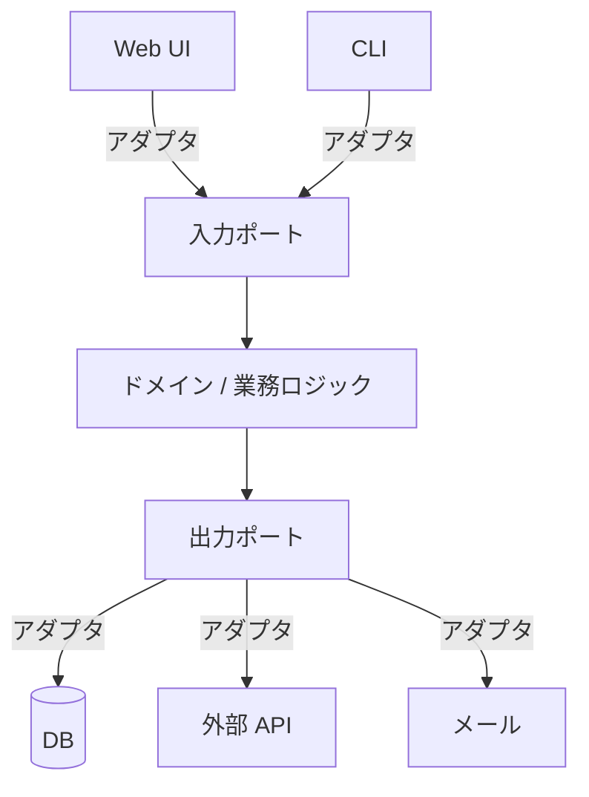

中心の業務ロジックを、外側の枝葉（DB・UI・API）から守るための六角形の構造設計。

## 何ができる？／なぜ重要？

人間の体を思い浮かべてください。心臓は外気に直接さらされていません。血管・肺・皮膚という何層もの仕組みが間に入って、必要な酸素や栄養だけが心臓に届くようになっています。もし心臓が外気に直接触れていたら、ちょっとした変化で止まってしまいます。ヘキサゴナルアーキテクチャは、この「中心を外気から守る血管系」をソフトウェアでやる設計です。

ソフトウェアの「心臓」は業務ロジック（ドメイン）です。一方、外側にはデータベース、Web UI、外部 API、メールサービスといった「外気」があります。これらは流行や事情で頻繁に変わります。SQL データベースから NoSQL に移ったり、Web UI からモバイルアプリに広がったり。中心と外気を直接つなぐと、外が変わるたびに心臓に手術が必要になります。そこで「ポート」という穴と「アダプタ」という栓で、中心と外を緩やかに切り離します。これにより、外側を別物に差し替えても中心は無傷で済みます。テストも「外を全部ニセ物に差し替えれば中心だけテストできる」という形になります。

## 仕組み

中心の六角形がドメイン、その辺一つ一つがポート、ポートの先に各種アダプタが付きます。アダプタを差し替えれば、UI を変えても DB を替えても、中心はまったく書き換えずに済みます。

## 用語

- **ヘキサゴナル**: 「六角形の」。各辺がポートを意味する図示の比喩。
- **ポート**: 中心が外と話すための「決められた穴（インターフェース）」。
- **アダプタ**: ポートに差し込む具体的実装（DB ドライバ、HTTP ハンドラ等）。
- **Ports and Adapters**: ヘキサゴナルの別名。
- **ドメイン層**: 業務ロジックの本体。外に依存しない。
- **アプリケーション層**: ドメインを呼び出して使い方を組み立てる層。
- **インフラ層**: アダプタの集まる外側の層。
- **依存性逆転**: 外側が中心の決めたインターフェースに従う原則。

## vault 内での使われ方

- [[memre]] — ドメインを中央に据えた構造で実装
- [[gulp-coach]] — 業務ロジックと外部接続を分離
- [[environment-health-viewer]] — 計測ドメインと表示・収集を分離
- [[macleap]] — UI と外部 API をアダプタとして扱う
- [[aid-on-ui-system]] — UI 側はアダプタとしての扱い
- [[aid-on-contract-generator]] — 契約ドメインを中心に置く構造
- [[aid-on-invoice-generator]] — 請求ドメインを中心に置く構造
- [[aid-on-draft-ui]] — UI アダプタの実例
- [[famulus2]] — ポート/アダプタ的な分離が見られる基盤

## 関連概念

- [[ddd]] — ドメインを中心に据えるという思想の双子
- [[dependency-injection]] — ポートに具体実装を差し込むための手段
- [[effect-system]] — 外との接点を型で縛るアプローチ
- [[sandbox]] — 中央を守る発想の別表現

## Links

- [Wikipedia: Hexagonal architecture](https://en.wikipedia.org/wiki/Hexagonal_architecture_(software))
- [Alistair Cockburn - Hexagonal Architecture](https://alistair.cockburn.us/hexagonal-architecture/)
