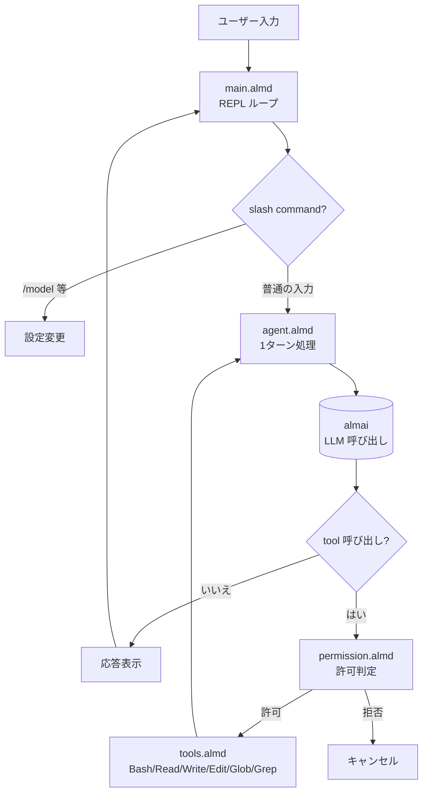

[[almide|Almide]] で書かれた AI エージェント CLI runtime。[[famulus]] / [[famulus2]] と同じ姿だが、土台が異なる—— TypeScript ではなく Almide で実装されている。

## 何ができる？

[[famulus]] や [[famulus2]] と同様に、ターミナルで対話しながら AI にコードを読み書き・実行させる「働く AI 助手」です。違いは中身の素材。homullus は [[almide|Almide]] というプログラミング言語自体で書かれていて、Almide が実用ツールを書くに足る言語であることの証明（自己言及）にもなっています。

ラテン語で「小さく作られた人」を意味する名前のとおり、コンパクトで自律的なエージェント。エージェントを Almide で書くことで、Almide の標準ライブラリの不足箇所を浮き彫りにし、言語自体の改善にフィードバックされる—— **言語にとって自分自身でツールを書くことが圧力テスト** になっています。

## 用語

- **エージェント**: 指示を受けて自分で考え、必要な道具を順に使う AI 助手プログラム。
- **REPL**: Read-Eval-Print Loop。対話的にコマンドを入力 → 実行 → 結果表示を繰り返す画面。
- **REPL slash command**: `/model` `/tools` のように `/` で始まる REPL 内コマンド。設定変更・ヘルプ等。
- **multi-provider**: Anthropic、OpenAI、OpenRouter、Cloudflare、Azure、Google、Bedrock など複数の AI 業者を切替可能。
- **permission mode**: ツール実行の許可レベル（`default` / `accept-edits` / `bypass`）。
- **dangerous-pattern detection**: `rm -rf`、`curl | sh` 等の危険な Bash パターンを検出して、`bypass` モードでも確認を求める仕組み。
- **exponential backoff**: API がレート制限（429）やサーバエラー（5xx）を返したとき、待ち時間を指数的に伸ばしてリトライする方式。
- **tool roundtrip**: AI が「このツールを使え」と指示 → ツール実行 → 結果を AI に戻す、の往復。
- **smoke test**: 最小限の動作確認テスト。REPL なしで 1 回 LLM を呼んで往復するだけ。

## 仕組み



`main.almd` が指揮者。状態（モデル / モード / 履歴 / システムプロンプト）はグローバル変数を使わず、再帰呼び出しで引き渡される。

## ファイル構成

```
homullus/
├── almide.toml          パッケージ定義、依存: almai
└── src/
    ├── main.almd        REPL、slash commands、state threading
    ├── agent.almd       1ターンの query + tool loop
    ├── tools.almd       Bash/Read/Write/Edit/Glob/Grep dispatch
    ├── permission.almd  3 モード解決 + 危険パターン検出
    └── smoke.almd       非対話的な end-to-end チェック
```

## v0.0.1 の機能

- **REPL** + slash commands（`/model`、`/tools`、`/trust`、`/clear`、`/help`、`/exit`）
- **6 ツール**: Bash, Read, Write, Edit, Glob, Grep
- **multi-provider**: [[almai]] 経由で 8 業者対応
- **3 モード**: `default`（read 自動、他は確認）/ `accept-edits`（read+write 自動）/ `bypass`（全自動）
- **dangerous-pattern detection** for Bash
- **retry with exponential backoff** on 429/5xx
- **native tool roundtrip** — `assistant.tool_calls` ↔ `role:"tool"`

## [[famulus]] / [[famulus2]] との関係

| | famulus / famulus2 | homullus |
|---|---|---|
| 言語 | TypeScript | Almide |
| プロバイダ層 | [[unillm]] | [[almai]] |
| 思想 | LLM は判断、実行は決定論 | 同上 |
| 二重目的 | エージェント自体 | エージェント + Almide の圧力テスト |

「Same shape, different substrate」（同じ姿、異なる土台）。

## 関連

- [[almide]] — 実装言語
- [[almai]] — 依存ライブラリ（multi-provider LLM クライアント）
- [[famulus]] / [[famulus2]] — 思想的な姉妹プロジェクト（TypeScript 版）
- [[claude-code]] — 元祖となる AI エージェント CLI
- [[agentic-coding]] — このプロジェクトが体現するパラダイム
- [[mcp|MCP]] — ロードマップで対応予定

## Links

- [GitHub](https://github.com/almide/homullus)
