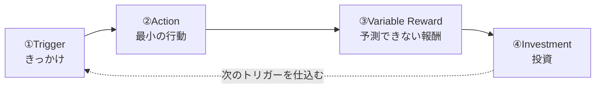

Nir Eyal が *Hooked: How to Build Habit-Forming Products* (2014) で提唱した、習慣形成型プロダクトの設計フレーム。**Trigger → Action → Variable Reward → Investment** の4段を1サイクルとし、これを反復させることで、外部の刺激がなくても自発的に戻ってくる**習慣（habit）**を作る。

核心は最後の investment が**次の trigger を仕込む**点：ループが閉じて自己駆動する。だから一過性の「面白さ」ではなく、累積的なロックインになる。

## 4つのフェーズ

| フェーズ | 内容 | 効くメカニズム |
|---|---|---|
| ① Trigger | 行動のきっかけ。**外的**（通知・メール・広告）から始まり、反復で**内的**（退屈・不安・寂しさといった感情）へ移行する | 内的トリガーが定着すると、感情と行動が直結し「無意識に開く」状態になる |
| ② Action | 報酬を期待して取る、最小限の行動（スクロール・タップ・検索） | 行動が起きるには **動機 × 能力 × トリガー**（Fogg の行動モデル）が同時に必要。摩擦を極限まで下げる |
| ③ Variable Reward | 約束された報酬。ただし**量・内容が予測できない** | 予測不能性がドパミン系を強く刺激する（[[reward-system]] の報酬予測誤差）。Eyal は3類型を挙げる（下記） |
| ④ Investment | ユーザーが時間・データ・労力・社会的資本を注ぎ込む（フォロー・投稿・設定・蓄積） | 投資が①保有効果でスイッチングを重くし、②次回の体験を良くして**次のトリガーを準備**する |

## なぜ効くか — 「投資が次のトリガーを仕込む」

普通のフィードバックループは reward で閉じる。Hooked が強いのは**4段目 investment** を置いた点にある。

- ユーザーの投資（フォロー、設定、データ蓄積）が、サービス側に**次に通知すべき理由**を与える。フォローした相手が投稿した → 通知（次の trigger）。
- 投資はサンクコストと保有効果を積み増し、乗り換えコストを上げる（[[behavioral-economics]] 参照）。
- ループを回すほど trigger が外的→内的に移り、最終的に**運営の介入なしで回る**。これが「習慣化＝最強のリテンション」。

## Variable Reward の3類型（Eyal）

| 類型 | 内容 | 例 |
|---|---|---|
| Rewards of the Tribe | 社会的報酬（承認・つながり） | いいね、コメント、フォロワー |
| Rewards of the Hunt | 資源・情報の探索 | フィードのスクロール、検索結果 |
| Rewards of the Self | 達成・習熟・支配感 | レベルアップ、タスク完了、コレクション |

**可変性（不確実さ）が肝**。常に同じ報酬だと予測されてドパミン応答が消え、習慣が壊れる（[[reward-system]] の「予期通りの報酬＝発火なし」と一致）。

## 注意 — 倫理（Manipulation Matrix）

Eyal 自身が、習慣形成は中立な道具であり乱用しうると警告し、判断軸として **Manipulation Matrix** を提示している（「自分も使うか」×「ユーザーの生活を改善するか」）。健康・学習アプリは正当な使い方、目的のない無限スクロールは搾取側に寄る。

## Links

- Nir Eyal, *Hooked: How to Build Habit-Forming Products* (2014) — [nirandfar.com/hooked](https://www.nirandfar.com/hooked/)
- [The Hooked Model: How to Manufacture Desire in 4 Steps](https://www.nirandfar.com/how-to-manufacture-desire/)
- BJ Fogg, Fogg Behavior Model（Behavior = Motivation × Ability × Trigger）

## 関連

- [[reward-system]] — variable reward の神経的基盤。**予測できない報酬ほどドパミン報酬予測誤差を強く引く**という Hooked の中核が、報酬系のメカニズムそのもの。両者の橋渡し点
- [[behavioral-economics]] — investment フェーズが効く理由（保有効果・サンクコスト・一貫性）を供給する土台
- [[free-distribution-strategy]] — 「N本無料」がこのループの入口（最初の action と investment）を低摩擦で踏ませる装置として Hooked を柱に使う
- [[engagement-driven-generation]] — variable reward を「エンゲージメント最大化」へ機械的に最適化した先にある問題系
