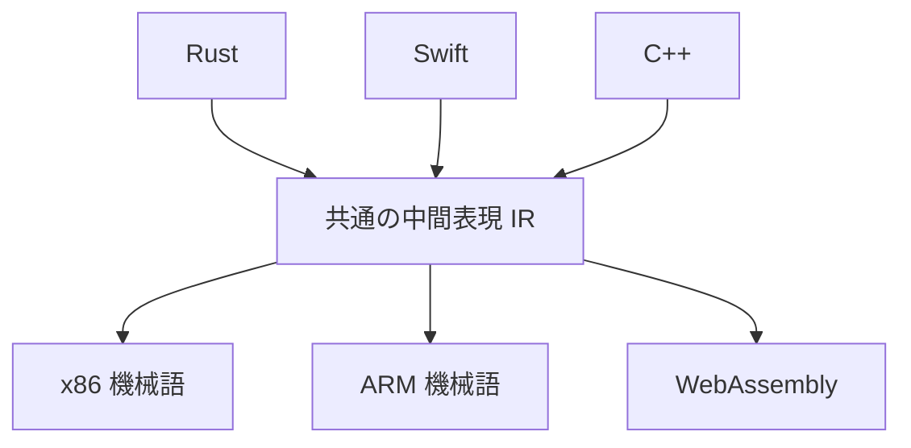

人間が書く言語と、機械が直接動かす機械語の「中間にある共通の表現」。

## 何ができる？／なぜ重要？

世界中の言葉を、すべての言語の組み合わせで翻訳しようとすると、辞書が膨大になります。日本語⇄英語、日本語⇄中国語、英語⇄中国語…と全部の対が必要です。そこで「いったん国際標準語に翻訳してから、そこから各国語に直す」という二段構えにすると、辞書の数がぐんと減ります。IR は、まさにこの「国際標準語」をプログラミング言語の世界で実現したものです。

たとえば Rust、Swift、C++ という別々の言語があっても、いったん IR に変換すれば、そこから先は同じ仕組みで CPU 用、スマホ用、ブラウザ用といった機械語に分配できます。新しい CPU が出ても、IR から機械語への翻訳器を一つ作れば、すべての言語が対応できる。逆に新しい言語を作るときも、IR への翻訳器だけ書けば、世界中のハードウェアで動かせます。これは「掛け算の手間を足し算にする」大きな発明です。

## 仕組み

各言語はまず IR に翻訳されます。IR から先は、CPU の種類ごとに別々の機械語へ落とし込みます。間に IR をはさむことで、言語と CPU の組み合わせ爆発を防ぎ、最適化処理も IR の段階でまとめて行えます。

## 用語

- **IR**: Intermediate Representation の略。中間表現。
- **コンパイラ**: 高水準言語を機械語に翻訳するソフトウェア。
- **フロントエンド**: 言語ごとに異なる「IR への翻訳器」。
- **バックエンド**: IR から CPU 用の機械語に落とし込む部分。
- **LLVM**: 代表的な IR とコンパイラ基盤。多くの言語が採用している。
- **最適化パス**: IR の段階でコードを賢く書き換える工程。
- **SSA**: 値を一度だけ代入する形式。最適化しやすい IR の作法。
- **AST**: 文法的な構造を表す木。フロントエンドが IR を作る前段で扱う形。
- **ターゲット**: 出力先の CPU やプラットフォーム。

## vault 内での使われ方

- [[lean4-rust-backend]] — Lean4 を IR 経由で Rust に落とすバックエンド
- [[almide]] — 独自言語が経由する内部表現の設計
- [[almide-grammar]] — 言語フロント側の文法定義
- [[tree-sitter-almide]] — 構文解析から IR の手前までを担うパーサ
- [[lean2ts]] — Lean を TypeScript に変換する際の中間段階
- [[bonsai-almide]] — Almide 関連の小さな実験基盤
- [[almide-lumen]] — Almide コンパイラ周りの軽量実装

## 関連概念

- [[ffi]] — 言語間の橋渡し。IR を共通プロトコルにすることもある
- [[effect-system]] — 副作用を IR 上で型として持ち回す設計
- [[agentic-coding]] — LLM がコードを生成する際にも AST/IR の知識が役立つ

## Links

- [Wikipedia: Intermediate representation](https://en.wikipedia.org/wiki/Intermediate_representation)
- [LLVM Project](https://llvm.org/)
