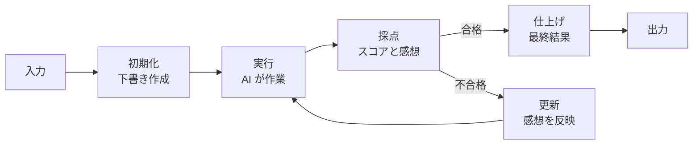

IteratoP (Iteration Processor) — 収束するまで反復する LLM ループを構築するライブラリ。Scrum / OODA loop に着想を得た 5 段階の構造化フローで、品質目標に達するまで自動反復。

## 何ができる？

AI に「下書き → 推敲 → 完成」のような繰り返し作業をさせる仕組みです。料理人が一度味見して、塩を足して、また味見して、合格点に達するまで調整するのと同じ流れを AI でやります。一発勝負で良い答えを出させるのではなく「採点 → 直し → 再挑戦」を自動で回し、合格ラインに届くまで磨き続けます。ブログ記事の推敲、コードのリファクタ、検索クエリの精緻化など「徐々に良くしていく」タスクが得意です。[[fractop]] が「文書を空間で分ける」のに対し、こちらは「時間で繰り返す」役割を担います。

## 用語

- **イテレーション**: 繰り返し 1 回分のこと。料理の味見 1 回、推敲 1 周
- **収束**: 繰り返すうちに結果が安定し、合格ラインに達すること
- **Scrum**: ソフト開発の進め方。短い期間で「計画 → 実行 → 振り返り」を回す
- **OODA ループ**: 「観察 → 状況判断 → 決定 → 行動」を高速で回す意思決定法
- **state（状態）**: 現在の作業途中のデータ。下書きの今の姿
- **action（アクション）**: 状態に対して AI が起こす作業。文章を書き直す、検索を投げるなど
- **evaluate（評価）**: アクション結果を採点する工程。「90 点」「もう少し」など
- **transition（遷移）**: 採点結果をもとに次の状態へ更新する作業
- **finalize（仕上げ）**: 合格に達した状態から最終結果を取り出す
- **target score**: 合格ライン。これを超えたら終了
- **max iterations**: 最大繰り返し回数。永遠ループを防ぐ安全装置
- **PDCA**: Plan → Do → Check → Act の改善サイクル

## 仕組み



Scrum のスプリントのように「計画 → 実行 → レビュー → 振り返り」を 1 周として、合格ライン（target score）に達するまで自動で何周も回します。回しすぎ防止の最大回数（max iterations）も設定できます。

## Core Idea

LLM の出力品質を「一発で」担保するのではなく、評価 → 修正 → 再生成の収束ループを宣言的に書く。

```
Initialize → Act → Evaluate → (Converged?) → Transition → Act → ... → Finalize
```

| Stage | Scrum/OODA | 役割 |
|---|---|---|
| Initialize | Sprint Planning | 入力から初期 state を作る |
| Act | Sprint Execution | 状態に基づきアクション実行 |
| Evaluate | Sprint Review | スコア + フィードバック |
| Transition | Retrospective | 次の state へ更新 |
| Finalize | Release | 収束した state から最終結果 |

## 使用例

### Basic

```ts
import { createIterator, createActionResult, createEvaluation } from '@aid-on/iteratop';

const processor = createIterator({
  initialize: async (input) => ({ query: input, results: [] }),

  act: async (state) => {
    const data = await searchAPI(state.query);
    return createActionResult(data, { cost: 0.01 });
  },

  evaluate: async (state, actionResult) => {
    const score = calculateRelevance(actionResult.data);
    return createEvaluation(score, {
      shouldContinue: score < 70,
      feedback: `Relevance: ${score}%`,
    });
  },

  transition: async (state, actionResult, evaluation) => ({
    ...state,
    results: [...state.results, actionResult.data],
    query: refineQuery(state.query, evaluation.feedback),
  }),

  finalize: async (state) => ({ answer: synthesizeAnswer(state.results) }),
});

const result = await processor.run("What is quantum computing?");
```

### Builder Pattern + Preset

```ts
import { iterationBuilder } from '@aid-on/iteratop';

const result = await iterationBuilder()
  .initialize(async (input) => ({ value: input }))
  .act(async (state) => createActionResult(state.value * 2))
  .evaluate(async (_, result) => createEvaluation(result.data))
  .transition(async (_, result) => ({ value: result.data }))
  .finalize(async (state) => state.value)
  .preset('balanced')
  .maxIterations(5)
  .targetScore(80)
  .run(10);
```

### Streaming with [[nagare]] (v0.2.0+)

```ts
import { createStreamingIterator } from '@aid-on/iteratop';

const processor = createStreamingIterator({ /* ... */ });

const stream = await processor.executeStream("LLM optimization techniques");
for await (const state of stream) {
  console.log(`Iteration ${state.iteration}: ${state.converged ? 'Done' : 'Processing'}`);
}
```

## Presets

| Preset | maxIterations | targetScore | 用途 |
|---|---|---|---|
| `fast` | 3 | 60 | 速度優先 |
| `thorough` | 10 | 90 | 品質優先 |
| `balanced` | 5 | 70 | デフォルト |
| `cost-optimized` | 3 | — | API 費用最小化 |

## Configuration

```ts
{
  maxIterations: 5,
  targetScore: 70,
  earlyStopScore: 95,
  minIterations: 1,
  timeout: 10000,
  skipMinIterations: false,
  alwaysRunTransition: true,
  verbose: true
}
```

## ユーティリティ

- `calculateTotalCost`, `calculateAverageScore`, `getScoreProgression`, `isImproving`
- `mergeArrayActionResults`, `mergeObjectActionResults` (deep / shallow)
- `withRetry`, `withTimeout`, `sleep`

## 思想対比: [[fractop]] (Fractal) vs IteratoP (Iteration)

- **fractop** — 空間軸: 大きな入力を分割して並列処理 (Map-Reduce 的)
- **iteratop** — 時間軸: 単一処理を品質収束まで反復 (PDCA 的)

両者は直交し、組み合わせ可能。

## 関連

- [[fractop]] / [[templex]] — 同じ Aid-On *oP 系列
- [[nagare]] — Streaming integration
- [[unillm]] — LLM provider 抽象

## Links

- [GitHub](https://github.com/Aid-On/iteratop)
- [npm](https://www.npmjs.com/package/@aid-on/iteratop)
