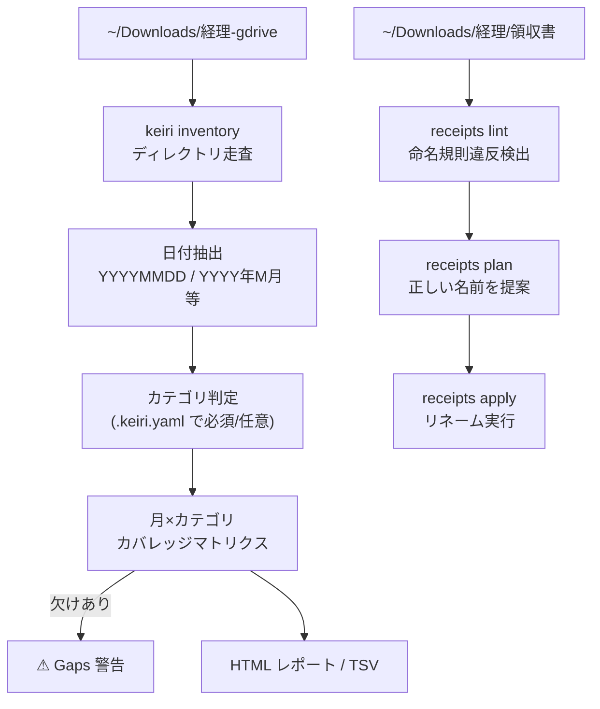

経理書類（領収書・請求書）の整理と命名規則違反を検出する CLI。月別カバレッジマトリクスや HTML レポート生成も搭載。

## 何ができる？

毎月の領収書や請求書をフォルダに溜めていると、「あれ？先月の Anthropic の請求書まだ来てない？」「ファイル名がバラバラで探しにくい」という事態が頻発します。`keiri` はそれを自動で整える秘書のようなツール。月ごとにどのカテゴリの書類がそろっているかを表で見せ、欠けている月を教え、ファイル名を統一規則（`YYYYMMDD_業者名_識別子.pdf`）に揃えてくれます。

「経理処理が忙しいときに、人手で目視チェックしていた作業」を毎日のシェル一発で済ませるのが嬉しさ。HTML レポート（`keiri view`）はダークモード対応で、月×カテゴリの色分けマトリクスを一目で確認できます。

## 用語

- **lint**: コードの誤りを自動検出する仕組み。keiri ではファイル名の規則違反検出に応用。
- **plan / apply**: 「やる予定の変更を一覧表示」（plan）と「実行」（apply）を分けるパターン。Terraform 等でも使われる。
- **canonical filename**: 標準形のファイル名。`YYYYMMDD_<Vendor>_<identifier>.<ext>` 形式。
- **inventory（棚卸し）**: 何がいつ・どのカテゴリにあるかを集計したマトリクス。
- **gap detection**: 定期発生するカテゴリで月が抜けていないかを検出。
- **vendor normalization**: `airdo` → `AIRDO`、`Paddle.com` → `Paddle` のように業者名を統一形に変換。
- **mtime (modification time)**: ファイルの最終更新日時。日付プレフィックスがないときの代替に使う。
- **pdftotext**: PDF からテキストを抽出するコマンド（ロードマップで業者名・金額自動抽出に使う予定）。

## 仕組み



設定ファイル `.keiri.yaml` で「必須カテゴリ（クレジットカード、売上請求書 等）」と「任意カテゴリ」を宣言。必須の月が抜けていれば警告される。

## 主要コマンド

```bash
keiri view                        # HTML レポート生成 + ブラウザ起動
keiri inventory                   # 月×カテゴリの一覧
keiri inventory --depth 2         # ベンダー単位まで展開
keiri receipts lint               # 命名規則違反検出
keiri receipts plan               # 正しい名前を提案
keiri receipts apply              # リネーム実行
```

## 検出する命名違反

- 日付プレフィックス（`YYYYMMDD_`）の欠落
- 重複日付
- コピー痕（`のコピー`、`[N]`、` (N)`）
- 飾り文字（`｜`、`－`、padded `_`）

## 統合

- [[grclone]] — クラウド同期と組み合わせて、Google Drive 上の経理フォルダを手元で整える運用を想定。元々 `grclone receipts` だった機能を独立 CLI 化したもの

## 関連

- [[cli|CLI]] — Go 製のシンプルな CLI
- [[serialization|Serialization]] — `.keiri.yaml` で設定を YAML シリアライズ

## Links

- [GitHub](https://github.com/O6lvl4/keiri)
