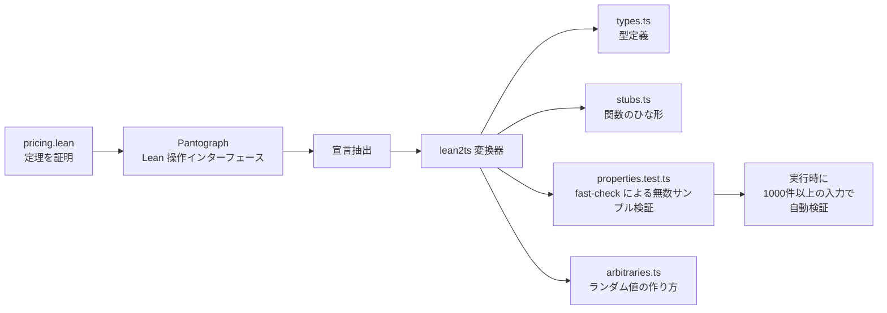

> Prove it in Lean. Test it in TypeScript.

Lean 4 の formal spec を TypeScript に変換する。型・関数スタブ・[fast-check](https://github.com/dubzzz/fast-check) property test を生成する。

## 何ができる？

Lean 4（数学の定理を計算機で厳密に証明できる言語）で書いた「ビジネスルールの正しさの証明」を、TypeScript（Web 開発で広く使われる言語）の自動テストに翻訳するツールです。たとえば「割引率は 100% を超えてはいけない」という商売の鉄則を Lean で証明しておけば、lean2ts はそれを「無数のサンプル金額で繰り返し試して、どんな入力でもルールが成り立つか自動確認するテスト」に書き換えてくれます。

何が嬉しいかというと、数学レベルで正しさが保証されたルールを、普段使いの Web コードに自然に組み込めるようになる点です。「200% 割引で顧客に -1.5 ドル課金してしまった」のような恥ずかしいバグが出にくくなります。

## 用語

- **Lean 4**: 数学の定理を計算機で厳密に証明できるプログラミング言語。
- **TypeScript**: JavaScript に「型」という安全装置を加えた言語。Web 開発で人気。
- **theorem（定理）**: 「常に成り立つ性質」のこと。Lean ではこれをコードで証明する。
- **structure / inductive**: Lean でデータの形を定義する書き方。それぞれ「組み合わせ型」と「選択肢型」に対応。
- **property test**: 「無数のランダム入力を試してルールが常に成り立つか確かめる」テスト方式。普通の単体テストが具体例 1 件を試すのに対し、こちらは 1 000 件以上を自動生成して試す。
- **fast-check**: TypeScript で property test を書くためのライブラリ。
- **arbitrary**: property test で「ランダム値の作り方」を表すレシピ。
- **stub**: 中身が空の関数のひな形。利用者が後から実装を埋める。
- **Pantograph**: Lean をプログラムから操作するためのインターフェース。lean2ts はこれと対話して情報を引き出す。
- **sorry**: Lean で「ここの証明はまだ書いていない」を意味する印。
- **discriminated union**: TypeScript で「複数のうちどれか一つ」を表す型の書き方。Lean の inductive と対応する。
- **kernel（カーネル）**: Lean の証明検証エンジン。LLM が出した証明案も最終的にここで判定されるので、AI を全面的に信用しなくて済む。

## 仕組み



Lean の世界で証明された定理を、TypeScript の世界では「無数のサンプルでルールを確かめる自動テスト」に翻訳します。証明の信頼性を保ったまま、普段の Web 開発の流れにそのまま組み込めるのが利点です。

## Core Idea

Lean で証明したビジネスルールを TypeScript に橋渡しする。Lean の `Nat` は負にならないので「200% 割引で -$1.50 が顧客に課金された」のようなバグは型レベルで不可能。lean2ts は theorem を property test に変換することで、その保証を TS テストに持ち込む。

```
pricing.lean ──► Lean compiler (proves theorems) ──► lean2ts ──► types.ts / stubs.ts / properties.test.ts
```

## What gets generated

| Lean construct | TypeScript output | File |
|---|---|---|
| `structure` | `interface` | types.ts |
| `inductive` | discriminated union + type guards | types.ts |
| `theorem` | fast-check property test | properties.test.ts |
| `def` | function stub | stubs.ts |
| Type parameters | generic arbitraries（factory functions） | arbitraries.ts |
| `sorry` | LLM + Pantograph で自動証明 | — |

### Type mapping

| Lean | TypeScript | fast-check arbitrary |
|---|---|---|
| `Nat` | `number` | `fc.nat()` |
| `Int` | `number` | `fc.integer()` |
| `String` | `string` | `fc.string()` |
| `Bool` | `boolean` | `fc.boolean()` |
| `List α` | `ReadonlyArray<α>` | `fc.array(...)` |
| `Option α` | `α \| undefined` | `fc.option(...)` |
| `α × β` | `readonly [α, β]` | `fc.tuple(...)` |

## Quick Start

```bash
npx lean2ts pricing.lean -o ./generated
```

[Pantograph](https://github.com/lenianiva/Pantograph)（Lean の programmatic interface）と通信して declaration を抽出し、TypeScript ファイルを書き出す。

### Prerequisites

- Node.js 22+
- Lean 4（`elan` 経由）
- Pantograph（プロジェクトの Lean version と同期させる必要あり）

## sorry の自動証明

```bash
npx lean2ts prove input.lean --verbose
```

LLM が candidate tactic を提案 → Pantograph が Lean kernel で検証 → 通れば proof は健全。LLM への信頼は不要（kernel が真の判定者）。

OpenAI / Cloudflare Workers AI / Groq / Together / Fireworks / Ollama など OpenAI 互換 API を環境変数で自動検出。

## Architecture

```
.lean ──► Pantograph REPL ──► S-expression AST ──► LeanExpr tree
   ──► IR (extractor) ──► TypeScript (generator)
```

### Source Layout

- `src/s-expression/` — S 式パーサ（tokenizer + 再帰下降）
- `src/extractor/` — `classifier`、`structure-parser`、`inductive-parser`、`theorem-parser`、`def-parser`、`type-resolver`
- `src/generator/` — `type-generator`、`arbitrary-generator`、`property-generator`、`stub-generator`
- `src/pantograph/` — JSON-RPC over stdin/stdout クライアント
- `src/prover/` — `sorry-finder`、`proof-loop`、`tactic-llm`

## CLI

```
lean2ts <input.lean> [-o ./generated] [--pantograph <path>] [--no-tests] [--no-stubs] [--dry-run]
lean2ts prove <input.lean> [--model <name>] [--max-attempts 3]
```

## Examples

`pricing/`、`weather/`、`scoring/`、`inventory/` など。`pricing` は割引ロジックの 4 theorem で実バグを捕まえる例。

## 関連

- [[lean4-rust-backend]] — Lean 4 を Rust で動かすバックエンド
- [[lean4-learning]] — Lean 4 学習リポジトリ群

## Links

- [GitHub](https://github.com/O6lvl4/lean2ts)
