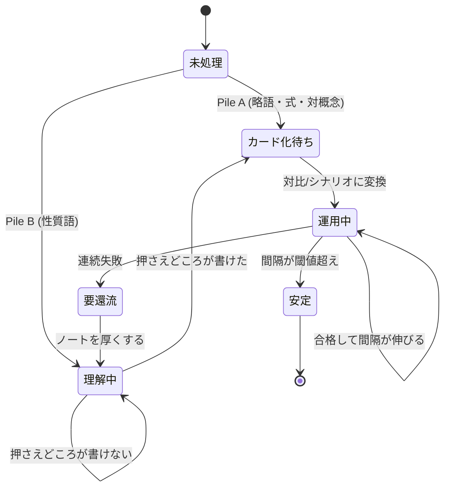

[[retrieval-practice|想起練習]]の理論を、実際に回るシステムへ落とすときの設計。核心は**記憶動力学(L1)とパイプライン(L2)を分離し、L1 を自作しないこと**。学習ツールの自作が失敗するのは、たいてい面白いほうの L1 に手を出して、価値のある L2 に到達しないため。

## 2層に分ける

| 層 | 中身 | 自作すべきか |
|---|---|---|
| **L1: 記憶動力学** | 項目ごとの記憶状態、減衰、増分、次回間隔の決定 | **しない** |
| **L2: パイプライン** | 素材 → ノート → カード → 失敗の還流、フェーズ制御 | **ここが本体** |

L1 は既存実装が圧倒的に強く、L2 は既存ツールが持っていない。分離の判断はこの非対称性だけで決まる。

## なぜ L1 を作ってはいけないか

**理論が関数形を与えていないから。** Bjork の2軸モデルは「貯蔵強度の増分は引き出し強度の**減少関数**」としか言わず、その関数の形を定めない。自作すると、理論が空けている穴を勘の定数で埋めることになる。

一方 **FSRS**(Anki 23.10 以降の標準スケジューラ)は、大量のレビューログでパラメータを実測して合わせている。しかもモデルの構造が2軸とほぼ対応する。

| FSRS の DSR | 定義 | 2軸モデルとの対応 |
|---|---|---|
| **R** (Retrievability) | 今この瞬間に想起できる確率 | **引き出し強度**そのもの |
| **S** (Stability) | R が 90% まで落ちるのに要する日数 | **貯蔵強度**の操作的定義 |
| **D** (Difficulty) | 項目固有の覚えにくさ (1–10) | 理論に対応物なし。経験的に足された第3項 |

**S の定義の仕方が要点**。貯蔵強度は直接測れない構成概念だが、[[retrieval-practice|規則3]](貯蔵強度が高いほど減衰が遅い)を逆に使えば、**減衰の遅さそのものを貯蔵強度の定義にできる**。測れない量を、測れる帰結で置き換える ── 構成概念を工学量に変換する典型的な手口で、L1 が既に解かれている理由でもある。

したがって L1 を書くなら、それは学習の道具作りではなく **FSRS の再実装という別プロジェクト**として扱う。混ぜると、学習が進まないまま実装だけが残る。

## L2 の状態機械

パイプラインではなく**ループ**である点が設計上の肝。`運用中 → 要還流 → 理解中` の戻り辺があるおかげで、**カードの失敗が、薄いノートを名指しで教えてくれる**。この辺が無いと、落ち続けるカードを永久に回すだけの装置になる。

## 遷移条件は観測可能な事実で書く

| 量 | 観測可能か | 取得元 |
|---|---|---|
| カードの成否・間隔・経過時間 | ✅ | SRS のレビューログ |
| ノートの有無 | ✅ | vault のファイル |
| 押さえどころの有無・項目数 | ✅ | ノートの走査 |
| Pile A / B の別 | ✅ | frontmatter に持たせる |
| **理解したか** | ❌ | **測れない** |

**観測不能なのは「理解したか」だけ**。ここにプロキシとして「押さえどころが書けたか」を置き、人間のゲートを1つだけ通す。逆に言えば、それ以外の遷移は全部自動化できる。

システム設計としては、**観測不能な量をゲート1つに押し込め、残りを機械に渡す**形になっている。ゲートが増えるほど回らなくなるので、増やさないことが設計目標。

## ルーティングとゲートの4規則

1. **Pile A は vault を通さない** — 略語・式にノートを書く価値はない。直接カードへ
2. **Pile B は押さえどころが書けるまでカード化しない** — 理解フェーズ未通過の項目をカードにすると、落ち続けて還流ループを無駄に回す
3. **定義カードを作らない** — 必ず対比かシナリオの形にする
4. **連続失敗はカードではなくノートを疑う** — 4 が無いと戻り辺が機能しない

## フェーズ制御は状態機械の外に出す

「習得モード」と「本番前モード」は個々の項目の状態ではなく**システム全体のモード**なので、状態機械と直交させる。

| モード | 新規投入 | 間隔 | 目的 |
|---|---|---|---|
| 習得 | あり | スケジューラ任せ | 貯蔵強度を積む |
| 本番前 | **停止** | 強制的に短縮 | 当日のアクセス確保 |

本番前モードは、**わざとミスさせる**設計を**ヒットさせ続ける**設計に反転させる操作 — つまりスケジューラの目的関数を意図的に裏切る。だから状態として持つと破綻し、モードとして外から被せる必要がある。学習効率は落ちるが、それを承知でやる期間だと自覚できていれば正しい判断になる。

## cue の多重化

同じ事実でも、**符号化したときの手がかりでしか引けない**。コードや図で理解した項目は、その形式の入口しか持たない状態になりやすい。

対策は SRS の note/card 構造をそのまま使うこと ── **1 note = 事実、複数 card = 入口**。理解の実体はどんな表現で持ってもよいが、**本番で与えられる形式の入口を必ず1本張る**。

転移の度合いは測れないので、ここは最適化せず**両方張る**保守運用で回避する。

## モデル化できない残り

1. **cue の転移度** — ある形式で符号化した理解が、別の形式の手がかりでどれだけ引けるか。測定手段がない
2. **言い換えの質** — 押さえどころが「書けている」かの判定。行数や語数では代理できない

どちらも人間のゲートに残る。**自動化できない2点を先に特定しておく**ことが、この種のシステム設計では実装より先に来る。

## 押さえどころ

- **設計の核心** → 記憶動力学(L1)とパイプライン(L2)の分離。L1 は作らない
- **L1 を作らない理由** → 理論が関数形を与えておらず、既存実装は実データでパラメータを実測済み
- **測れない量の扱い方** → 貯蔵強度を「減衰の遅さ」で定義し直す。構成概念を帰結で置き換えて工学量にする
- **L2 がループである理由** → カードの失敗が薄いノートを名指しするため。戻り辺が無いと落ち続けるカードを回すだけになる
- **観測可能性** → 測れないのは「理解したか」だけ。ゲート1つに押し込め、残りは自動化する
- **フェーズは直交させる** → 本番前モードはスケジューラの目的関数を裏切る操作なので、状態ではなくモードとして外から被せる
- **cue の多重化** → 1 note = 事実、複数 card = 入口。本番形式の入口を必ず1本張る

## 制限

- 対象は宣言的知識(語彙・概念)の獲得を回すシステム。技能の習得は別の設計になる
- L2 の各規則(連続失敗の回数、間隔の閾値)に理論的根拠はない。運用しながら決める調整値であり、理論から導かれた数値ではない
- 「L1 を作るな」は現在の既存実装が十分に強いという前提に依存する判断であって、原理的な主張ではない

## Links

- [FSRS Scheduler Implementation (Anki)](https://deepwiki.com/ankitects/anki/4.1-fsrs-scheduler-implementation)
- [A technical explanation of FSRS](https://expertium.github.io/Algorithm.html)
- [What spaced repetition algorithm does Anki use? (Anki FAQs)](https://faqs.ankiweb.net/what-spaced-repetition-algorithm)

## 関連

- [[retrieval-practice]] — 本ノートが実装しようとしている理論。2軸モデルと3規則の出典
