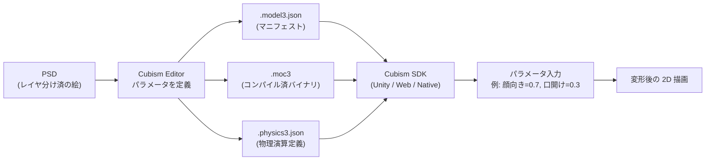

2D 静止イラストを「変形だけで」動かす日本発の技術。Live2D Inc. が開発、現行版は **Cubism 4**。3D モデリングを介さずに 2D の絵をそのまま立体的に動かせるのが核。

## 何を解決した技術か

VTuber や 2D ゲームでキャラを動かすときの選択肢は元々2つしかなかった：

1. **3D モデリング** — Blender / Maya で立体を作る。立体感は出るが、絵師の描いた線・塗り・タッチが失われる
2. **コマアニメ** — 何枚も描く。労力が膨大で表情の自由度が低い

Live2D は3つ目の道。**1枚のイラストを PSD レイヤに分けて、各レイヤを「メッシュ変形」で動かす**。絵師の線そのままで、表情・首振り・呼吸・髪揺れまで作れる。

## 仕組み

中核は **パラメータ → 変形** の写像。`ParamAngleX`（顔の左右）、`ParamMouthOpenY`（口の開き）等の標準パラメータがあり、ランタイムにこの数値を投げると絵が変形する。フェイストラッキングは「カメラ → 表情パラメータ」の変換器に過ぎない。

## ファイル一式（Cubism 3+）

| 拡張子 | 中身 |
|---|---|
| `.moc3` | コンパイル済モデル（メッシュ + パラメータ + デフォーマ）。バイナリ |
| `.model3.json` | マニフェスト（テクスチャ参照、物理ファイル参照、パラメータグループ） |
| `.physics3.json` | 髪・服・揺れもの物理演算の定義 |
| `.cdi3.json` | パラメータの表示用メタデータ（任意） |
| `.motion3.json` | アニメーションクリップ |
| `.exp3.json` | 表情プリセット（複数パラメータの組） |
| テクスチャ画像 | png（4096×4096 が一般的） |

## VTuber エコシステムとの関係

- **VTube Studio** / **VSeeFace** / **PrPrLive** — エンドユーザ用の VTuber アプリ。中で Cubism SDK を回している
- **iPhone TrueDepth / カメラのみ** — 顔のランドマーク → 標準パラメータに変換するのが各アプリの仕事
- **VRM** — 別規格。VRM は 3D（glTF 拡張）。Live2D は 2D。同居は可能（アバター切替）

[[animula]] のような「AI VTuber」を作る場合、**音声合成 → 表情パラメータ生成 → Cubism SDK へ送信** が中核ループ。Live2D 自体は「絵を動かす部分」だけで、AI 部分は外側。

## ライセンスと商用利用の注意点

- **Cubism Editor**: FREE 版（個人〜小規模）と PRO 版（商用本格）の二段階
- **Cubism SDK**: 売上規模により段階的にロイヤリティ／契約が発生。年商 1,000 万円までは無償で SDK 利用可、超えると年間ライセンス契約が必要（2024 時点。最新は公式参照）
- VTuber 配信単体は通常 SDK ライセンス対象外（クライアントアプリ側がカバーしているため）

## 競合・代替

| 技術 | 形式 | 強み | 弱み |
|---|---|---|---|
| **Live2D** | 2D メッシュ変形 | 絵師の線そのまま | 真横〜真後ろは描けない |
| **Spine** | 2D ボーン+メッシュ | ゲーム最適化、軽量 | 日本市場の素材が薄い |
| **VRM** | 3D (glTF 拡張) | どの角度でも描画 | モデリング工程が重い |
| **PSDtuber 系** | レイヤ切替 | 究極に簡単 | 表情自由度ほぼゼロ |

## 押さえどころ（カード化候補）

- Live2D は何を変形するか → **PSD のレイヤ単位でメッシュを切って変形させる**
- 出力ファイル `.moc3` の意味 → **Cubism Editor がコンパイルした、ランタイムが読むモデルバイナリ**
- パラメータの代表例 → **`ParamAngleX` (顔向き)、`ParamMouthOpenY` (口開け)、`ParamEyeBallX` (黒目)** 
- VTuber アプリと SDK の関係 → **VTuber アプリは Cubism SDK の上で動く。SDK は変形だけ、トラッキングはアプリ側**
- Live2D vs VRM → **Live2D は 2D（絵そのまま、横は描けない）/ VRM は 3D（どの角度でも描ける、モデリング必要）**
- Cubism Editor の FREE / PRO の境目 → **個人や小規模は FREE、本格商用は PRO**

## Links

- [Live2D 公式](https://www.live2d.com/)
- [Cubism SDK](https://www.live2d.com/sdk/about/)
- [VTube Studio](https://denchisoft.com/) — Cubism SDK 上の代表的 VTuber アプリ
