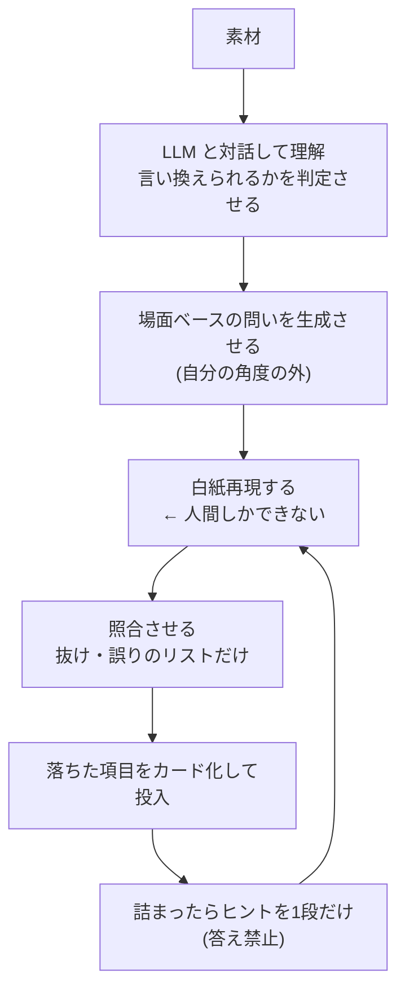

LLM は学習の周辺作業を大きく自動化するが、中心にある**想起そのものは代替できない**。むしろ既定の使い方 — 詰まったら聞く — は、答えを見るコストをゼロにするため、学習を破壊する方向に働く。役に立てるには、**答えを出さない制約を入れて**運用を反転させる必要がある。

前提となる機序は [[retrieval-practice]] と [[cue-reduction]] に譲り、ここでは何が変わって何が変わらないかだけを扱う。

## 変わらないもの

| | 理由 |
|---|---|
| **想起そのもの** | 説明してもらう行為は「読む」に分類される。深さ(貯蔵強度)は自分で思い出したときにしか増えない |
| **復習のタイミング** | [[forgetting-curve\|FSRS]] が実データで既に解いている。ここに出番はない |

**思い出す作業の総量は1秒も減らない。** 減らせるのは周辺の摩擦だけになる。

## 変わるもの

| 従来のボトルネック | 何が変わるか |
|---|---|
| **ヒントの階段を事前に用意する** | 詰まった時点で動的に1段だけ出せる。事前準備が不要になる |
| **白紙再現の答え合わせ** | 元ノートと書き出しを渡せば抜けと誤りを列挙できる。言い方が違うが合っている、の判定もできる |
| **問いが自分の角度に閉じる** | 別角度の問いを生成できる。クイズの「他人が作る」価値を部分的に代替する |
| **場面ベースのカードを作る手間** | 「用語 → 定義」より強い「場面 → 判断」を量産できる |

上2つが本命になる。従来この2つには**人間の相手役が必要**で、独学の最大の穴がそこにあった。

特に答え合わせが効く。白紙再現の最大の弱点は「書けたつもりで間違っている箇所を自分では検出できない」ことで、しかも誤ったまま想起すると誤りのほうが定着する。ここが埋まる意味は大きい。

## 最大のリスク

**答えを見るコストがゼロになった。**

詰まった瞬間に聞けば、正確な答えが即座に返る。[[cue-reduction]] の鉄則と正面から衝突する。

> 答えを見る前に、必ず思い出そうとする。

この鉄則は以前から守りにくかったが、いまは意識的な制約なしにはまず守れない。**既定の使い方が、そのまま想起の機会を消す設計**になっている。

## 使い方を反転させる

対処は単純で、**答えを出さない制約を明示的に与える**。

| 悪い使い方 | 反転させた形 |
|---|---|
| 「これ何?」→ 即座に完璧な説明 | 「答えを言わずに、ヒントを1段階だけ出して」 |
| 「合ってる?」→ 正解を提示 | 「私の書き出しと元ノートを照合して、**抜けだけ**指摘して。正解は書かないで」 |
| 「まとめて」→ 要約が返る | 「この項目について、場面から入る問いを5つ作って。答えは別に隠して」 |
| 「教えて」→ 説明が返る | 「私が説明するので、誤りと抜けを指摘して」 |

右列に共通するのは、**出力から答えを抜いている**点になる。答えを抜いた瞬間に、道具の性質が反転する。

最後の行は特に効く。自分が説明する側に回ると、それ自体が想起になり、LLM は採点役に収まる。

## ループ

## 役割分担

| 担当 | 仕事 |
|---|---|
| **スケジューラ (FSRS)** | タイミングだけ |
| **LLM** | 問いの生成・照合・ヒント供給 |
| **人間** | **想起そのもの。委譲不可** |

きれいに割れる。そして人間の取り分が減らない点が重要になる。周辺作業が全部自動化されても、思い出す時間は変わらない。

したがってここで言う「2.0」の正体は、楽になることではない。**想起以外の摩擦が消えて、想起に使える時間の比率が上がる**ことを指す。

## 押さえどころ

- **代替できないもの** → 想起。説明してもらう行為は「読む」であって、深さは増えない
- **本命の用途** → 白紙再現の答え合わせと、ヒントの動的生成。従来は人間の相手役が要った2つ
- **最大のリスク** → 答えを見るコストがゼロになり、想起の機会が消える
- **反転の方法** → 出力から答えを抜く制約を与える。「ヒントを1段だけ」「抜けだけ指摘」「答えは隠して」
- **最も強い形** → 自分が説明し、LLM に誤りと抜けを指摘させる。説明が想起になり、LLM が採点役に収まる
- **役割分担** → タイミングはスケジューラ、問いと照合は LLM、想起は人間
- **2.0 の意味** → 総作業時間が減ることではなく、想起に使える比率が上がること

## 制限

- **照合役の誤りが混入する** — LLM が誤って「合っている」と判定すると、誤りのまま定着する。白紙再現に答え合わせが必須なのと同じ理由で、照合結果もまた検証を要する。重要な項目では元資料に当たる
- **問いの質が一定しない** — 生成された問いは玉石混交で、本番で与えられる手がかりと形が揃っているとは限らない。選別が要る
- 本ノートは運用の設計であって、効果を実証した研究に基づくものではない。[[retrieval-practice]] の機序から演繹した構成になる

## 関連

- [[retrieval-practice]] — 想起が代替できない理由。2軸モデルと3規則
- [[cue-reduction]] — ヒントの階段と「答えを見る前に思い出す」の鉄則。LLM が最も衝突する相手
- [[learning-system]] — 素材からカードまでのパイプライン。LLM はその各工程に入る
- [[forgetting-curve]] — タイミング側を担う FSRS の位置づけ
