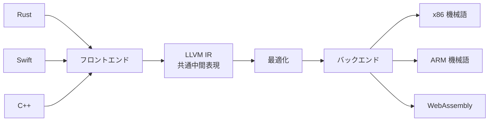

色々なプログラミング言語を「共通の中間語」に変換し、最適化したうえで色々な機種の機械語に出力する、コンパイラの汎用基盤。Rust、Swift、C++ など多くの言語が利用している。

## 何ができる？／なぜ重要？

国際会議で活躍する「翻訳者ハブ」を想像してください。日本語、英語、フランス語、中国語…どんな言語の話者が来ても、まず「共通の中継言語」に翻訳してから、聞き手の言語に再翻訳します。LLVM はソフトウェア版のこの仕組みで、Rust や Swift など多種多様な言語を一旦「LLVM IR」という中継言語に翻訳し、そこから x86、ARM、WASM など望む機械語に変換します。

これが嬉しいのは、新しい言語を作る人も、新しい CPU を作る人も、すべての組み合わせを一から作らずに済むことです。なければ、N 個の言語と M 個の CPU の組み合わせで N×M 個のコンパイラを作る必要があり、現実的ではありません。LLVM があると N+M で済みます。

## 仕組み

各言語は「フロントエンド」で LLVM IR に翻訳され、LLVM がそれを最適化したうえで、目的の機械語に「バックエンド」で出力します。

## 用語

- **IR (Intermediate Representation)**: 中間表現。言語と機械語の中継地点。
- **フロントエンド**: ソース言語を IR に変換する部分。
- **バックエンド**: IR を機械語に変換する部分。
- **最適化パス**: IR に対して施される性能改善の処理。
- **Clang**: LLVM 上で動く C/C++ コンパイラ。
- **ターゲット**: 出力先の CPU アーキテクチャ（x86、ARM など）や WASM。
- **LTO (Link Time Optimization)**: リンク時に複数モジュールをまたいで最適化する手法。
- **JIT**: 実行時に機械語へ変換する仕組み。LLVM はこれにも使える。

## 関連概念

- [[compiler]] — LLVM はコンパイラ基盤の代表例
- [[wasm]] — LLVM の出力先のひとつ
- [[ast]] — フロントエンドが AST を経由して IR に変換する

## Links

- [LLVM 公式サイト](https://llvm.org/)
- [Wikipedia: LLVM](https://ja.wikipedia.org/wiki/LLVM)
