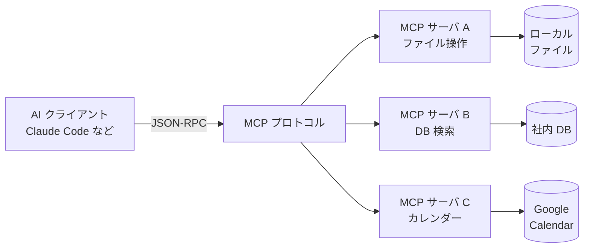

AI と外部ツール（ファイル・データベース・API など）をつなぐための共通規格。USB のように「どの AI でも、どのツールでも、同じ差込口で繋がる」ことを目指す。

## 何ができる？／なぜ重要？

家電でたとえると、昔はメーカーごとにコンセントの形が違って、海外旅行のたびに変換アダプタを買い直していました。AI と外部ツールの世界も少し前まで同じで、「この AI にこのツールを使わせたい」と思うたびに専用の配線を一から作り直す必要がありました。MCP は「全部このコンセント形状でいきましょう」と決めた取り決めです。一度ツール側を MCP の作法で作っておけば、Claude でも他の AI でも、同じツールがそのまま差し込めます。

なぜ重要かというと、AI が「自分の頭の中で考えるだけ」を抜け出して「世界に手を伸ばせる」ようになるからです。社内データベースを引いたり、カレンダーに予定を入れたり、Git のコミットを作ったりといった実世界の作業を、AI が共通規格越しに扱えるようになります。

## 仕組み

AI はどのツールに対しても同じ作法（JSON-RPC で「ツールを呼んで」と頼む形）で会話します。サーバ側は自分の担当する世界（ファイル・DB・外部 API）だけを知っていればよく、AI 本体の事情を気にする必要がありません。

## 用語

- **MCP (Model Context Protocol)**: AI と外部ツールをつなぐ共通プロトコル。Anthropic が提唱した規格。
- **MCP サーバ**: ツール側。「私はこういう機能を提供します」と AI に教える役。
- **MCP クライアント**: AI 側。サーバを見つけてきてツールを呼び出す役。
- **JSON-RPC**: JSON 形式で「あの関数を呼んで」と伝える遠隔手続き呼び出しの規約。
- **stdio トランスポート**: 標準入出力でやり取りするシンプルな通信路。同じマシン上で完結する場合に使う。
- **HTTP トランスポート**: ネットワーク越しに繋ぐ場合の通信路。
- **ツール定義**: サーバが「私はこういう引数で、こういう結果を返します」と自己紹介するスキーマ。
- **Resource**: ツールが提供する読み取り可能なデータ（ファイル・記事など）。
- **Prompt テンプレート**: サーバが提供する「定型の問いかけ文」。
- **capability ネゴシエーション**: 接続時に「お互いに何ができるか」を確認しあう手続き。

## vault 内での使われ方

- [[famulus2]] — `src/modules/mcp` で MCP クライアントを実装。`/mcp add <name> <cmd>` で外部 MCP サーバに接続しツールを取り込む
- [[claude-code]] — MCP クライアントとして外部 MCP サーバを接続できる
- [[porta]] — Almide で書かれた MCP サーバ。`porta serve agent.wasm` で WASM エージェントを stdio JSON-RPC 2.0 経由で公開する

## 関連概念

- [[capability-based-security]] — MCP サーバへの権限を細かい鍵で渡す
- [[rag]] — RAG の検索ツールを MCP サーバとして提供できる

## Links

- [Model Context Protocol (公式)](https://modelcontextprotocol.io/)
- [MCP GitHub](https://github.com/modelcontextprotocol)
