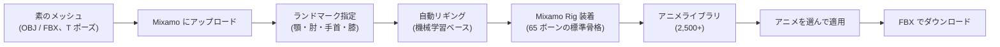
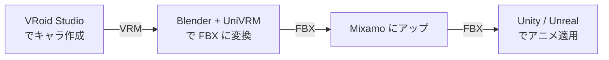

3D キャラクターを **自動でリギング**し、**2,500 本以上のモーキャプアニメーション**を着せ替えできる Adobe の Web サービス。Mixamo Inc. を 2015 年に Adobe が買収。**個人・商用問わず無料**で、Adobe ID さえあれば使える。

## 何が革命的だったか

3D キャラを動かすには通常以下が必要：

1. **モデリング** — Blender / Maya でメッシュ作成
2. **リギング** — ボーンを仕込む（人間の骨格を 50 本前後配置）
3. **スキニング** — 各頂点をどのボーンにどれくらい追従させるか塗る
4. **アニメーション** — 歩く・走る・ジャンプ等を1コマずつ作る

これらは **個別に職人技が必要** で、特に 2-3-4 はキャラ造形とは別の専門技能。Mixamo は **2 / 3 / 4 を全部肩代わり**する：

- T ポーズの裸モデル（OBJ / FBX）をアップロード
- ブラウザ上で「目元・肘・膝・手首」をクリックでマーキング
- **数十秒で自動リギング + スキニング完了**
- ライブラリから走る・戦う・踊る等のアニメをワンクリック適用
- リグ + アニメ込みの FBX で書き出し

これで「絵は描けるけど動かせない」「3D は作れるけどアニメ作れない」人がキャラ動画やゲームを作れるようになった。

## 仕組み



## 出力フォーマット

- **FBX (.fbx)** — メイン。リグ + アニメーション込み。Unity / Unreal / Blender がそのまま読む
- **DAE (Collada)** — 互換用、利用頻度低い
- **glTF への直接出力はなし** — 必要なら FBX → FBX2glTF 変換

ダウンロード時のオプション：

- **with skin / without skin** — スキン情報を含むか（同じキャラに別アニメを後から重ねるなら without で軽量に）
- **30fps / 60fps** — フレームレート
- **In Place / Original** — ルートモーション（その場で動く / 実際に移動する）

## Mixamo Rig（65 ボーンの標準骨格）

Mixamo が自動で着せるボーン構造には決まった命名規則がある：

```
mixamorig:Hips
├── mixamorig:Spine
│   ├── mixamorig:Spine1
│   │   ├── mixamorig:Spine2
│   │   │   ├── mixamorig:Neck
│   │   │   │   └── mixamorig:Head
│   │   │   ├── mixamorig:LeftShoulder → ... → LeftHandIndex3
│   │   │   └── mixamorig:RightShoulder → ...
├── mixamorig:LeftUpLeg → LeftLeg → LeftFoot → LeftToeBase
└── mixamorig:RightUpLeg → ...
```

- 全ボーンに `mixamorig:` プレフィックス（リネーム不要、エンジン側で剥がせる）
- 指は片手 5 本 × 3 関節 = 15 ボーンまで自動配置
- 顔のボーンは入らない（表情はモーフターゲット側でやる、Mixamo の範囲外）
- Unity の Humanoid Avatar / Unreal の Skeleton は Mixamo Rig をそのまま受けてくれる

## 商用利用

- **完全無料** — 個人・商用・ゲーム・映画・配信、すべて OK
- Adobe ID（Adobe Cloud アカウント不要、ID だけ）作成のみ必要
- ダウンロード制限なし
- **再配布は NG** — 元のリグ・アニメをそのまま売り直す等は不可

## 開発状況

Adobe は 2017 年以降 **新規アニメ追加をほぼ停止**し、サービスはメンテナンスモード。とはいえ：

- 既存 2,500+ アニメは引き続き利用可
- 自動リギングは現在も機能
- Adobe としてはサ終予告なし、長期間動いている

代替候補：

- **Cascadeur** — 物理ベース手動アニメ（半自動）
- **DeepMotion** — AI ベースの動画 → モーキャプ
- **Rokoko** — ハードウェア + ソフトウェアで実モーキャプ
- **AccuRIG (Reallusion)** — 同様の自動リギング（無料、Mixamo 後継候補）

## ワークフロー例（典型）



VRoid → Mixamo の落とし穴: VRoid のメッシュは指が短く Mixamo の自動リグが指を見失うことがある。手動マーキングか、Blender 側で指関節を増やしてから上げる。

## 押さえどころ（カード化候補）

- Mixamo の所有者と料金 → **Adobe（2015 年に Mixamo Inc. を買収）。個人・商用問わず完全無料、Adobe ID 取得のみ必要**
- Mixamo が肩代わりしてくれる工程 → **リギング、スキニング、アニメーション制作（モーキャプ済 2,500+ 本のライブラリから選択）**
- Mixamo の出力フォーマット → **FBX が主。DAE もあるが利用は少ない。glTF 直出しはなし**
- Mixamo Rig の特徴 → **65 ボーンの標準骨格、`mixamorig:` プレフィックスの命名規則。指は片手 15 ボーン、顔ボーンは入らない**
- Mixamo の現状 → **メンテナンスモード。新規アニメ追加は 2017 以降ほぼ停止しているが、既存ライブラリと自動リギングは現役**
- 代替サービス → **Cascadeur (物理ベース手動)、DeepMotion (AI 動画→モーキャプ)、Rokoko (実モーキャプ)、AccuRIG (Reallusion 製、自動リギング後継候補)**

## Links

- [Mixamo 公式](https://www.mixamo.com/)
- [Adobe FAQ - Mixamo の現状](https://helpx.adobe.com/jp/creative-cloud/faq/mixamo-faq.html)
