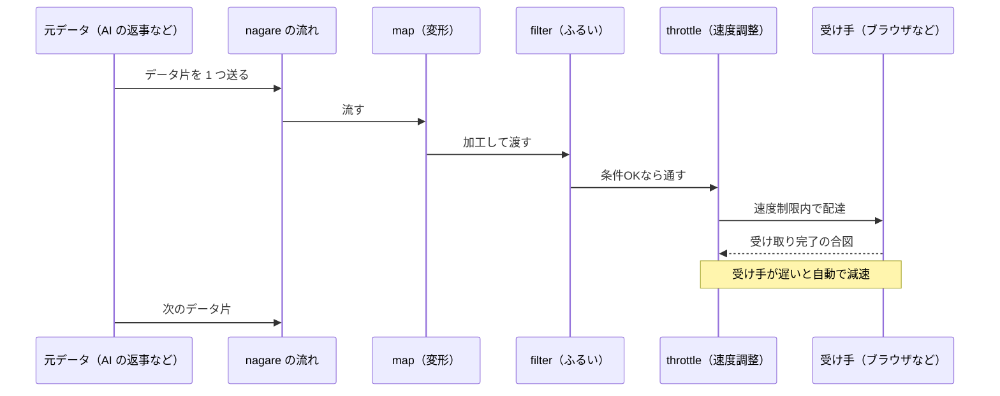

「流れ」をエッジで一級市民にする stream プリミティブ。`Stream<T>` は ReadableStream<T> そのものであり、reactive オペレータを直接持つ。

## 何ができる？

データを「川の流れ」のように、上流から下流へ順番に流しながら処理できます。工場の製造ラインで、ベルトコンベアの上を部品が流れてきて、各工程の作業員が「ねじを締める」「色を塗る」「検品する」と順に手を加えていくイメージです。全部のデータが揃うのを待たずに、届いた分から処理して次に渡せるので、長い処理でもユーザーをずっと待たせません。Web の標準的な水道管規格に乗っかっているので、ブラウザでもサーバでもそのまま動きます。

## 用語

- **ストリーム**: データが順番に流れてくる仕組み。川やベルトコンベアのように連続的に届く
- **ReadableStream**: ウェブ技術の標準で定められた「読み取れる流れ」の規格。世界共通の水道管規格のようなもの
- **エッジ**: ユーザーに近い場所のサーバ。コンビニのように、本部より近くて速い
- **reactive オペレータ**: 流れに対して「こういう加工をして」と注文する道具（map で変形、filter でふるい分け、など）
- **map**: 流れる各データを別の形に変える作業（例: 全部大文字にする）
- **filter**: 条件に合うデータだけ通すふるい分け
- **throttle**: 流れの速度を制限する蛇口。1 秒あたり何件まで、と絞る
- **バックプレッシャー**: 受け手が追いつかないと送り手が自動で減速する逆方向の圧力
- **SSE (Server-Sent Events)**: サーバから少しずつ情報を送り続けるウェブの仕組み
- **並列処理**: 複数の作業を同時に進めること。10 人で同時に部品を作るイメージ
- **Promise**: 「あとで結果を渡すよ」という約束札。1 個の結果しか持てない（流れではない）
- **Observable**: 別の流派の「流れ」概念。nagare はこれを使わずウェブ標準を使う

## 仕組み



製造ラインのように、各工程（map / filter / throttle）が順番に並び、データ片が 1 つずつ流れていきます。受け手が詰まれば自動でラインが止まる安全装置（バックプレッシャー）も内蔵されています。

## Core Idea

Observable でも Promise でもなく、Web Streams API の `ReadableStream` を基本単位として扱う。ラッパーオブジェクトを介さずネイティブ性能を保ったまま、`map` / `filter` / `throttle` などの reactive 操作を提供。

```ts
const nagareStream = stream.from(readableStream); // ゼロオーバーヘッド
nagareStream instanceof ReadableStream; // true
```

## 設計方針

1. **Stream is the primitive** — Observable や Promise を新たに導入しない
2. **Edge-first** — Cloudflare Workers, Deno, Bun を最初から想定
3. **Zero magic** — 見た通りに動く
4. **Type safety** — TypeScript strict 完全対応
5. **Web standards** — `ReadableStream` を基盤とする

## Unique Features

### 順序保持並列処理

並列実行しながら、結果の順序を入力順に保つ。

```ts
const results = await stream
  .array([1, 2, 3, 4, 5, 6, 7, 8, 9, 10])
  .mapAsync(async (n) => {
    await delay(Math.random() * 1000);
    return n * 2;
  }, 10) // concurrency: 10
  .collect();

// ALWAYS [2, 4, 6, 8, 10, 12, 14, 16, 18, 20]
```

### 自動バックプレッシャー

consumer が遅いと stream が自動で pause。メモリオーバーフローもデータロスもない。

### Cross-Platform SSE

`\r\n`, `\n`, `\r` を自動処理。Windows / Unix / Mac サーバすべてで動作。

### Dual Interface

```ts
// Reactive (pull-based)
stream.from(source).map(x => x * 2).filter(x => x > 10);

// Imperative (push-based)
stream.create((controller) => {
  controller.next(1);
  controller.next(2);
  controller.complete();
});
```

## 使用例: AI Streaming Response

```ts
export default {
  async fetch(request) {
    const aiStream = stream.create<string>((controller) => {
      const response = await ai.complete(prompt, {
        stream: true,
        onToken: (token) => controller.next(token)
      });
    });

    return aiStream
      .tap(token => metrics.record(token))
      .throttle(50)
      .toSSE()
      .toResponse({
        headers: { 'Content-Type': 'text/event-stream' }
      });
  }
};
```

## 使用例: Real-time Pipeline

```ts
const pipeline = stream
  .fromSSE('/api/market-data')
  .mapAsync(async data => {
    const [analysis, prediction] = await Promise.all([
      analyzeMarket(data),
      predictTrend(data)
    ]);
    return { ...data, analysis, prediction };
  }, 5)
  .buffer(10)
  .tap(batch => database.insert(batch))
  .debounce(100);
```

## 関連

- [[unillm]] — `unillm().stream()` は `Stream<T>` を返す
- [[fractop]] — ストリーミングチャンク処理に利用
- [[iteratop]] — `createStreamingIterator` で nagare 統合
- [[whenm]] / [[memory-rag]] — エッジ稼働の前提として活用

## Links

- [GitHub](https://github.com/Aid-On/nagare)
- [npm](https://www.npmjs.com/package/@aid-on/nagare)
