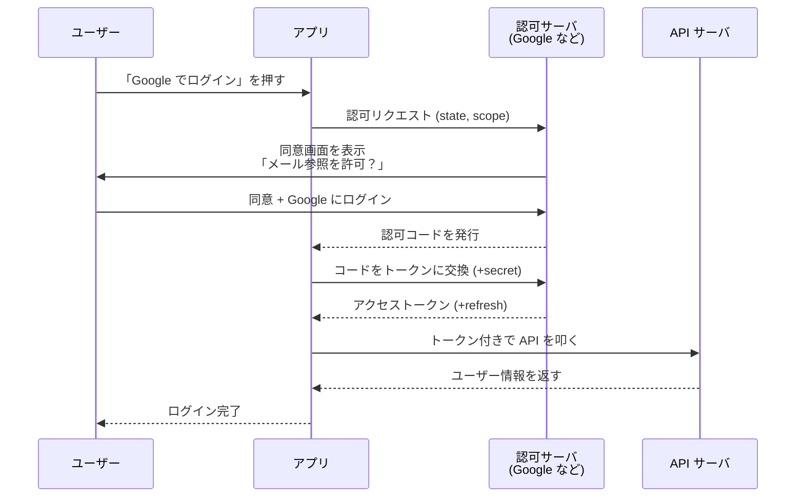

他社サービスにパスワードを直接渡さず、「あなたの代わりに必要な操作だけしてよい」という許可札（トークン）を発行してもらう仕組み。Web ログインの裏側で広く使われる。

## 何ができる？／なぜ重要？

ホテルのカードキーにたとえます。あなたが宿泊するとき、家の鍵束をフロントに預けるのはあり得ないですよね。代わりにフロントは「あなたの部屋だけ・チェックアウトまで」だけ開けられるカードキーを発行します。OAuth はインターネット版のカードキー発行所です。「Google でログイン」「LINE でログイン」のボタンを押すと、Google や LINE に「この人をログインさせていい？」と聞きに行きます。あなたは Google の画面でだけパスワードを入れ、Google からアプリ側へ「この人は本物です」というカードキー（トークン）が渡される、という流れです。

なぜ重要かというと、利用者は新しいパスワードを覚える必要がなくなり、アプリ側はパスワードを預からずに済みます。万一アプリが漏洩しても、トークンだけなら無効化できますし、Google 側のパスワード本体が漏れることもありません。「権限を必要なものだけ・期限つきで渡す」という考え方の代表例です。

## 仕組み

ユーザーは認可サーバ（Google など）の画面で同意するだけで、パスワード本体はアプリに見えません。アプリは「カードキー（トークン）」を受け取り、それを使って必要な操作を行います。トークンは期限切れで自動失効し、漏れたら個別に取り消せます。

## 用語

- **OAuth 2.0**: 現行の標準仕様。「認可（permission を渡す）」が本来の目的。
- **OpenID Connect (OIDC)**: OAuth の上に「認証（誰なのかを確認する）」の層を足した規格。「ログイン」用途で広く使われる。
- **認可サーバ (Authorization Server)**: トークンを発行する側。Google、LINE、GitHub など。
- **リソースサーバ (Resource Server)**: 守られた API。トークンを受け取って情報を返す。
- **クライアント (Client)**: トークンを使う側のアプリ。
- **アクセストークン**: 「短期有効のカードキー」。API を叩く際に添付する。
- **リフレッシュトークン**: 「カードキーを再発行できる元札」。アクセストークンの期限切れ時に使う。
- **scope (スコープ)**: 「この権限まで」を表す範囲指定（例: メール参照のみ）。
- **state パラメータ**: CSRF（なりすまし）対策のためにアプリが発行・確認する一時値。
- **PKCE**: モバイル / SPA 向けに secret なしでも安全に交換するための拡張仕様。
- **redirect URI**: 認可サーバからの戻り先 URL。事前登録が必須。

## vault 内での使われ方

- [[next-auth-providers]] — NextAuth.js 向けの OAuth プロバイダ実装
- [[auth-providers-ts]] — フレームワーク非依存な OAuth プロバイダライブラリ
- [[famulus]] — OAuth が絡む外部 API 呼び出し
- [[famulus2]] — MCP サーバ経由で OAuth が必要な API を叩く構成

## 関連概念

- [[capability-based-security]] — トークン = capability の一種。OAuth は capability ベースの考え方
- [[mcp]] — MCP サーバが外部サービスにアクセスする際に OAuth を使う
- [[edge-computing]] — エッジでのトークン検証は性能と安全の両面で工夫が必要
- [[serialization]] — JWT などトークンの形式

## Links

- [OAuth 2.0 (Wikipedia)](https://en.wikipedia.org/wiki/OAuth)
- [RFC 6749 (OAuth 2.0)](https://datatracker.ietf.org/doc/html/rfc6749)
- [OpenID Connect](https://openid.net/connect/)
