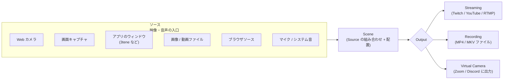
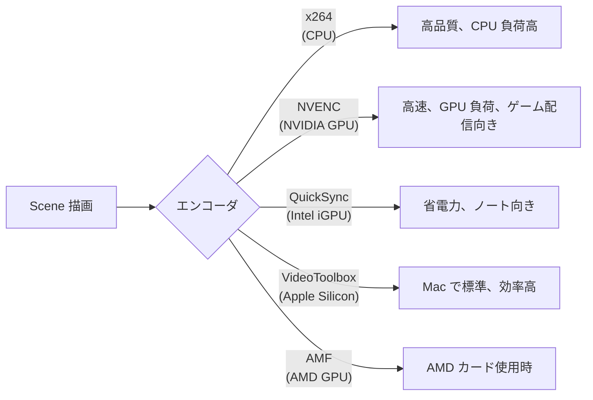
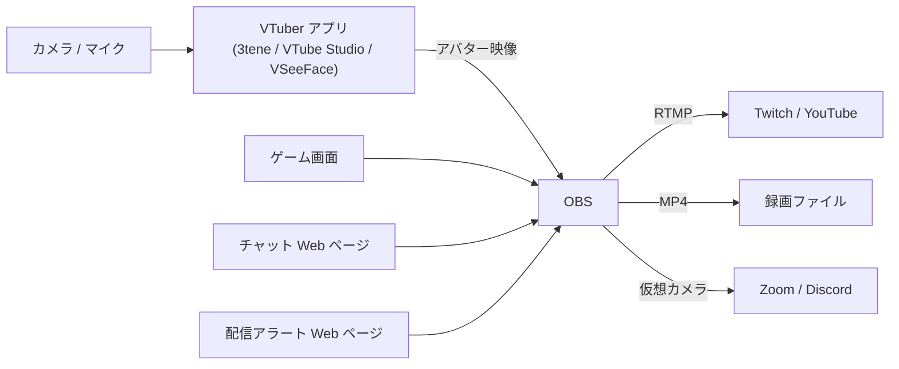

**Open Broadcaster Software**。配信と録画の事実上の標準となっている **無料・オープンソース** のソフトウェア。Windows / macOS / Linux 対応。Twitch / YouTube / TikTok / カスタム RTMP どこへでも配信できる、ライブストリーミングのデファクト。

## 何を解決したか

ライブ配信の前は次のような問題があった：

- **専用ハードウェア**（Blackmagic ATEM 等）が高価（数万〜数十万円）
- **配信ソフトが商用** で月額課金
- **マルチソース合成**（カメラ + 画面 + 画像 + チャット + アラート）が手間
- **エンコードと配信**が別ソフト

OBS は **これら全部を 1 本のソフトに無料で統合**して、世界中の配信文化を爆発させた立役者。VTuber 配信、ゲーム実況、オンライン会議の録画、教育動画制作、すべて OBS が下支えしている。

## 中核概念: Source × Scene × Output

- **Source**: 映像や音声の入力単位（カメラ、画面、画像、テキスト、ブラウザ、外部アプリのキャプチャ）
- **Scene**: 複数の Source を 1 画面に重ねた構成（VTuber なら「アバター + ゲーム画面 + Twitch チャット」等）
- **Scene 切り替え**: 配信中に Hotkey や Stream Deck でシーンを切り替える（休憩中シーン、開始シーン、ゲーム中シーン）
- **Output**: Scene を最終的にどこへ出すか（配信 / 録画 / 仮想カメラ）

この **Source → Scene → Output** という3層構造が OBS の設計の中核で、ほぼすべての配信ソフトがこの概念を踏襲している。

## 配信プロトコル

| プロトコル | 用途 | 備考 |
|---|---|---|
| **RTMP** | Twitch / YouTube / Facebook Live | 古典だが圧倒的シェア。OBS デフォルト |
| **RTMPS** | RTMP の TLS 版 | YouTube / Facebook が主に要求 |
| **WHIP / WHEP (WebRTC)** | 低遅延配信 | 新世代、対応プラットフォーム拡大中 |
| **SRT** | 高品質・低遅延 | 放送業界、リモート制作 |
| **NDI** | LAN 内ライブ映像 | 複数 PC で番組制作する時 |

VTuber や個人配信は **RTMP / RTMPS** がほぼ全て。

## エンコーダの選択

「**ゲームしながら配信**」用途では GPU エンコーダ（NVENC / VideoToolbox / AMF）が圧倒的有利。CPU を取られないので fps が下がらない。

## VTuber ワークフローでの位置

OBS は **VTuber エコシステムの "出口"**。VTuber アプリがアバターを描画し、その映像を OBS が他のソース（ゲーム / チャット / アラート）と合成して配信する分業。

## プラグイン

OBS は **プラグインで機能拡張**できる。代表的なもの：

- **OBS WebSocket** — 外部ツールから OBS を制御（Stream Deck、Touch Portal、自作スクリプト）
- **Move Transition** — シーン遷移にアニメ
- **Source Record** — Source 単位で録画
- **StreamFX** — シェーダ・3D 変形・ブラー等の高度な視覚効果
- **NDI Tools** — LAN 内で他 PC と映像をやり取り
- **Lua / Python スクリプト** — シーン切替の自動化

## 仮想カメラ（重要機能）

OBS の **Virtual Camera** は、Scene の出力を OS の仮想カメラデバイスとして見せる機能。Zoom / Google Meet / Discord 等のビデオ会議ソフトが「Web カメラの一覧」に OBS を表示し、選ぶだけで **OBS で作り込んだ映像を会議に流せる**。

VTuber が普段の Discord 通話でアバターを使う時はこの機能経由。

## ライセンスと開発

- **GPLv2 ライセンス** — 完全に無料、改変・再配布可
- 開発主体は **OBS Project**（非営利）。Twitch / Facebook / YouTube などからスポンサー支援
- リリースサイクル: 半年〜1 年に 1 回のメジャー、月 1 ペースのマイナー
- 主要言語: C / C++（コア）、Lua / Python（スクリプティング API）

## 競合と代替

| ソフト | 特徴 | 立ち位置 |
|---|---|---|
| **OBS Studio** | 無料・OSS・全部入り | 全業界デファクト |
| **Streamlabs Desktop** | OBS 派生、UI を整理、課金機能あり | 入門者向け、課金で機能追加 |
| **Twitch Studio** | Twitch 特化、シンプル | Twitch 配信のみ |
| **XSplit** | 商用、独自機能多め | 月額制、減少傾向 |
| **vMix** | プロ放送向け | 高機能・高価 |

## 押さえどころ（カード化候補）

- OBS の正式名称とライセンス → **Open Broadcaster Software。GPLv2 ライセンスの完全無料・オープンソース**
- OBS の中核概念3つ → **Source（映像・音声の入力）、Scene（Source を合成した1画面）、Output（配信・録画・仮想カメラ）**
- OBS が対応している配信プロトコル → **RTMP / RTMPS（Twitch・YouTube 等）、WHIP/WHEP（WebRTC）、SRT、NDI**
- OBS のエンコーダ選択肢 → **x264 (CPU)、NVENC (NVIDIA)、QuickSync (Intel)、VideoToolbox (Apple Silicon)、AMF (AMD)。ゲーム配信は GPU 系が有利**
- OBS Virtual Camera の機能 → **Scene の出力を OS の仮想カメラデバイスとして見せる。Zoom や Discord で OBS の映像を Web カメラ扱いで使える**
- VTuber ワークフローでの OBS の役割 → **VTuber アプリ（3tene 等）のアバター映像、ゲーム画面、チャット、アラートを合成して配信プラットフォームへ流す出口**

## Links

- [OBS Studio 公式](https://obsproject.com/)
- [OBS Studio (GitHub)](https://github.com/obsproject/obs-studio)
- [OBS WebSocket Plugin](https://github.com/obsproject/obs-websocket)
