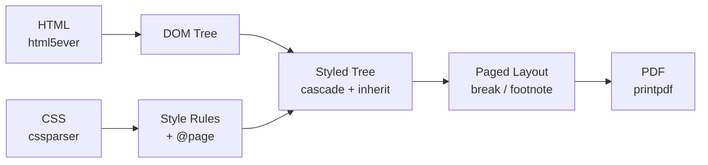

Rust 製の HTML + CSS → PDF 変換エンジン。CSS Paged Media 仕様の実装を目指す OSS (MIT / Apache-2.0)。

リポジトリ: [github.com/O6lvl4/pagina](https://github.com/O6lvl4/pagina)

## アーキテクチャ

Servo プロジェクトの html5ever（HTML パーサー）と cssparser（CSS パーサー）を使用。レイアウトエンジンと PDF 出力は自前実装。

## Cargo Workspace 構成

| クレート | 役割 |
|---|---|
| `pagina-core` | エンジン本体（DOM, CSS, スタイル, レイアウト, PDF） |
| `pagina-cli` | CLI バイナリ（`pagina input.html -o output.pdf`） |

## 対応機能

| 機能 | 状態 |
|---|---|
| @page { size, margin } | 対応（A4/A3/A5/B4/B5/letter/legal + landscape） |
| マージンボックス（@top-center 等 16 箇所） | 対応 |
| counter(page) / counter(pages) | 対応 |
| 柱 — string-set + string() | 対応 |
| @page :first / :left / :right | 対応 |
| 改ページ — break-before / break-after: page | 対応 |
| 脚注 — float: footnote | 対応 |
| CSS カスケード（タグ/クラス/ID + inline style） | 対応 |
| font-size / font-weight / font-style / color | 対応 |
| text-align / line-height / margin / padding | 対応 |
| テーブル（基本） | 対応 |
| リスト（ol/ul） | 対応 |
| 罫線（border-bottom / hr） | 対応 |
| SVG 埋め込み | 未対応 |
| フォント埋め込み（日本語等） | 未対応 |
| target-counter()（目次） | パーサーのみ |
| MathML | 未対応 |
| PDF/A / PDF/UA | 未対応 |
| JavaScript 実行 | 未対応 |
| CMYK カラー | 未対応 |

## 差別化ポイント

- **Rust 製**: シングルバイナリ、高速、将来的に WASM 対応可能
- **Servo 部品**: html5ever + cssparser の信頼性
- **OSS**: MIT / Apache-2.0 デュアルライセンス
- **CSS Paged Media 特化**: ブラウザが実装しない仕様（マージンボックス、脚注、柱）を実装

## 関連

- [[prince|Prince]] — 商用の CSS Paged Media エンジン（Pagina の目標）
- [[css-paged-media|CSS Paged Media]] — Pagina が実装する W3C 仕様
- [[document-generation|書面の自動生成]] — Pagina が使われる文脈
