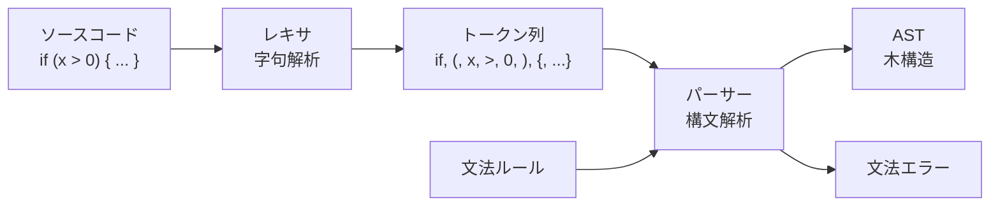

文章やコードを「文法に従って分解し、構造を取り出す装置」。プログラミング言語の処理では、テキストを AST に変換する役割を担う。

## 何ができる？／なぜ重要？

国語の授業で文を「主語・述語・目的語」に分ける作業を覚えていますか。パーサーはあれをコンピュータに自動でやらせる仕組みです。「私は今日本を読む」という文が来たら、「主語＝私」「述語＝読む」「目的語＝本」とラベル付けして、構造を木の形で取り出します。コードでも同じで、`if (x > 0) { print(x); }` を「if 文、条件部、本体部…」と分解してくれます。

これが嬉しいのは、文字の並びを意味のある構造として扱えるようになることです。エディタの色付け、文法エラーの検出、コードの自動修正、品質測定、すべてパーサーがあって初めて成り立ちます。なければ、コードはただの長い文字列で、機械は何もまとめて理解できません。

## 仕組み

パーサーは2段構えで動きます。まずレキサ（字句解析器）が文字列をトークン（意味のあるかたまり）に切り、次にパーサーが文法に従ってトークンを組み合わせて木構造を作ります。

## 用語

- **レキサ / トークナイザ**: 文字列をトークンに分ける前段。
- **パーサー**: トークンを文法に従って組み立てる本体。
- **トークン**: 言語の最小単位（キーワード、演算子、識別子など）。
- **文法 (Grammar)**: 「こういう並びは正しい」というルール集。BNF などで書く。
- **AST**: パーサーの最終成果物である木構造。
- **PEG / LL / LR**: 代表的なパーサーのアルゴリズム種別。
- **再帰下降パーサー**: 関数呼び出しの再帰で文法を実装する手書き型のパーサー。
- **エラーリカバリ**: 文法エラーがあっても止まらず、続きを解析する工夫。
- **パーサジェネレータ**: 文法定義から自動でパーサーを生成するツール（例: tree-sitter、ANTLR、yacc）。

## vault 内での使われ方

- [[tree-sitter-almide]] — Almide のパーサー（tree-sitter で生成）
- [[almide-grammar]] — Almide の文法定義（パーサーの設計図）
- [[almide]] — 自前のパーサーを持つ言語
- [[codopsy]] — パース結果の AST から品質を測定
- [[codopsy-ts]] — TS 版。同様にパーサー結果を解析
- [[famulus2]] — パーサー出力を活用したコード解析ツール
- [[famulus]] — パーサーを核としたコード解析の前身
- [[lean2ts]] — Lean をパースして TS に変換
- [[vscode-almide]] — VSCode 上で Almide パーサーを利用
- [[almide-js]] — JS 側で Almide をパース
- [[ccgrid]] — 構文解析を活用したグリッドツール

## 関連概念

- [[ast]] — パーサーが生成するデータ構造
- [[tree-sitter]] — パーサーを自動生成する代表ライブラリ
- [[compiler]] — コンパイラの最初のステップがパース
- [[token]] — パースの前段で扱う基本単位

## Links

- [Wikipedia: 構文解析](https://ja.wikipedia.org/wiki/%E6%A7%8B%E6%96%87%E8%A7%A3%E6%9E%90)
