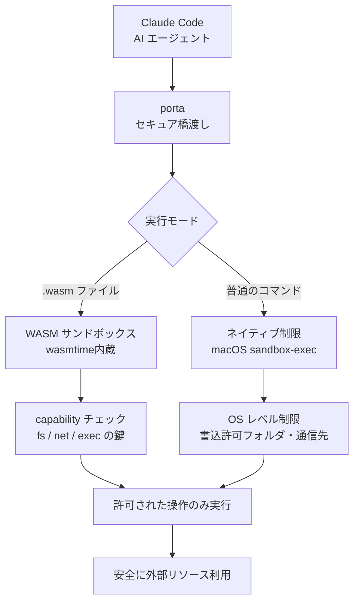

AI エージェントとネイティブコマンド向けのセキュア MCP ブリッジ。WASM 隔離 + OS レベル制限を capability で統合する。Docker 不要。

## 何ができる？

AI エージェントや任意のコマンドを「安全な部屋（サンドボックス）の中」で動かすための仕組みです。たとえば AI が暴走して `~/.ssh` の秘密鍵を読み取ろうとしても、外部の見知らぬサーバーに勝手に通信しようとしても、部屋のドアに鍵がかかっていれば外に出られません。porta は「このドアだけ開けてよい」「この時間帯だけ通信してよい」という鍵を一本一本渡す形で、AI に必要最小限の権限だけを与えます。Docker のように重たいコンテナを使わずに同等の隔離が実現できる点が特徴です。

何が嬉しいかというと、AI に新機能を試させるとき、最悪 AI が想定外の動作をしてもパソコンや会社のデータが守られる点です。

## 用語

- **MCP (Model Context Protocol)**: AI モデルと外部ツールをつなぐための共通プロトコル。porta はこの仕組みの「橋渡し」になる。
- **サンドボックス**: 「砂場」が原意。子どもがどんなに暴れても外の世界に影響しない、隔離された遊び場のような実行環境。
- **WASM (WebAssembly)**: どの OS でも同じように動く軽量な実行形式。porta は wasmtime という実行エンジンで動かす。
- **wasmtime**: WASM コードを動かすエンジンのひとつ。porta は自前で組み込んでいる。
- **capability**: 「特定のドアの鍵」のような権限の単位。`net`（通信）、`fs.write`（ファイル書込）など、機能ごとに分かれている。
- **deny-by-default**: 「初期状態は全部禁止、必要なものだけ明示的に許可する」流儀。安全側に倒した設計。
- **sandbox-exec**: macOS が標準で持つ「プロセスを制限つきで実行する」仕組み。
- **MCP サーバ**: AI からのツール呼び出しを受け付けるサーバ役。porta は WASM エージェントを MCP サーバとして公開できる。
- **JSON-RPC**: JSON 形式でやり取りする「遠隔手続き呼び出し」プロトコル。MCP の通信に使われる。
- **WASI**: WASM が OS の機能（ファイル・時刻など）を使うときの共通インターフェース。
- **profile**: あらかじめ用意された権限セット（`ai-agent`、`worker`、`full` の 3 種類）。
- **stdio**: 標準入出力。MCP の最もシンプルな通信路。

## 仕組み



porta は「AI と外の世界の間の関所」として動きます。AI から来た要求を、二重の防壁（OS レベルとアプリレベル）で確認し、許可された行動だけを通します。鍵のかかっていないドアからは出られないので、AI が想定外の動きをしても被害が部屋の中にとどまります。

## Two Execution Modes

| モード | 隔離手段 | 用途 |
|---|---|---|
| **WASM sandbox** | wasmtime (内蔵 interpreter) | [[almide|Almide]] / Rust / C を WASM 化したエージェント |
| **Native restrictions** | macOS `sandbox-exec` | [[claude-code|Claude Code]] / Python / Node などの素のコマンド |

`porta run` が拡張子で自動判別する（`.wasm` → WASM、それ以外 → native）。

## Quick Start

```bash
# Claude Code を HTTPS のみ許可で実行
porta run claude --allow-net '*:443' -v . -e "HOME=$HOME" -- --print "Fix the bug"

# 宣言的に
porta init native claude
porta up -- --print "Fix the bug in main.rs"

# WASM エージェントを MCP サーバとして公開
porta serve agent.wasm --profile full
```

## porta.toml

```toml
[runtime]
type = "native"           # "native" or "wasm"
command = "claude"

[sandbox]
mounts = ["."]            # ":ro" で read-only
network = ["*:443"]       # 空 = 全許可

[secrets]
API_KEY = { from-env = true }
```

## Security Model

### Two-Layer Enforcement

1. **OS layer** — `sandbox-exec` でプロセスのファイル書き込み・ポートを制御。子プロセスから回避不能
2. **MCP layer** — `porta.exec` / `porta.http` ビルトインツールのホスト+ポート URL フィルタ

### macOS Native Restrictions

| Control | 振る舞い |
|---|---|
| FS write | `-v` マウント先と `/tmp` 以外は拒否 |
| FS read | `~/.ssh` `~/.gnupg` は常に拒否 |
| Network | デフォルト全開、`--allow-net "*:443"` で制限 |

macOS sandbox-exec はポートベースのみ。ホスト名フィルタは MCP 層で処理。

### WASM Capability Set

deny-by-default。`io`, `fs`, `fs.write`, `process`, `env`, `clock`, `random`, `net`, `exec` を組み合わせ、`ai-agent` / `worker` / `full` のプリセット profile を提供。

## Architecture

```
porta/
├── cli.almd        引数 / help
├── mod.almd        コマンド dispatch（entry）
├── engine.almd     serve / run / validate / inspect
├── dispatch.almd   WASM instance lifecycle, tool dispatch
├── mcp.almd        MCP プロトコル状態機械
├── jsonrpc.almd    Content-Length framed JSON-RPC 2.0
├── sandbox.almd    capability 強制
├── ops.almd        daemon 管理 (ps/stop/kill/logs/rm)
├── wasm_rt.almd    wasmtime ブリッジ
└── wasm/
    ├── binary.almd binary parser
    └── wasi.almd   WASI Preview 1 host fns
```

ハーネス全体が [[almide|Almide]] で書かれている。WASM interpreter / WASI 実装も内製。

## MCP Built-in Tools

| Tool | 必須 capability | 用途 |
|---|---|---|
| `porta.exec` | `CapExec` + `--allow-exec` | コマンド実行（FS/net 制限付き） |
| `porta.http` | `CapNet` + `--allow-net` | 許可ホストへの HTTP |
| Agent tools | — | WASM エージェントへ委譲 |

## Claude Code 統合

```json
{
  "mcpServers": {
    "agent": {
      "type": "stdio",
      "command": "porta",
      "args": ["serve", "agent.wasm", "--profile", "full", "--allow-net", "*:443"]
    }
  }
}
```

## 関連

- [[almide]] — Porta 自身の実装言語、WASM ターゲットの主要ユースケース
- [[claude-code|Claude Code]] — native モードの代表的な制限対象
- [[famulus2]] — 同様に LLM 駆動だが、Porta はその実行基盤になり得る
- [[obsid]] — 別系統の WASM ホスト（こちらはグラフィクス用）

## Links

- [GitHub](https://github.com/almide/porta)
