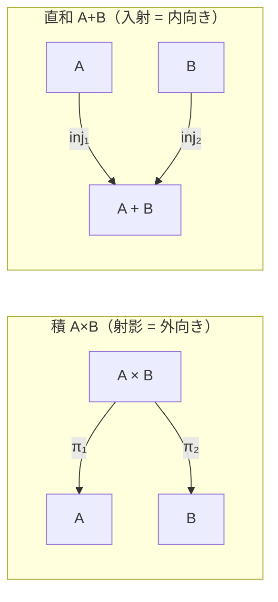
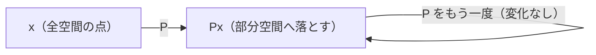
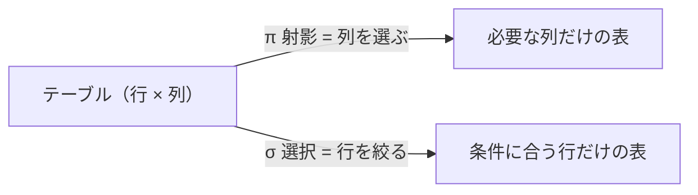

複数の分野に現れるが、共通核は同じ — **全体から一部の成分・次元だけを取り出し、残りを捨てる**操作。多くは**冪等**(2回適用しても結果は変わらない: `p(p(x)) = p(x)`)で、**情報を落とす**(非可逆)。双対は「埋め込む・注入する(injection)」。分野ごとに姿を整理する。

## 圏論・型の射影

**積(product)`A×B` からの取り出し** `π₁ : A×B → A`、`π₂ : A×B → B`(プログラムの `fst` / `snd`)。型では `A ∧ B → A` = **∧除去**([[curry-howard|カリー=ハワード]]で「タプルから片方を取る」)。積の**普遍性**そのものが射影で定義される(任意の対 `f:C→A, g:C→B` が一意の `⟨f,g⟩:C→A×B` を経由し、πで戻る)。

[[duality|双対]]は**直和(coproduct)`A+B` への入射** `inj₁ : A → A+B`(型では `A → A∨B` = ∨導入)。**射影=取り出す / 入射=埋め込む**が積↔和の双対をなす。→ [[adt-gadt|直積/直和型]]の取り出しと構築。

矢印の向きが対照的(射影は外向き、入射は内向き):

## 線形代数の射影

線形写像 `P` で **`P² = P`(冪等)** を満たすもの。空間をある部分空間へ「潰す」。
- **直交射影**: さらに `Pᵀ = P`(対称)。点から部分空間への**最短距離の足**を与える → **最小二乗法**の幾何的中身
- 次元削減(**PCA** など)は「分散最大の部分空間への射影」
- 冪等=「一度潰したものを再度潰しても同じ」、情報落ち=「捨てた次元は戻せない」

冪等性(`P²=P`)を図で:

## 関係代数の射影

RDB の **`π`(列の選択)= SQL の `SELECT 列…`**。テーブルから**必要な属性(列)だけ**を残す。
- 対になるのは**選択(selection)`σ` = `WHERE`(行の絞り込み)**。射影=縦に削る / 選択=横に削る
- 集合意味論では重複を除くため冪等的

縦(列)に削るのが射影、横(行)に削るのが選択:

## その他の「射影」

- **Futamura 射影(二村射影)** → [[partial-evaluation|部分評価]]。インタプリタの特殊化を3段で重ねる別概念(名前が同じだけ)
- **透視射影(perspective projection)** → 3D→2D 変換([[lumen]] 等のグラフィックス数学)

## 共通する直感(押さえどころ)

- **射影とは** → 全体から一部の成分/次元を取り出し残りを捨てる操作。多くは冪等(`p∘p = p`)で情報を落とす(非可逆)。
- **圏論・型** → 積からの取り出し `π₁/π₂`(fst/snd)、`A∧B→A`(∧除去)。双対は直和への入射 `A→A∨B`(∨導入)。
- **線形代数** → `P²=P` の冪等写像。直交射影(`Pᵀ=P`)は最短距離=最小二乗、PCA は分散最大部分空間への射影。
- **関係代数** → `π`=列の選択(SELECT)。行を絞る選択 `σ`(WHERE)と対。
- **同名だが別物** → Futamura 射影(部分評価)、透視射影(3D→2D)。

## 関連

- [[duality]] — 射影(取り出す)↔ 入射(埋め込む)、積↔直和の双対
- [[curry-howard]] — `A∧B→A` は射影、`A→A∨B` は入射という論理⇔型の対応
- [[adt-gadt]] — 直積/直和型。射影・入射はその基本操作
- [[category-theory]] — 積/余積の普遍性が射影/入射を定義する
- [[partial-evaluation]] — 同名の「Futamura 射影」(別概念)
