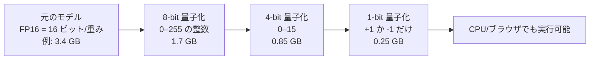

巨大な AI モデルの数値の精度を意図的に粗くして、サイズと計算コストを大きく下げる手法。極端な例が「+1 か -1 だけで表す」1-bit LLM。

## 何ができる？／なぜ重要？

写真にたとえます。デジタル写真は本来、色をとても細かく記録しています（RGB を 8 ビットずつなど）。しかしメッセージで送るとき、解像度や色数を落としても「人の目で見れば十分」な画質に縮められます。量子化はこれと同じ発想を AI に対して行います。AI の脳細胞のつなぎ目（重み）は、本来は小数点以下何桁もある精密な数値で記録されていますが、量子化すると「ざっくり 256 段階」「2 段階だけ」のように粗い目盛りに置き換えます。情報量は激減しますが、答えの賢さはほとんど落ちないことが多いのです。

なぜ重要かというと、ノートパソコンやスマホ、ブラウザ単体でも大きな AI が動くようになるからです。クラウドに頼らずに済むのでプライバシーが守れて、電気代も安くなります。

## 仕組み

精度を粗くするほどファイルが軽く、計算も速くなります。重要なのは「目盛りを粗くしても、AI 全体の振る舞いはあまり変わらない」という性質を活かす点です。最近では最初から 1-bit で学習し直す方式も出てきており、後から圧縮するより精度劣化を抑えられます。

## 用語

- **量子化 (Quantization)**: 連続値を限られた段階に丸める処理全般。アナログ → デジタルの基本動作。
- **重み (Weight)**: ニューラルネットワークの脳細胞のつなぎ目の強さ。AI のメインの容量。
- **FP16 / FP32**: 浮動小数点 16 ビット / 32 ビット。学習時の標準的な精度。
- **INT8 / INT4**: 8 ビット / 4 ビット整数表現。代表的な量子化先。
- **1-bit LLM**: 重みを「+1 / -1」（あるいは「+1 / 0 / -1」）だけで表現する超圧縮モデル。
- **ポストホック量子化**: 学習が終わったモデルを後から圧縮する方式。
- **量子化対応学習 (QAT)**: 学習中から量子化されることを意識して訓練する方式。
- **GGUF / GGML**: ローカル LLM でよく使われる量子化済みモデルのファイル形式。
- **scale (スケール)**: 粗い目盛りを実数に戻す係数。グループごとに 1 つ持つ実装が多い。
- **bit/weight**: 重み 1 つあたり何ビット使うか。圧縮率の指標。

## vault 内での使われ方

- [[bonsai-almide]] — 1-bit LLM「Bonsai」をブラウザで動かす実証プロジェクト。1.125 bit/weight、248 MB
- [[almide-nn]] — Almide で書かれた Transformer 実装。量子化と相性がよい層
- [[almai]] — Almide エコシステム内の LLM クライアント
- [[unillm]] — 量子化済みモデルもラップできる LLM 抽象
- [[fractop]] — エッジでの推論を見据えた並列処理

## 関連概念

- [[edge-computing]] — 量子化されたモデルはエッジでこそ威力を発揮
- [[codec]] — 「精度を下げて軽くする」発想は画像・音声コーデックと共通
- [[context-window]] — 量子化で軽くなった分、より長い文脈を処理できる
- [[serialization]] — 量子化済みモデルの保存形式（GGUF など）

## Links

- [Quantization (signal processing) (Wikipedia)](https://en.wikipedia.org/wiki/Quantization_(signal_processing))
- [BitNet b1.58 paper (Microsoft, 2024)](https://arxiv.org/abs/2402.17764)
