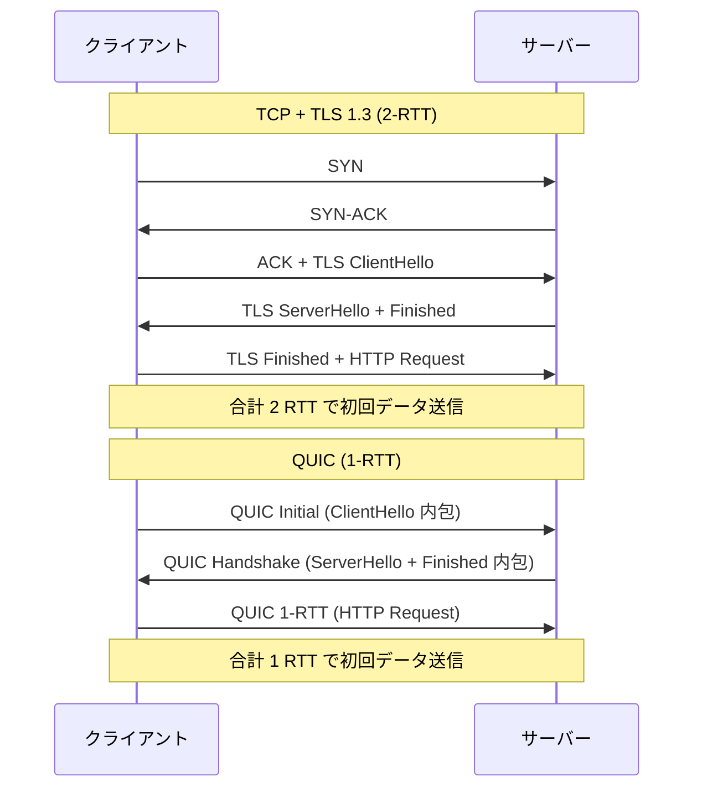
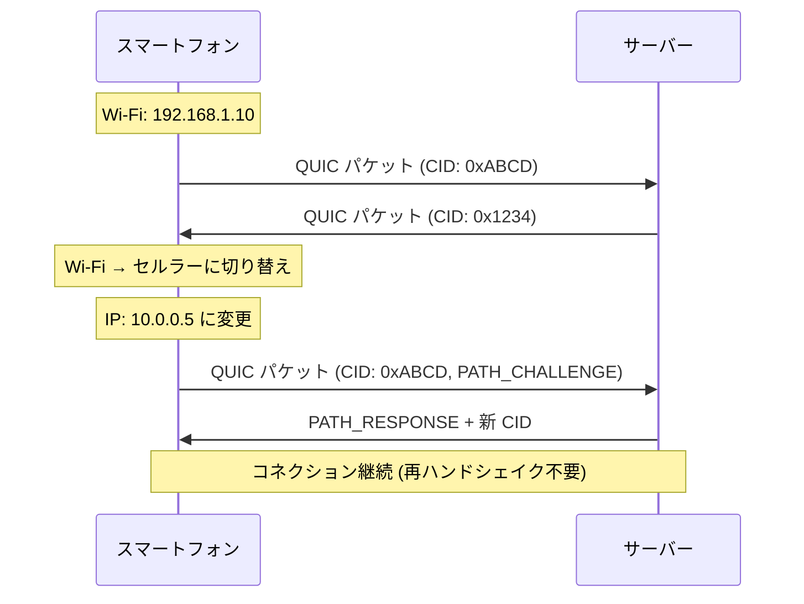
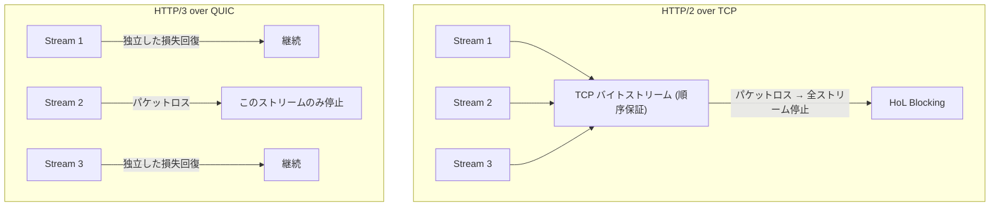
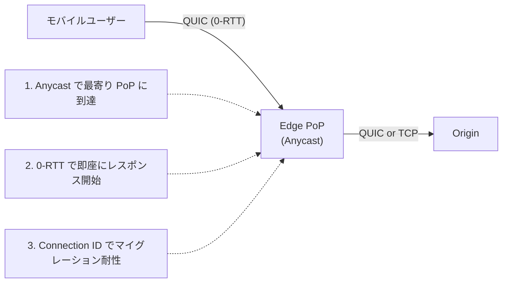
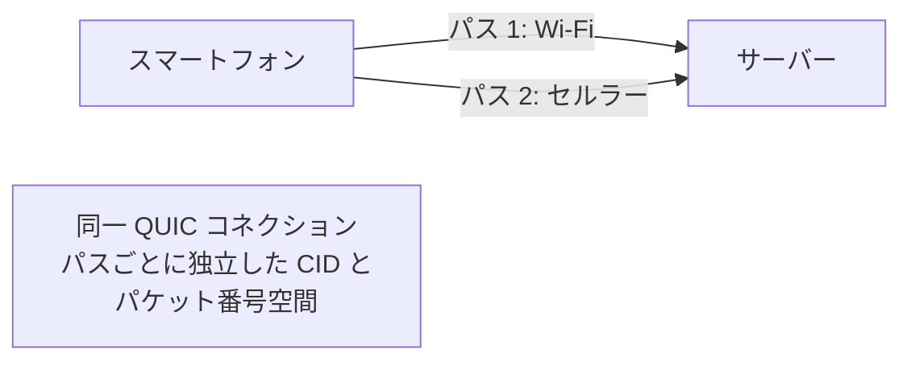

UDP 上に構築された暗号化・多重化トランスポートプロトコル QUIC と、その上で動作する HTTP/3 の包括的整理。TCP + TLS が数十年かけて獲得した機能を、ossification を回避しつつ単一プロトコルに統合した。2025年10月時点で全 Web トラフィックの約 35% が HTTP/3 で配信されている。

---

## 1. QUIC の概要

### Google QUIC (gQUIC) から IETF QUIC へ

| 年 | 出来事 |
|---|---|
| 2012 | Google が社内で QUIC の実験を開始 |
| 2013 | Google が QUIC を公表。Chromium に実装。独自暗号ハンドシェイク (QUIC Crypto) を使用 |
| 2015 | IETF に Internet-Draft を提出 |
| 2016 | IETF QUIC Working Group 設立。Google 独自仕様 (gQUIC) から標準化プロセスへ |
| 2018 | HTTP over QUIC を「HTTP/3」と命名 |
| 2021 (5月) | RFC 9000 (QUIC Transport), RFC 9001 (QUIC-TLS), RFC 9002 (Loss Detection & Congestion Control) が Proposed Standard として公開。gQUIC 非推奨化 |
| 2022 (6月) | RFC 9114 (HTTP/3), RFC 9204 (QPACK), RFC 9218 (Extensible Prioritization Scheme) 公開 |
| 2023 (5月) | RFC 9369 (QUIC v2) 公開 |
| 2025-2026 | Multipath QUIC が draft-21 (2026年3月)。WebTransport が W3C Working Draft。全ブラウザが HTTP/3 をネイティブサポート |

gQUIC → IETF QUIC の最大の変更点: 独自暗号ハンドシェイク (QUIC Crypto) を廃止し、TLS 1.3 を統合。ワイヤフォーマットも全面再設計。

### コア RFC 群

| RFC | タイトル | 内容 |
|---|---|---|
| RFC 8999 | Version-Independent Properties of QUIC | バージョン間で不変の性質を定義 |
| RFC 9000 | QUIC: A UDP-Based Multiplexed and Secure Transport | トランスポート層の本体仕様 |
| RFC 9001 | Using TLS to Secure QUIC | TLS 1.3 ハンドシェイクの統合方法 |
| RFC 9002 | QUIC Loss Detection and Congestion Control | パケットロス検出と輻輳制御 |
| RFC 9114 | HTTP/3 | HTTP セマンティクスの QUIC マッピング |
| RFC 9204 | QPACK | HTTP/3 用ヘッダ圧縮 |
| RFC 9218 | Extensible Prioritization Scheme for HTTP | HTTP/2・HTTP/3 共通の優先度方式 |
| RFC 9369 | QUIC Version 2 | ossification 対策としてのバージョン2 |

### なぜ QUIC が必要か: TCP + TLS の問題



| TCP + TLS の問題 | QUIC での解決 |
|---|---|
| ハンドシェイクに 2-3 RTT | TLS 1.3 統合で 1-RTT、再接続時 0-RTT |
| Head-of-Line Blocking (HoL) | 独立ストリームでストリーム間の HoL を排除 |
| IP/ポートでコネクション識別 → ネットワーク切り替えで切断 | Connection ID による識別。コネクションマイグレーション |
| ミドルボックスの ossification (TCP オプション拡張不能) | ほぼ全パケットが暗号化。ミドルボックスが内部を見れない |
| カーネル実装 → 更新が OS リリースに縛られる | ユーザー空間実装 → アプリケーションと共にデプロイ |

### なぜ UDP 上に構築するか

1. **カーネル変更不要**: 新しいトランスポートプロトコルを IP プロトコル番号で定義すると、全 OS カーネルの対応が必要。UDP はすでに全デバイスで動作する
2. **NAT/ファイアウォール通過**: UDP port 443 は多くのネットワークで通過可能
3. **ユーザー空間実装**: UDP ソケット上でプロトコルロジックを実装することで、アプリケーションと同じペースで進化できる
4. **ミドルボックス ossification の回避**: TCP は数十年の最適化の結果、ミドルボックスが TCP ヘッダの構造に依存した処理を行うようになり、プロトコル拡張が事実上不可能に。UDP は「何も仮定しない」ため自由度が高い

---

## 2. QUIC の技術的詳細

### コネクション確立 (0-RTT / 1-RTT)

#### 1-RTT ハンドシェイク (初回接続)

QUIC は TLS 1.3 を統合しており、トランスポート層のハンドシェイクと暗号ハンドシェイクが不可分。TCP のように「先に TCP 接続 → 次に TLS」という2段階がない。

1. クライアントが Initial パケットを送信 (TLS ClientHello を内包)
2. サーバーが Handshake パケットで応答 (TLS ServerHello + 証明書 + Finished を内包)
3. クライアントが Handshake 完了 + 最初の 1-RTT データ (HTTP リクエスト等) を送信

**重要**: QUIC の Initial パケット自体も暗号化されている (ただし鍵は公知の値から導出されるため、機密性ではなくフォーマット保護が目的)。Handshake 以降のパケットは完全に暗号化される。

#### 0-RTT (再接続時)

以前の接続で取得した PSK (Pre-Shared Key) / セッションチケットを使い、ハンドシェイク完了前にアプリケーションデータを送信。

```
クライアント → サーバー: Initial + 0-RTT データ (HTTP GET 等)
サーバー → クライアント: Handshake + 1-RTT レスポンス
```

接続確立のレイテンシがゼロ。モバイルユーザーや Edge CDN での再接続に特に有効。

#### 0-RTT のリプレイ攻撃リスクと対策

0-RTT データは前方秘匿性 (Forward Secrecy) を持たない。攻撃者が 0-RTT パケットをキャプチャして再送すると、サーバーが同じリクエストを再度処理する可能性がある。

| 対策 | 説明 |
|---|---|
| 冪等性の要求 | 0-RTT では冪等なリクエスト (GET 等) のみ送信すべき。非冪等操作 (POST による送金等) は 1-RTT 確立後に |
| PSK Binder による一意性検証 | PSK Binder が 0-RTT リクエストごとに一意。Cloudflare はこれをリプレイ検出キーとして使用 |
| リプレイキャッシュ | サーバーが受信済み 0-RTT のタイムスタンプ/ノンスを Bloom Filter 等で追跡 |
| 時間ウィンドウ制限 | セッションチケットの有効期間を短く設定 (例: 数分) |
| アプリケーション層の防御 | サーバーアプリケーションが 0-RTT データを「暫定的」として扱い、ハンドシェイク完了後に確定 |

### Connection ID によるコネクション識別

TCP はコネクションを (送信元 IP, 送信元ポート, 宛先 IP, 宛先ポート) の 4-tuple で識別する。QUIC は **Connection ID** (可変長、最大 20バイト) で識別する。

#### コネクションマイグレーション



- クライアントの IP アドレスが変わっても、Connection ID が一致すればサーバーは同一コネクションと認識
- PATH_CHALLENGE / PATH_RESPONSE で新しいパスを検証
- Wi-Fi → セルラー、VPN 接続/切断、NAT リバインド等のシナリオで接続が途切れない

#### [[anycast-cdn|Anycast]] との相性

TCP + Anycast の問題: BGP 経路変更でパケットが別 PoP に到達 → TCP 状態がない → RST → 切断。

QUIC + Anycast の解決策:
1. 初回は Anycast で最寄り PoP に接続
2. Connection ID にルーティング情報をエンコード (QUIC-LB: draft-ietf-quic-load-balancers)
3. ロードバランサーが Connection ID から正しいサーバーに転送
4. PoP 障害時も Connection ID ベースで別 PoP にマイグレーション可能

### ストリーム多重化

#### Head-of-Line Blocking の解消



- **TCP の HoL**: TCP は全データを単一のバイトストリームとして順序保証。1パケットのロスが全ストリームを停止
- **QUIC の独立ストリーム**: 各ストリームが独立したバイトストリーム。Stream 2 のパケットロスは Stream 1, 3 に影響しない

#### ストリームの種類

| 種類 | ID の偶奇 | 開始者 | 用途 |
|---|---|---|---|
| クライアント開始双方向 | 0, 4, 8, ... | クライアント | HTTP リクエスト/レスポンス |
| サーバー開始双方向 | 1, 5, 9, ... | サーバー | サーバープッシュ (HTTP/3 では未使用) |
| クライアント開始単方向 | 2, 6, 10, ... | クライアント | QPACK エンコーダストリーム等 |
| サーバー開始単方向 | 3, 7, 11, ... | サーバー | QPACK デコーダストリーム等 |

- 双方向ストリーム: 両端がデータを送受信
- 単方向ストリーム: 開始者のみがデータを送信。HTTP/3 の制御ストリームや QPACK の同期に使用
- コネクションあたりの最大ストリーム数は QUIC トランスポートパラメータで交渉

### フロー制御

QUIC は 2 層のフロー制御を持つ:

| 層 | 制御対象 | 目的 |
|---|---|---|
| ストリームレベル | 個別ストリームのバッファ消費 | 1つの高帯域ストリームが他のストリームを圧迫しない |
| コネクションレベル | コネクション全体のバッファ消費 | 受信者のメモリ保護 |

MAX_STREAM_DATA フレームと MAX_DATA フレームで受信ウィンドウを動的に通知。TCP のウィンドウスケーリングに相当するが、ストリーム単位の粒度がある。

### 輻輳制御

QUIC の輻輳制御はプラグ可能 (pluggable) に設計されている。RFC 9002 は New Reno をベースラインとして定義するが、実装は任意のアルゴリズムを使用可能。

| アルゴリズム | 特徴 | 主な使用 |
|---|---|---|
| New Reno | RFC 9002 のリファレンス。ロスベース | 仕様準拠のベースライン |
| CUBIC | ロスベース。TCP のデフォルト (Linux)。高 BDP ネットワーク向け | Cloudflare quiche (デフォルト), 多くの実装 |
| BBR (v1/v2/v3) | モデルベース。帯域幅と RTT を推定。ロスに鈍感 | Google (Chromium), LiteSpeed |
| HyStart++ | スロースタートの改良。CUBIC と組み合わせ | Cloudflare quiche |
| Copa, Aero 等 | 研究段階のアルゴリズム | 学術研究 |

**BBR vs CUBIC の本質的な違い**: CUBIC はパケットロスを輻輳の信号とする。BBR はボトルネック帯域幅と RTT を推定し、パケットロスと輻輳を区別する。無線ネットワークのような物理的パケットロスが多い環境では BBR が有利。

### パケットロスとリカバリ

| TCP の問題 | QUIC の解決 |
|---|---|
| シーケンス番号の再利用 (再送パケットが同じ seq) → RTT 推定が曖昧 | パケット番号は単調増加。再送パケットも新しい番号 → RTT 推定が正確 |
| SACK (Selective ACK) は TCP オプションで容量制限 | ACK フレームに任意数の ACK Range を含めることが可能 |
| NACK なし、ACK + SACK で推定 | ACK ベース (NACK なし) だが、豊富な ACK Range で同等の情報量 |
| RTO (Retransmission Timeout) の曖昧性 | PTO (Probe Timeout) で早期にプローブパケットを送信し、タイムアウト待ちを削減 |

---

## 3. HTTP/3

### HTTP/3 = HTTP over QUIC

HTTP/3 (RFC 9114) は HTTP のセマンティクス (メソッド、ヘッダ、ステータスコード等) を QUIC トランスポート上にマッピングしたもの。HTTP のセマンティクス自体は HTTP/1.1, HTTP/2, HTTP/3 で共通 (RFC 9110)。

### HTTP/2 との主要な違い

| 項目 | HTTP/2 | HTTP/3 |
|---|---|---|
| トランスポート | TCP + TLS 1.2/1.3 | QUIC (UDP + TLS 1.3 統合) |
| 多重化の HoL | TCP 層で HoL Blocking あり | ストリーム間の HoL なし |
| ヘッダ圧縮 | HPACK | QPACK |
| ハンドシェイク | TCP 3-way + TLS = 2-3 RTT | 1-RTT (初回), 0-RTT (再接続) |
| コネクションマイグレーション | 不可 | 可能 (Connection ID) |
| 優先度制御 | 依存ツリーモデル (複雑、実装差大) | RFC 9218 (urgency + incremental) |
| サーバープッシュ | あり (広く使用) | 仕様上あり、実質廃止 |

### QPACK vs HPACK

| 項目 | HPACK (RFC 7541) | QPACK (RFC 9204) |
|---|---|---|
| 設計対象 | HTTP/2 (TCP 上の順序保証あり) | HTTP/3 (QUIC の独立ストリーム) |
| 動的テーブル更新 | ストリーム内でインライン | 専用の単方向ストリームで送受信 |
| HoL Blocking | なし (TCP が順序保証) | 設計で回避 (静的テーブル参照と Literal はブロックしない) |
| 静的テーブルサイズ | 61 エントリ (値付き 14、~23%) | 99 エントリ (値付き 78、~80%) |
| 順序依存 | あり (1 TCP コネクション内で順次処理) | なし (エンコーダ/デコーダストリームで同期) |

HPACK は TCP の順序保証に依存して動的テーブルを更新するが、QUIC ではストリーム間の順序が保証されないため、QPACK はエンコーダストリーム (送信側→受信側) とデコーダストリーム (受信側→送信側) の2本の単方向ストリームで動的テーブルの同期を行う。

### Server Push の実質的廃止

HTTP/2 で導入されたサーバープッシュは、HTTP/3 でも仕様上は存在するが、実質的に廃止されている:

- Chrome は HTTP/3 でのプッシュをサポートせず、追加予定もなし
- 2022年、Chrome は HTTP/2 のプッシュサポートも削除
- プッシュの問題: ブラウザキャッシュとの重複、帯域幅の浪費、実装の複雑さ
- 代替: `103 Early Hints`, `rel=preload`, `rel=preconnect`

### HTTP/3 Priority (RFC 9218)

HTTP/2 の依存ツリーモデルは複雑で実装間の差異が大きく、実質的に機能しなかった。RFC 9218 で全面的に再設計:

```
Priority: u=3, i
```

- `u` (urgency): 0-7 の整数。0 が最高優先度、7 が最低。デフォルト 3
- `i` (incremental): 存在すれば増分的 (例: 画像の漸進的表示)。不在なら非増分的 (例: JS は全部届いてから実行)
- HTTP/2 と HTTP/3 の両方で使用可能 (バージョン非依存)
- Priority ヘッダまたは PRIORITY_UPDATE フレームで伝達

---

## 4. Edge Computing と QUIC/HTTP/3

### CDN での QUIC 活用



| QUIC の Edge 価値 | 説明 |
|---|---|
| 0-RTT の意味 | Edge PoP でTLS 終端 → 再訪問ユーザーは 0-RTT で即座にデータ取得。CDN の TLS 終端メリットをさらに強化 |
| Anycast + Connection ID | BGP 経路変更でもコネクション維持。QUIC-LB (draft-ietf-quic-load-balancers) で Connection ID にルーティング情報をエンコード |
| モバイルユーザー | Wi-Fi → セルラー切り替えでもストリーミング/ダウンロードが中断しない |
| DDoS 耐性 | QUIC の Initial パケットはステートレスリトライ (Retry パケット) で増幅攻撃を軽減 |

### Cloudflare の QUIC 実装 (quiche / tokio-quiche)

Cloudflare は QUIC/HTTP/3 実装 `quiche` を Rust で開発し、全 Edge PoP で運用:

- **quiche**: Rust 製。QUIC Transport + HTTP/3。CUBIC, BBR, HyStart++ をプラグ可能に実装
- **tokio-quiche** (2025年12月オープンソース化): quiche を Tokio 非同期ランタイムと統合。UDP ソケット管理、データグラムのコネクションへのルーティング、quiche ステートマシンの駆動を自動化
- Apple iCloud Private Relay の Proxy B を tokio-quiche で運用。数百万 RPS を処理
- ユースケース: DNS-over-QUIC、カスタム VPN、HTTP/3 サーバー

### モバイルユーザーへの影響

コネクションマイグレーションは理論上の機能ではなく、モバイルユーザーの日常体験に直接影響する:

- 電車での移動中に基地局が切り替わる → IP 変更 → TCP なら再接続 (数秒)、QUIC なら透過的にマイグレーション
- Akamai の 2025年レポート: モバイルでのレイテンシが HTTP/2 比で 30% 削減

---

## 5. パフォーマンス

### ベンチマーク実測値

#### Cloudflare 測定 (blog.cloudflare.com, 2024)

| メトリクス | HTTP/3 | HTTP/2 | 差 |
|---|---|---|---|
| TTFB (平均) | 176ms | 201ms | HTTP/3 が 12.4% 高速 |
| 小さいページ (15KB) | 443ms | 458ms | HTTP/3 がわずかに高速 |
| 大きいページ (1MB) | 2.33s | 2.30s | HTTP/2 がわずかに高速 |

大きいページで HTTP/3 が遅い原因: テスト時の HTTP/2 は BBRv1、HTTP/3 は CUBIC を使用。輻輳制御アルゴリズムの差が支配的。

#### Request Metrics 測定 (距離別)

| 場所 (サーバーからの距離) | HTTP/3 の HTTP/2 比改善 |
|---|---|
| New York (~1,000マイル) | 200-325ms 高速 |
| London (大西洋横断) | 600-1,200ms 高速 (NY の 3-3.5 倍の改善) |
| Bangalore (長距離) | さらに大きな改善幅 |

距離が長いほど QUIC の 0-RTT / 1-RTT 削減効果が顕著。

#### Catchpoint 測定 (6カ国、TTFB)

HTTP/3 は中央値 TTFB を 41.8% 削減。

#### LCP (Largest Contentful Paint) 実測

HTTP/3 ユーザー: 1.44秒、HTTP/2 ユーザー: 1.67秒 → 13.8% 改善。

### パフォーマンス特性まとめ

| シナリオ | HTTP/3 の優位性 | 理由 |
|---|---|---|
| 高レイテンシ (長距離) | 大 | 1-RTT / 0-RTT の効果が RTT に比例 |
| パケットロスの多い環境 | 大 | ストリーム間 HoL Blocking なし |
| モバイル (ネットワーク切替) | 大 | コネクションマイグレーション |
| 再訪問ユーザー | 大 | 0-RTT で即座にデータ送信 |
| 低レイテンシ LAN | 小〜なし | RTT 削減の効果が小さい |
| 大容量ファイル転送 | 小〜逆転 | 輻輳制御の成熟度次第。TCP の BBR が有利なケースも |
| 初回接続 | 中 | 1-RTT (QUIC) vs 2-3 RTT (TCP+TLS) |
| 再接続 | 大 | 0-RTT (QUIC) vs 1-2 RTT (TCP+TLS) |

---

## 6. 実装

### 主要な QUIC 実装

| 実装 | 言語 | 組織 | 特徴 |
|---|---|---|---|
| quiche | Rust | Cloudflare | 全 Cloudflare Edge で運用。CUBIC/BBR/HyStart++ プラグ可能。tokio-quiche で非同期統合 |
| Quinn | Rust | コミュニティ | Tokio ネイティブ。安定ネットワークで高スループット。Rust エコシステムのデファクト |
| s2n-quic | Rust | AWS | AWS のプロダクション品質。s2n-tls と統合 |
| Neqo | Rust | Mozilla | Firefox の QUIC 実装 |
| msquic | C | Microsoft | Windows カーネル統合。高パフォーマンス。ロス/リオーダリング耐性が高い |
| ngtcp2 | C | コミュニティ (tatsuhiro-t) | nghttp3 と組み合わせ。curl の HTTP/3 バックエンド |
| quic-go | Go | コミュニティ | Go エコシステムのデファクト。MASQUE 実装 (masque-go) もあり |
| mvfst | C++ | Meta | Meta プロダクション。proxygen と統合 |
| lsquic | C | LiteSpeed | LiteSpeed Web Server の QUIC 実装。BBR サポートが早期 |
| Chromium QUIC | C++ | Google | Chrome / Chromium の実装。gQUIC から IETF QUIC に移行済 |
| picoquic | C | コミュニティ (huitema) | リファレンス実装寄り。fuzzing ツール fuzi_q を同梱 |
| XQUIC | C | Alibaba | クロスプラットフォーム |
| linuxquic | C | コミュニティ | Linux カーネル内 QUIC 実装 (実験段階) |
| aioquic | Python | コミュニティ | Python asyncio ベース |
| AppleQuic | C/ObjC/Swift | Apple | macOS/iOS ネイティブ。プロプライエタリ |

### ブラウザ対応状況 (2026年5月)

| ブラウザ | HTTP/3 サポート | 備考 |
|---|---|---|
| Chrome | 87+ (2020年11月〜) | デフォルト有効 |
| Firefox | 88+ (2021年4月〜) | デフォルト有効 |
| Safari | 14+ (2020年〜) | 実験的 → 16 以降デフォルト |
| Edge | 87+ (Chromium ベース) | Chrome と同等 |

全主要ブラウザでデフォルト有効。HTTP/3 の発見は Alt-Svc ヘッダまたは DNS HTTPS レコードで行われる。

---

## 7. QUIC の課題と批判

### UDP ベースの問題

| 問題 | 詳細 |
|---|---|
| ファイアウォール/ISP のブロック | 企業ネットワークやホテル Wi-Fi で UDP 443 がブロックされるケースあり。ブラウザは TCP (HTTP/2) にフォールバック |
| 国家レベルの検閲 | 2025年1月時点で中国の GFW が SNI ベースで QUIC をブロック。ただし、複数 UDP データグラムにまたがる ClientHello の再組み立てには対応していない |
| NAT タイムアウト | UDP の NAT エントリは TCP より短い (30秒〜2分 vs 数時間)。QUIC はキープアライブが必要 |

### CPU 負荷

- QUIC は全パケットを暗号化 (TCP は TLS record 単位)。パケット単位の AES-GCM / ChaCha20 処理
- TCP は数十年のカーネル最適化 (TSO, GRO, zero-copy sendfile 等) があるが、QUIC のユーザー空間実装にはこれらが直接適用されない
- 対策: Linux GSO (Generic Segmentation Offload) で sendmsg あたり最大 64KB のバッチ送信。640 Mbps → 1.6 Gbps に改善
- sendmmsg + GSO の組み合わせで CPU の 70-80% を占めていたソケット層のオーバーヘッドを大幅に削減

### ミドルボックスの不透明性

QUIC パケットのほぼ全体が暗号化されているため:
- DPI (Deep Packet Inspection) が機能しない
- 企業のセキュリティポリシー適用が困難
- QoS の適用が難しい (TCP のフラグやオプションに依存した既存の仕組みが使えない)
- 2025年: QASM (QUIC-Aware Stateful Middlebox) フレームワークが提案され、5% 未満のオーバーヘッドで HTTP/3 のミドルボックス機能を実現

### OS カーネルでの最適化の遅れ

- TCP は Linux カーネルで数十年最適化 (TSO, GRO, zero-copy, eBPF, etc.)
- QUIC はユーザー空間実装が主流 → コンテキストスイッチ、メモリコピーのオーバーヘッド
- linuxquic プロジェクトがカーネル内 QUIC を実験中だが、成熟には時間がかかる
- Linux v4.18: UDP GSO、v6.2: TUN ドライバで GSO トグル対応
- 2025年: カーネルパッチで GSO バッファ内のペーシングが可能に → バッチングの性能利点とペーシングの公平性を両立

---

## 8. 将来の展望

### QUIC v2 (RFC 9369)

2023年5月公開。QUIC v1 と機能的にほぼ同一だが、ワイヤフォーマットの一部 (Initial パケットの salt, Retry パケットの鍵等) を意図的に変更。目的:

- **ossification 対策**: ミドルボックスが QUIC v1 の固定パターンに依存した処理を構築することを防ぐ
- **バージョンネゴシエーション演習**: Compatible Version Negotiation (RFC 9368) の実運用テスト
- v1 と v2 を同時にサポートすることで、将来のバージョン更新の基盤を確立

### Multipath QUIC (draft-ietf-quic-multipath-21, 2026年3月)

単一コネクションで複数のネットワークパスを同時使用:



- Wi-Fi + セルラーの帯域を集約
- 一方のパスが障害 → もう一方で継続 (シームレスフェイルオーバー)
- 各パスに独立した Connection ID とパケット番号空間を割り当て
- 2026年3月で draft-21、RFC 化は近い

### WebTransport

QUIC 上でブラウザから低レイテンシのデータグラム/ストリーム通信を行う API:

| 項目 | WebSocket | WebTransport |
|---|---|---|
| トランスポート | TCP | QUIC (HTTP/3 上) |
| 多重化 | なし (1コネクション = 1ストリーム) | 複数ストリーム + データグラム |
| HoL Blocking | あり | なし |
| 信頼性 | 常に reliable | reliable (ストリーム) + unreliable (データグラム) 選択可能 |
| 0-RTT | 不可 | 可能 |

- W3C Working Draft (2026年3月時点)。2026年 Q2 に Recommendation 予定
- 2026年: 全主要ブラウザでサポート (Safari 26.4 が最後の gap を埋めた)
- ユースケース: クラウドゲーミング、ライブストリーミング、リアルタイム協調編集、IoT センサーデータ、金融ティッカー

### MASQUE (Multiplexed Application Substrate over QUIC Encryption)

QUIC / HTTP/3 上でプロキシングを行うプロトコル群:

| RFC/Draft | 名前 | 機能 |
|---|---|---|
| RFC 9298 | Proxying UDP in HTTP | HTTP/3 CONNECT-UDP で UDP トラフィックをプロキシ |
| draft-ietf-masque-quic-proxy-08 (2026年3月) | QUIC-Aware Proxying | プロキシが QUIC short header を認識し、UDP 4-tuple を再利用。スループット向上 |

- Apple iCloud Private Relay、Cloudflare WARP 等の VPN サービスの基盤技術
- 従来の VPN (IPsec, WireGuard) と異なり、HTTP/3 の上に構築されるため Web インフラと統合しやすい

---

## 押さえどころ (カード化候補)

- QUIC の定義 → UDP 上に構築された暗号化・多重化トランスポートプロトコル。TLS 1.3 を統合し、TCP + TLS の2段階を1プロトコルに統合。RFC 9000 (2021年)
- gQUIC → IETF QUIC → Google が 2012年に実験開始、2013年に公表。2016年に IETF WG 設立。独自暗号 (QUIC Crypto) を廃止し TLS 1.3 に統合。2021年に RFC 9000 として標準化
- QUIC が UDP 上に構築される理由 → カーネル変更不要、NAT/FW 通過可能、ユーザー空間実装でアプリと同ペースで進化、TCP のミドルボックス ossification を回避
- 1-RTT ハンドシェイク → TLS 1.3 をトランスポートに統合。TCP の 3-way + TLS = 2-3 RTT を 1 RTT に削減。Initial パケットに ClientHello を内包
- 0-RTT 再接続 → PSK でハンドシェイク完了前にデータ送信。レイテンシゼロ。ただし Forward Secrecy なし、リプレイ攻撃リスクあり。冪等リクエストのみ使用すべき
- 0-RTT リプレイ対策 → 冪等性の要求 + PSK Binder による一意性検証 + リプレイキャッシュ (Bloom Filter) + 時間ウィンドウ制限 + アプリケーション層での暫定処理
- Connection ID → 可変長 (最大20バイト) の識別子。IP/ポートの 4-tuple ではなく CID でコネクション識別。IP 変更でも接続維持
- コネクションマイグレーション → Wi-Fi → セルラー切替時、新 IP から PATH_CHALLENGE / PATH_RESPONSE でパス検証。再ハンドシェイク不要で接続継続
- QUIC + Anycast → TCP + Anycast は BGP 経路変更で切断。QUIC は CID でコネクション識別 → 経路変更に耐性。QUIC-LB で CID にルーティング情報をエンコード
- ストリーム多重化と HoL 解消 → TCP は単一バイトストリーム、1パケットロスで全ストリーム停止 (HoL)。QUIC は各ストリームが独立、あるストリームのロスが他に影響しない
- 双方向/単方向ストリーム → 双方向: HTTP リクエスト/レスポンス。単方向: QPACK エンコーダ/デコーダストリーム、制御ストリーム。ストリーム ID の偶奇で種類と開始者を区別
- 2層フロー制御 → ストリームレベル (1ストリームの暴走防止) + コネクションレベル (受信者メモリ保護)。MAX_STREAM_DATA / MAX_DATA フレームで動的に通知
- プラグ可能な輻輳制御 → RFC 9002 は New Reno をベースライン定義。実装は CUBIC, BBR, HyStart++ 等を自由に選択。quiche は config API でコネクションレベルで切替可能
- BBR vs CUBIC → CUBIC はロスベース (パケットロス = 輻輳)。BBR はモデルベース (帯域幅 + RTT 推定、ロスと輻輳を区別)。無線環境の物理的ロスでは BBR が有利
- パケット番号の単調増加 → TCP は再送パケットに同じ seq を使用 → RTT 推定が曖昧 (リトランスミッション曖昧性)。QUIC は再送にも新番号 → 正確な RTT 推定
- HTTP/3 = HTTP over QUIC → HTTP セマンティクス (RFC 9110) を QUIC 上にマッピング。RFC 9114。ストリーム間 HoL なし、1-RTT/0-RTT、コネクションマイグレーション
- QPACK vs HPACK → HPACK は TCP の順序保証に依存。QPACK は QUIC のストリーム独立性に対応するため、専用の単方向ストリームで動的テーブルを同期。静的テーブルも 61→99 エントリに拡充
- Server Push の実質廃止 → Chrome は HTTP/3 でサポートせず追加予定なし。2022年に HTTP/2 のプッシュも削除。代替: 103 Early Hints, rel=preload
- RFC 9218 Priority → HTTP/2 の依存ツリーを廃止。urgency (0-7) + incremental フラグのシンプルなモデル。HTTP/2・HTTP/3 共通。Priority ヘッダまたは PRIORITY_UPDATE フレームで伝達
- Edge CDN での 0-RTT → Edge PoP で TLS 終端 + 0-RTT → 再訪問ユーザーはハンドシェイク 0 RTT でデータ取得開始。CDN の TLS 終端メリットをさらに強化
- QUIC パフォーマンス特性 → 高レイテンシ/パケットロス/モバイル/再訪問で大きな優位性。低レイテンシ LAN や大容量転送では差が小さいか逆転するケースも
- HTTP/3 TTFB 改善 → Cloudflare 測定: HTTP/3 が 176ms vs HTTP/2 の 201ms (12.4%改善)。Catchpoint 測定: 中央値 TTFB 41.8% 削減。距離が長いほど効果大
- quiche (Cloudflare) → Rust 製 QUIC/HTTP/3 実装。全 Edge PoP で運用。tokio-quiche (2025年 OSS 化) で Tokio 統合。Apple Private Relay で数百万 RPS
- QUIC 実装の選択軸 → Rust: quiche (プロダクション), Quinn (エコシステム), s2n-quic (AWS)。C: msquic (Windows), ngtcp2 (curl)。Go: quic-go。C++: mvfst (Meta)
- UDP ベースの課題 → FW/ISP ブロック (TCP フォールバック必要)、NAT タイムアウトが短い、国家検閲 (GFW の SNI ベースブロック)
- QUIC の CPU 負荷 → 全パケット暗号化 + ユーザー空間実装。TCP の数十年のカーネル最適化なし。対策: GSO で sendmsg バッチ化 (640Mbps→1.6Gbps)
- ミドルボックスの不透明性 → QUIC の暗号化で DPI 不能、企業セキュリティポリシー適用困難、QoS 適用困難。QASM が 5% 未満のオーバーヘッドで対処を試みる
- QUIC v2 (RFC 9369) → v1 と機能同一だがワイヤフォーマットを意図的に変更。ossification 対策 + バージョンネゴシエーション演習
- Multipath QUIC → 単一コネクションで Wi-Fi + セルラーを同時使用。帯域集約 + シームレスフェイルオーバー。パスごとに独立した CID とパケット番号空間。draft-21 (2026年3月)
- WebTransport → QUIC/HTTP/3 上のブラウザ API。reliable ストリーム + unreliable データグラム。WebSocket の後継。2026年に全ブラウザサポート。W3C Recommendation 予定 2026 Q2
- MASQUE → HTTP/3 上のプロキシングプロトコル。CONNECT-UDP で UDP トラフィックを透過。iCloud Private Relay, Cloudflare WARP の基盤。従来 VPN より Web インフラと親和性が高い

## Links

- [RFC 9000: QUIC Transport](https://www.rfc-editor.org/rfc/rfc9000.html)
- [RFC 9001: Using TLS to Secure QUIC](https://www.rfc-editor.org/rfc/rfc9001.html)
- [RFC 9002: QUIC Loss Detection and Congestion Control](https://www.rfc-editor.org/rfc/rfc9002.html)
- [RFC 9114: HTTP/3](https://www.rfc-editor.org/rfc/rfc9114.html)
- [RFC 9204: QPACK](https://www.rfc-editor.org/rfc/rfc9204.html)
- [RFC 9218: Extensible Prioritization Scheme for HTTP](https://www.rfc-editor.org/rfc/rfc9218.html)
- [RFC 9369: QUIC Version 2](https://www.rfc-editor.org/rfc/rfc9369.html)
- [QUIC Working Group - Implementations](https://quicwg.org/implementations)
- [Cloudflare: HTTP/3 vs HTTP/2](https://blog.cloudflare.com/http-3-vs-http-2/)
- [Cloudflare: tokio-quiche OSS](https://blog.cloudflare.com/async-quic-and-http-3-made-easy-tokio-quiche-is-now-open-source/)
- [Cloudflare: CUBIC and HyStart++ in quiche](https://blog.cloudflare.com/cubic-and-hystart-support-in-quiche/)
- [Cloudflare: Accelerating UDP packet transmission for QUIC](https://blog.cloudflare.com/accelerating-udp-packet-transmission-for-quic/)
- [Cloudflare: 0-RTT Resumption](https://blog.cloudflare.com/even-faster-connection-establishment-with-quic-0-rtt-resumption/)
- [Cloudflare: MASQUE Proxying](https://blog.cloudflare.com/unlocking-quic-proxying-potential/)
- [HTTP/3 Is Fast - Request Metrics](https://requestmetrics.com/web-performance/http3-is-fast/)
- [QUIC-LB: Generating Routable QUIC Connection IDs](https://quicwg.org/load-balancers/draft-ietf-quic-load-balancers.html)
- [Multipath QUIC Draft](https://datatracker.ietf.org/doc/draft-ietf-quic-multipath/)
- [W3C WebTransport](https://www.w3.org/TR/webtransport/)
- [IETF MASQUE Working Group](https://ietf-wg-masque.github.io/)
- [Demystifying QUIC from the Specifications (2025)](https://arxiv.org/html/2511.08375v1)

## 関連

- [[anycast-cdn]] — Anycast + Connection ID で QUIC が TCP + Anycast の経路変更問題を構造的に解決
- [[edge-computing]] — QUIC/HTTP/3 は Edge CDN の 0-RTT + コネクションマイグレーションの基盤
- [[edge-platforms]] — Cloudflare Workers 等の Edge プラットフォームが QUIC/HTTP/3 をフロントエンドに使用
- [[edge-security]] — QUIC の暗号化とミドルボックスの不透明性が Edge セキュリティに影響
- [[distributed-consistency]] — QUIC のストリーム多重化は分散システムの並行性制御と関連
- [[nist-test-vectors]] — QUIC が使用する TLS 1.3 / AES-GCM の暗号実装検証
