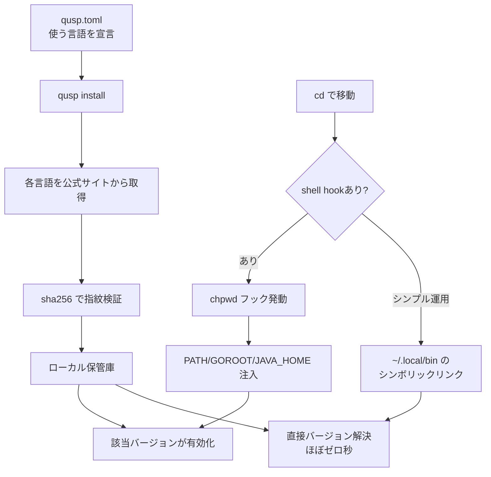

マルチ言語ツールチェインマネージャ。21 言語ネイティブ Rust バックエンド、シングル `qusp.toml` で全部宣言、`qusp.lock` で再現性。

## 何ができる？

21 種類のプログラミング言語を「一つの設定ファイル」でまとめて管理するツールです。あるフォルダに行くと自動的に Go 1.25 と Node 22 と Python 3.13 が使える、別のフォルダに移ると Ruby 3.3 と Java 21 に切り替わる、という具合に、行き先（カレントディレクトリ）に応じて使う言語の組み合わせを自動で切り替えてくれます。タクシーが行き先によって運賃計算アルゴリズムを変えるようなイメージで、場所が決まれば使う言語の組合せも一意に決まる、という発想です。

何が嬉しいかというと、複数言語を行き来するプロジェクトでも「`cd` で移動するだけ」で正しいバージョンが揃い、新しいメンバーも `qusp sync` 一発で全員と同じ環境を手に入れられる点です。

## 用語

- **マルチ言語**: 1 つのソフトで複数言語を扱えること。Go・Ruby・Python・Node・Java など 21 言語に対応。
- **ネイティブ Rust バックエンド**: 各言語の処理を「Rust で直接書いた」ということ。bash スクリプトを呼び出す既存ツールより速くて安全。
- **シンボリックリンク（symlink）**: 「別の場所のファイルを指す近道」。`~/.local/bin/node` を作っておくと `node` と打つだけで本物が動く。
- **shim / シェルフック**: バージョン切り替えの別方式。少し遅い。
- **shell hook**: ターミナルでフォルダ移動するたびに自動実行される仕掛け。`cd` に反応して環境変数を切り替える。
- **chpwd**: zsh などで「カレントディレクトリが変わったとき」に呼ばれるフック関数の名前。
- **マニフェスト（qusp.toml）**: そのプロジェクトで使う言語バージョンとツール群を書き留めるファイル。
- **ロックファイル（qusp.lock）**: 確定済みバージョンを記録し、全員が同じ環境を再現できるようにするファイル。
- **sha256 / sigstore**: ダウンロードしたファイルが本物かを確かめる「指紋」と「電子署名」の仕組み。
- **superposition**: 量子力学の「重ね合わせ」。すべての言語が同時に存在し、`cd` で 1 つに収束する、という比喩。
- **derivation（Nix）**: Nix というツールが使う環境定義の単位。qusp はこの方式を採らない。

## 仕組み



タクシーが「行き先 → 運賃計算」を切り替えるように、qusp は「カレントディレクトリ → 言語の組み合わせ」を切り替えます。3 つの動作モード（シンボリックリンク方式、明示的に `qusp run` する方式、shell フック方式）から好みを選べます。

## Core Idea

> Every language toolchain in superposition. `cd` collapses to one.

すべてのバックエンドが **ネイティブ Rust** — プラグイン bash なし、`rustup` / `nvm` / `pyenv` のサブプロセスにフリーライドしない。

**qusp** = **Qu**ick **S**tart us **P**rogramming。ツールチェインセットアップが「コードを書き始められない理由」になってはいけない。

## Three modes, one tool

### 1. Symlink farm（推奨・日常使い）

`qusp install` + `qusp pin set` で `~/.local/bin/` にシンボリックリンク配置。uv が `python3.13` でやっているのと同じモデル。shim も shell hook もオーバーヘッドもなし。

```bash
$ qusp install node 22.9.0 && qusp pin set node 22.9.0
$ which node
~/.local/bin/node
```

### 2. uv-style（明示的 `qusp run`）

shell には何も触れず、すべて `qusp run` / `quspx` 経由。

### 3. mise-style（オプトイン shell hook）

`chpwd` フックが PATH + GOROOT + JAVA_HOME 等を注入し、ディレクトリ単位でツールチェインを解決。`cd` で抜けると baseline 復帰。

## Languages (21 backends, all native Rust)

| Backend | Source | Verification |
|---|---|---|
| go | go.dev | sha256 |
| ruby | ruby-build | sha256 |
| python | python-build-standalone | sha256 |
| node | nodejs.org | sha256 |
| deno, bun | 公式リリース | sha256 |
| java | Foojay (Temurin/Corretto/Zulu/GraalVM CE) | sha256 |
| rust | static.rust-lang.org | sha256 |
| kotlin, scala, groovy, clojure, zig, julia, crystal, dart | 各公式リリース | sha256 |
| elm | GitHub Release | content-addressed |
| gleam | GitHub Release | sha256 + sigstore |
| lua | source compile | sha256 |
| php | [[php-build-standalone]] | sha256 |
| haskell | GHCup | sha256 |

すべてのインストールで **公開ハッシュを必ず検証** してから展開する。

## Architecture

- `qusp-core` — `Backend` trait、マニフェスト、ロック、オーケストレータ、symlink farm
- `qusp-cli` — argv[0] dispatch (`qusp` vs `quspx`)
- 基盤: [[anyv-core]]（paths, extract, sha 検証, presentation, self-update）
- 直接依存: [[gv]] の `gv-core`（Go）、[[rv]] の `rv-core`（Ruby）— サブプロセスではなく Cargo ライブラリとして

オーケストレータが唯一のファンアウト点。CLI ハンドラは `Orchestrator::{install_toolchains, sync, add_tool, find_tool, build_run_env, route_tool}` に縮約。新言語追加は `crates/qusp-core/src/backends/` に1ファイル + `r.register(...)` 1行。

## How it differs

| | mise / asdf | proto | uv | sdkman | devbox / Nix | qusp |
|---|---|---|---|---|---|---|
| Languages | 100+ via plugins | ~15 | 1 | JVM | unlimited | 21 native |
| Plugin model | bash | Rust | n/a | bash | derivations | none |
| Hash verification | varies | varies | strict | sha256 | derivation | strict, every install |
| Bare commands | shim or shellenv | shim | symlink farm | shellenv | shell-direct | symlink farm |
| Lockfile | partial | partial | yes | no | flake.lock | yes |

**qusp の lane**: mise/asdf より深く（プラグインなし、すべてネイティブ、厳格なハッシュ検証）、uv より広く（Python だけでなく全言語）、Nix より親しみやすい（derivation 言語なし）。Nix の OS-library 再現性を置き換えるものではない。

## Latency

```
qusp run go version          12.0 ms
mise exec go version         12.1 ms
mise shim go version         49.4 ms (default)
~/.local/bin/go (qusp farm)  ~1 ms
```

farm アプローチが最速。直接 symlink で解決ステップなし。

## What qusp is NOT

- パッケージマネージャではない（Maven/npm/PyPI artifact は管理しない）
- 再現可能 OS 環境マネージャではない（Nix/devbox を使う）
- プラグインプラットフォームではない（21 言語の curated 品質が強み）

## Links

- [GitHub](https://github.com/O6lvl4/qusp)
