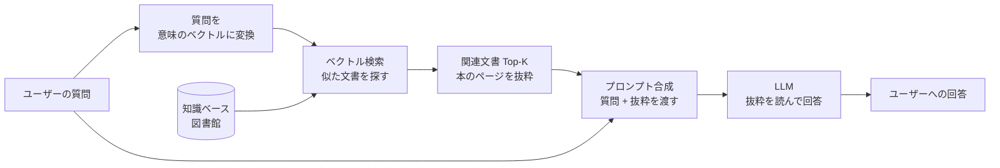

AI に質問するとき、先に資料を検索してきて、その内容を読みながら答えてもらう方式。「知ったかぶり」ではなく「調べてから答える」しくみ。

## 何ができる？／なぜ重要？

普通の AI は、学校で習ったことだけを頼りに答える生徒のようなものです。教科書に載っていない最新の出来事や、社内の独自ルールについて聞かれても、それっぽい嘘を返してしまうことがあります。RAG は AI に「司書」をつける工夫です。質問が来たら、AI 本人が答える前に司書が図書館へ走り、関係しそうな本のページを抜き出してきます。AI はそのページを横に置いた状態で答えるので、最新情報や社内資料に基づいた具体的な答えになります。

なぜ重要かというと、AI を「再学習」させなくても新しい知識を追加できるからです。会社の資料を司書の本棚に並べておけば、AI は学習し直すことなく、その日に追加された資料すら参照して答えられます。誤情報（ハルシネーション）も大幅に減らせます。

## 仕組み

質問は数値の並び（ベクトル）に変換され、似た意味の文書が一瞬で検索されます。AI 本人は「丸暗記」ではなく「机の上の資料を見ながら」答える形になるので、根拠が明確で、情報の差し替えも簡単です。

## 用語

- **LLM**: 大量の文章を学んだ「言葉のしくみを覚えた巨大なモデル」。質問に答えたり文章を書いたりできる。
- **Retrieval（検索）**: 関係しそうな資料を探し出してくる工程。司書が本棚を歩き回るところ。
- **Generation（生成）**: 抜粋を読んで実際の回答文を組み立てる工程。
- **Embedding（埋め込み）**: 文章を「意味のベクトル（数字の並び）」に変換したもの。意味が近い文章は近い場所に配置される。
- **Vector Store（ベクトルストア）**: 埋め込みベクトルを保管しておく専用の本棚。「意味で検索」できる図書館。
- **チャンク (chunk)**: 大きな文書を扱いやすいサイズに切り分けた断片。本のページのような単位。
- **Top-K**: 検索結果の上位 K 件だけを取り出す指定。多すぎると AI の机が散らかる。
- **ハルシネーション**: AI がそれっぽい嘘を自信満々に答えてしまう現象。RAG はこれを抑える。
- **Semantic Search（意味検索）**: 単語の一致ではなく「意味の近さ」で探す検索方式。
- **コンテキスト挿入**: 検索した抜粋を AI への指示文に差し込むこと。

## vault 内での使われ方

- [[memory-rag]] — 軽量な in-memory RAG ライブラリ。外部ベクタ DB 不要、エッジ稼働
- [[whenm]] — 時間軸を持った RAG。「いつの話か」を理解できる時系列メモリ
- [[famulus2]] — コードを「読む」ときに code graph で構造を抜粋して LLM に渡す。広義の RAG
- [[fractop]] — 大きな文書をチャンクに分割して並列処理する。RAG の前段に近い処理
- [[graph-garden]] — 知識をグラフ化する。RAG の知識ベース構築に通じる発想
- [[agentic-coding]] — エージェントがコードを「検索 → 読解 → 修正」するのも RAG 的

## 関連概念

- [[context-window]] — RAG はコンテキストに資料を差し込むので窓のサイズが効く
- [[mcp]] — RAG の「検索ツール」を AI に差し込む共通規格
- [[serialization]] — 文書を保存・送信するための形式

## Links

- [Retrieval-Augmented Generation (Wikipedia)](https://en.wikipedia.org/wiki/Retrieval-augmented_generation)
- [Original RAG paper (Lewis et al., 2020)](https://arxiv.org/abs/2005.11401)
