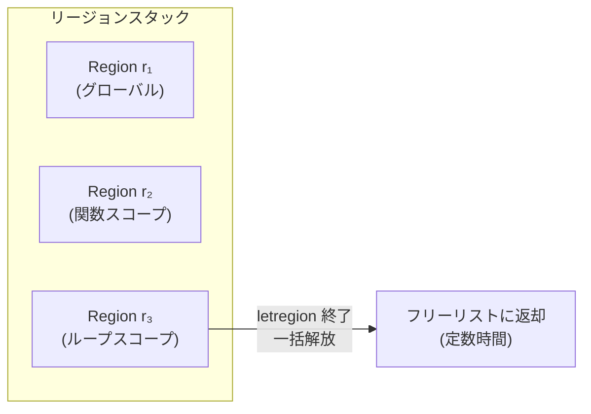

コンパイル時にヒープメモリの割り当てと解放をすべて推論する手法。GC なしで安全なメモリ管理を実現する。Tofte & Talpin (1997) が理論的基盤を確立し、MLKit (Standard ML コンパイラ) で実装された。

## 基本アイデア

ヒープをリージョン (arena) に分割し、リージョン単位で一括定数時間解放する。



- 割り当て: bump-pointer 方式 (ポインタを進めるだけ)
- 解放: リージョン全体を一括解放 (個別オブジェクトの free なし)
- リージョンは LIFO 順序でスタック上に管理される

## Tofte & Talpin (1997) の理論

原論文: "Region-Based Memory Management" (Information and Computation, Vol.132, 1997)。初発表は POPL 1994。

### 型システムの拡張

ラムダ計算を2つの構成子で拡張する:

| 構文 | 意味 |
|---|---|
| `e at ρ` | 式 e の結果をリージョン ρ に格納 |
| `letregion ρ in e end` | リージョンを作成して ρ に束縛、e 評価後に一括解放 |

型にはリージョン注釈が付く: `int at ρ` = 「リージョン ρ に格納された整数値」。

### Region Polymorphism (リージョンの多相性)

関数がリージョンパラメータを取る。呼び出し側が結果の格納先リージョンを選択:

```sml
(* 概念的な region-annotated コード *)
letrec fac [ρ_result] n =
  if n = 0 then 1 at ρ_result
  else n * fac [ρ_result] (n - 1)
```

`fac` はリージョンパラメータ `[ρ_result]` を取る多相関数。リージョン注釈における多相的再帰 (polymorphic recursion) が可能。

### 効果 (Effect) システム

型付け判断は型に加えて効果を関連付ける:

| 効果 | 意味 |
|---|---|
| `put(ρ)` | リージョン ρ への書き込み |
| `get(ρ)` | リージョン ρ からの読み取り |

関数型の矢印に効果が注釈される: `τ₁ →^{φ} τ₂` (φ は効果集合)。効果変数の単一化時に効果は和集合で結合される。

### 型推論アルゴリズム (Tofte & Birkedal, 1998)

2フェーズの制約ベースアルゴリズム:

1. **S アルゴリズム**: 各値生成式にリージョン変数を生成し、`letregion` を挿入
2. **R アルゴリズム**: 再帰関数のリージョン引数における多相的再帰を処理

ML の型推論と同様に単一化を用いるが、効果集合が主単一化子 (principal unifier) に対する問題を提起する。

### 正しさの保証

型安全性の証明により、解放済みリージョン内のオブジェクトへのアクセスが型システムによって静的に不可能となる。

## MLKit コンパイラの実装

### MLKit とは

Standard ML コンパイラ。1989年からエディンバラ大学で Elsman & Tofte が開発。最新: v4.7.21 (2026年1月)。ソース SML にはリージョン注釈が一切不要 (完全自動推論)。

### コンパイルパイプラインでの位置


### Region Inference 後の追加解析

| 解析 | 内容 |
|---|---|
| Multiplicity Inference | 各リージョンへの書き込み回数を推論 (0, 1, ∞) |
| Physical Size Inference | リージョンが有限 (スタック上) か無限 (ページリンクリスト) かを判定 |
| Storage Mode Analysis | 無限リージョンの格納モードを決定: `attop` (追加) / `atbot` (リセット後格納) / `sat` (実行時判定) |

### ランタイム表現

- 有限リージョン: スタック上に直接格納 (64-bit ポインタ)
- 無限リージョン: 800バイト固定サイズのリージョンページのリンクリスト
- リージョンディスクリプタ: 16バイト (先頭/末尾ポインタ)
- `letregion` 開始: フリーリストからページ取得 + ディスクリプタを push
- `letregion` 終了: ページをフリーリストに返却 + ディスクリプタを pop (定数時間)

## Bump Allocator との関係

リージョンは本質的に **bump allocator + スコープ (ライフタイム管理)**:

| 概念 | リージョン | Bump Allocator |
|---|---|---|
| 割り当て | bump-pointer を進める | 同じ |
| 解放 | リージョン一括解放 | 全体リセット |
| `letregion` | スコープ付きの save/restore | bump pointer の save/restore |
| 個別 free | なし | なし |

Hanson (1990) が示したように、bump-pointer 方式は最速の malloc より高速に動作する。

## 制限・既知の問題

### Space Leaks (空間リーク)

純粋なスタックベースリージョン体系では不可避の問題。

| パターン | 説明 |
|---|---|
| LIFO 制約による長寿命化 | 大きなデータ構造と小さな結果が同一リージョンに共存。小さな値だけ必要でもリージョン全体が生存 |
| グローバルリージョンへの退避 | ライフタイムを推論できないデータがプログラム全体の寿命を持つリージョンに配置される |
| リスト全要素の同一リージョン制約 | 同じリストの全要素は同じリージョン。一部が不要でもリスト全体のリージョンが生存 |

### Region Explosion

高階関数や複雑な再帰で推論されるリージョン数が爆発的に増加。

### 対策

| 対策 | 内容 |
|---|---|
| Storage Mode Analysis | `atbot` でリージョンをリセットして再利用 |
| Region Resetting | `resetRegion` で既存データを破棄 |
| Region Profiling | MLKit 付属のプロファイラで空間リーク特定 |
| ハイブリッド GC | リージョン推論 + 参照追跡 GC の併用 (Hallenberg, Elsman & Tofte, PLDI 2002) |

## 関連する研究・言語

### Cyclone (2002, PLDI)

Grossman, Morrisett らによる安全な C 方言。C にリージョンベースメモリ管理を追加。明示的なリージョン注釈が必要 (レガシー C からの移植で約 8% のコード変更)。動的リージョン、ユニークポインタ、参照カウントの統合。

### [[rust|Rust]] のライフタイム

Rust のバロウチェッカはリージョン推論の影響を受けているが、本質的に異なる:

| 観点 | Tofte-Talpin | Rust |
|---|---|---|
| 追跡対象 | 値の配置先 (どのリージョンに格納されるか) | 参照のライフタイム (借用が有効な範囲) |
| スコープ | レキシカル (`letregion`) | 非レキシカル (NLL, 制御フローグラフベース) |
| 安全性保証 | 効果システム (put/get) | 所有権 + 借用規則 |
| 注釈 | 完全自動推論 | 一部プログラマが明示注釈 |

Rust 内部では実際にリージョン変数 (`RegionVid`) を使い、outlives 制約 (`'a: 'b`) を伝播・解決する。

### Linear Regions Are All You Need (Fluet, Morrisett, Ahmed, ESOP 2006)

線形型とリージョンの組み合わせだけで安全なメモリ解放が実現できることを証明。Tofte-Talpin の効果システムの代替として、線形能力 (linear capability) によるリージョン管理を提案。

### Spegion (Hughes, Vollmer, Batty, ECOOP 2025)

暗黙的・非レキシカルなリージョンとサイズ付き割り当て。ソース言語からファーストクラスのリージョン構文を除去し、C 系言語との自然な互換性を実現。効果ベースの型システムで安全性を保証。

## WASM への適用可能性

リージョンベース管理は WASM に本質的に適する:

- GC なし: WASM の基本モデルは線形メモリ + 手動管理
- バイナリサイズ: bump allocator は dlmalloc (~6KB) / emmalloc (~1KB) より小さくできる
- 線形メモリとの親和性: リージョンは連続メモリブロックの管理に自然に対応
- コンパイル時決定: 実行時オーバーヘッド最小

## 押さえどころ（カード化候補）

- Region Inference の基本アイデア → ヒープをリージョン (arena) に分割し、リージョン単位で一括定数時間解放。割り当ては bump-pointer、解放は全体リセット。GC なしで安全なメモリ管理を実現
- letregion の意味 → `letregion ρ in e end`: リージョンを作成して ρ に束縛、e を評価した後に一括解放。リージョンのスコープと自動解放を型レベルで表現
- Region Polymorphism → 関数がリージョンパラメータを取り、呼び出し側が結果の格納先リージョンを選択。同一関数を異なるリージョンに対して多相的に使える
- 効果システム (put/get) → put(ρ): リージョン ρ への書き込み。get(ρ): リージョン ρ からの読み取り。関数型の矢印に効果を注釈し、型安全性 (解放済みリージョンへのアクセス排除) を静的に保証
- リージョン = bump allocator + スコープ → letregion ≈ bump pointer の save/restore。割り当ては bump-pointer を進めるだけ、解放はリージョン全体のリセット。Hanson (1990) が malloc より高速であることを実証
- MLKit の追加解析パス → Region Inference の後に Multiplicity Inference (書き込み回数 0/1/∞)、Physical Size Inference (有限/無限)、Storage Mode Analysis (attop/atbot/sat) が続く
- Storage Mode Analysis → attop: リージョンに追加 (既存データ保持)。atbot: リセット後に格納 (既存データ破棄)。sat: 実行時に判定。空間リーク対策の核心的な最適化
- Space Leaks が不可避な理由 → LIFO 制約で大きなデータ構造と小さな結果が同一リージョンに共存。小さな値だけ必要でもリージョン全体が生存。リスト全要素が同一リージョンに配置される
- ハイブリッド GC の必要性 → リージョン推論だけでは回収できないメモリを参照追跡 GC で回収。Hallenberg, Elsman & Tofte (PLDI 2002) で実証。実用的なリージョンベースシステムでは事実上必須
- Tofte-Talpin vs Rust ライフタイム → Tofte-Talpin: 値の配置先を推論、レキシカルスコープ、効果システム、完全自動推論。Rust: 参照のライフタイムを追跡、非レキシカル (NLL)、所有権 + 借用規則、一部明示注釈
- Cyclone のアプローチ → C にリージョンベースメモリ管理を追加した安全な方言。明示的リージョン注釈が必要。レガシー C から約 8% のコード変更で移植可能
- Linear Regions Are All You Need → 線形型 + リージョンだけで安全なメモリ解放を実現。Tofte-Talpin の効果システムの代替として線形能力によるリージョン管理を提案。Fluet, Morrisett, Ahmed (ESOP 2006)
- Spegion (ECOOP 2025) → 暗黙的・非レキシカルなリージョン。ソース言語からリージョン構文を除去し、C 系言語との自然な互換性を実現。最新の Region Inference 研究
- Region Inference の型推論アルゴリズム → 2フェーズの制約ベース。S アルゴリズム (リージョン変数生成 + letregion 挿入) + R アルゴリズム (再帰関数の多相的リージョン引数)。ML 型推論の拡張
- WASM への適用可能性 → GC なしの線形メモリモデルにリージョンが自然に対応。bump allocator は dlmalloc/emmalloc より小さいバイナリ。コンパイル時決定で実行時オーバーヘッド最小
- MLKit のパフォーマンス特性 → GC 比で「10倍速いものから4倍遅いものまで」プログラム依存で大きく変動。万能ではなく、プログラムの割り当てパターンに強く依存する

## Links

- [Tofte & Talpin (1997) - Region-Based Memory Management](http://ropas.snu.ac.kr/lib/dock/ToTa1997.pdf)
- [Tofte & Birkedal (1998) - A Region Inference Algorithm](https://elsman.com/mlkit/pdf/toplas98.pdf)
- [MLKit (GitHub)](https://github.com/melsman/mlkit)
- [MLKit Papers](https://elsman.com/mlkit/papers)
- [Programming with Regions in the MLKit](https://elsman.com/pdf/mlkit-4.7.16.pdf)
- [Cyclone - Region-Based Memory Management](https://www.cs.umd.edu/projects/cyclone/papers/cyclone-regions.pdf)
- [Linear Regions Are All You Need (Fluet et al., 2006)](https://www.ccs.neu.edu/home/amal/papers/linrgn.pdf)

## 関連

- [[copy-on-write]] — リージョンの CoW メモリイメージ最適化
- [[rust]] — Rust のライフタイムは Region Inference の影響を受けた設計
- [[wasm-at-the-edge]] — GC なしの WASM 環境にリージョンベース管理が適する
- [[dead-code-elimination]] — WASM バイナリサイズ最適化。リージョンベース allocator は小さいバイナリ
