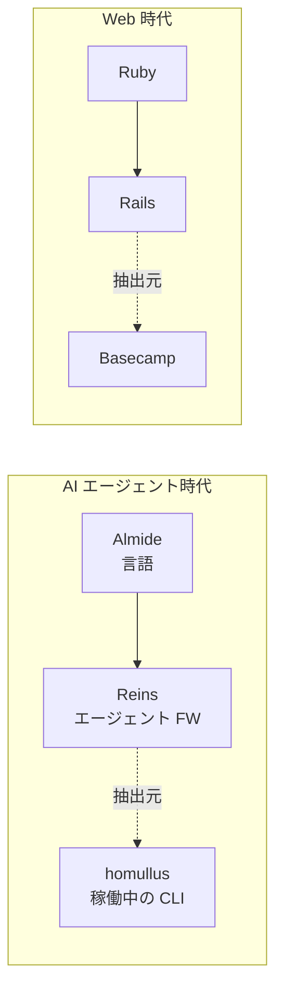

> **[仮版・planning]** Reins はまだ実装されていない。本ドキュメントは Almide の上に乗る AI エージェントフレームワーク Reins の構想と、抽出元プロダクト homullus からの分離計画を記述する planning ノート。コードはまだ存在しない。名前・モジュール境界・分割タイミングは大きく変更されうる。

Almide を言語基盤とする AI エージェントフレームワーク。**homullus（almide/homullus）から抽出される予定** の、エージェントループ・ツール定義・パーミッション・メッセージ往復・テストハーネスを束ねたランタイム。野心としては **AI エージェントフレームワークとして Mastra を超える水準** を目指し、homullus を Basecamp 級のショーケース・プロダクトに育てた上で、そこから Reins を抽出する。

## 構造的アナロジー

Reins の存在意義は次の二段の同型から来る。

Ruby が Web フレームワーク Rails のランタイムであり、Rails が Basecamp から抽出されたように、Almide はエージェントフレームワーク Reins のランタイムであり、Reins は homullus から抽出される。**設計から始めず、動いている現場から抽出する** のが Rails が成立した条件で、Reins もこの条件を踏襲する。

## なぜ "Reins"

Rails が線路で列車を決定的に導く語であるのに対し、Reins（手綱）は連続的に方向を与え続ける語。この差は **ルールベースのプログラムを動かす基盤（Rails）と、LLM エージェントを動かす基盤（Reins）の差** にそのまま対応する。Trains run on rails. Agents run on reins.

代替候補は Cadence / Loom / Helm。最終決定は Reins v0 の切り出しが具体化する段階で再検討する。

## 抽出元 — homullus の現状

homullus v0.0.1（2026-05-01 時点で end-to-end 動作確認済み）:

- Almide で書かれた AI エージェント CLI runtime
- almai 経由で multi-provider（Anthropic / OpenAI / OpenRouter / Groq / Cloudflare / Azure / Google / Bedrock / Claude CLI）
- 組み込みツール: Bash / Read / Write / Edit / Glob / Grep
- 3 つのパーミッションモード: default / accept-edits / bypass
- ネイティブな tool roundtrip（`assistant.tool_calls` ↔ `role:"tool"` with `tool_call_id`）
- スクリプト化された provider 注入によるテスト
- 24 件の integration assertion
- 4 ラウンドの dogfooding（うち 2 ラウンドは homullus が自分自身のソースを LLM 経由で編集）

つまり Reins の素地はすでに揃っている。homullus は Claude Code と構造的に同じ shape を Almide 上で実装した実例。詳細は [`almide/homullus` README](https://github.com/almide/homullus) 参照。

## 抽出ライン（Reins へ移すもの ↔ homullus に残すもの）

### Reins へ抽出する候補

| モジュール候補 | 内容 | homullus 内の現状 |
|---|---|---|
| `reins.agent` | single-turn query + tool loop の汎用化 | `src/agent.almd` |
| `reins.tool` | ツール定義 protocol（schema / dispatch / name）| `src/tools.almd` の構造部分 |
| `reins.permission` | 3-mode resolver + 危険パターン検出 | `src/permission.almd` |
| `reins.repl` | recursive REPL + slash command framework | `src/main.almd` の骨格 |
| `reins.test` | scripted-provider 統合テストハーネス | `src/agent_check.almd` の手法 |
| `reins.message` | `LLMResponse` / `ToolCall` / `Message` 型と roundtrip | 現在は homullus 内 ad-hoc |

### homullus に残すもの

- 6 ツールの具体実装（Bash / Read / Write / Edit / Glob / Grep の本体）
- 各 slash command の実装（`/model` `/tools` `/trust` `/clear` `/help` `/version` 等）
- CLI バイナリの起動経路
- streaming UI / token counter 表示
- CLAUDE.md / git status auto-injection（v0.1+ 計画）

つまり Reins は **「エージェントを書くための語彙」**、homullus は **「その語彙で書かれた具体的な agent CLI」** という関係に再構成する。

## ポジショニング — Mastra を超える水準を目指す

Reins が比較対象として意識すべきは **Mastra**（TypeScript ベースの AI エージェントフレームワーク、2024〜）。Mastra は agent / workflow / memory / RAG / eval / telemetry を一体化したフルスタック agent framework として現時点でリードしている。Reins は同等のスコープをカバーした上で、**Almide という基盤からしか出せない性質** で差別化する。

| 軸 | Mastra | Reins（目標） |
|---|---|---|
| 基盤言語 | TypeScript（Node 中心）| Almide（Rust 出力 / WASM 直接 emit）|
| ツール定義の失敗モデル | ランタイム検証（Zod 等）| **`effect fn` で型システムが保証**（コンパイル時）|
| 配布ターゲット | Node / serverless | ネイティブバイナリ + WASM（ブラウザ・エッジ・組込）|
| 実行時依存 | Node ランタイム + 多数の npm 依存 | **GC なし・ランタイムなし・単一バイナリ** |
| エージェントコードの修正生存性 | TS の型はあるが MSR 概念は存在しない | **MSR を一次指標として設計**（LLM が修正しても動く）|
| 規約密度 | TS の表現多様性をそのまま受け継ぐ | **One Canonical Form**（[[the-almide-doctrine]] 第 4 原則）でコーパスが一貫 |
| トークン経済性 | TS ボイラープレート分の context 消費 | 構文ノイズが少なく、agent 定義が小さい context に収まる |

Reins が Mastra を「超える」というのは機能網羅で勝つことだけを意味しない。**「エージェントのコード自体を、AI が連続的に修正しても壊れない」という性質** を Mastra が原理的に提供できない領域として確保すること。これは TS 上では原理的に難しく、Almide 基盤だからこそ提供できる差別化軸。

homullus はこの差別化軸を **動くプロダクトとして実証する Basecamp** であり、Reins はその実証から抽出される再利用可能な語彙。両者がそれぞれ「Basecamp 級」「Rails 級」に達して初めて、Almide エコシステムは Mastra に対して構造的優位を持てる。

## 抽出のタイミングと条件

**抽出を急がない理由**:

- 抽出が早すぎると、抽象が一つの現場の都合に縛られる（Rails が Basecamp 一つから抽出された時の限界も同じ構造で起きた）
- 第二の現場で初めて「これは agent 一般の抽象か、それともこのプロダクト特有の便利関数か」が判定できる

**抽出のための前提条件**:

1. homullus が daily driver として実用に耐えている（達成済み、dogfooding 4 回成功）
2. 第二の現場が見えている（Reins v0 を再利用する別エージェントの企画があること）
3. almide 本体の package system が cross-package codegen を完全サポートしている（PRs #231–#235 で進捗中）

3 が揃った段階で、第二の現場の企画が立てば抽出に着手するのが適切なタイミング。

## 第二の現場候補

| 候補 | フィット度 | 留意点 |
|---|---|---|
| Vibe Coder の daily 自動化エージェント（GitHub triage / CI watcher / calendar）| 高 | homullus と同じ「ツール呼び出し中心」型なので抽象の検証になりにくい可能性 |
| 別 domain-specific agent（research agent / 文章校正 agent）| 中 | homullus と異なる loop 形状（無限ループではなく単発タスク）が抽象を強制的に一般化する |
| almide-aituber（既存）| 中 | 永続ループ + persona の特殊性があり、抽出フィルタとしては癖が強い。逆にそれが抽象を鍛える可能性もある |

第二の現場は **homullus と loop 形状が異なるもの** を選ぶのが、抽象の一般性を確かめる上で筋が良い。

## 4 ステップ計画

1. **homullus audit** — 上記の抽出候補テーブルを実コードに当てて、各モジュール候補が独立に切り出せる粒度になっているか確認
2. **Reins v0 切り出し** — `reins` パッケージとして分離。homullus 側は `import reins` で書き直す（Rails が Basecamp から抜けたのと同じ動き）
3. **第二の現場で検証** — 別用途で v0 を再利用、抽象が筋良かったか検証、必要なら作り直す
4. **Reins Doctrine（仮）** — 抽出が落ち着いた段階で、Almide Doctrine の派生として 9 原則を仮版化

## 押さえどころ（カード化候補）

- Reins の抽出元 → **homullus（almide/homullus、v0.0.1 で稼働中の AI agent CLI runtime）**
- Almide:Reins の構造的アナロジー → **Ruby:Rails と同型。言語の上に乗るドメイン特化フレームワーク + 起源プロダクトからの抽出**
- "Reins" の語源 → **手綱。Rails（線路）が決定的な軌道で導くのに対し、Reins は連続的に方向を与える。ルールベース → LLM ベースの転換に対応**
- 抽出を急がない理由 → **Rails が Basecamp 一つから抽出された限界と同じ構造を避ける。第二の現場で抽象の一般性を確かめてから分離する**
- Reins の主要モジュール候補（6 つ）→ **agent / tool / permission / repl / test / message**
- 第二の現場の選び方 → **homullus と loop 形状が異なるもの（単発タスク型 / persona 永続ループ型）を選ぶと抽象が鍛えられる**
- Reins が Mastra を「超える」軸 → **機能網羅ではなく、エージェントコード自体の MSR（修正生存性）。TS では原理的に難しく、Almide 基盤だからこそ提供できる差別化軸**

## Links

- [almide/homullus（抽出元プロダクト）](https://github.com/almide/homullus)
- [almide/homullus dogfooding 2026-05-01](https://github.com/almide/homullus/blob/main/docs/dogfooding-2026-05-01.md)
- [almai（homullus が依存する multi-provider LLM client）](https://github.com/almide/almai)
- [Aid-On/famulus（homullus の TypeScript 前駆体・対応物）](https://github.com/Aid-On/famulus)
- [Almide 公式](https://almide.github.io/)
