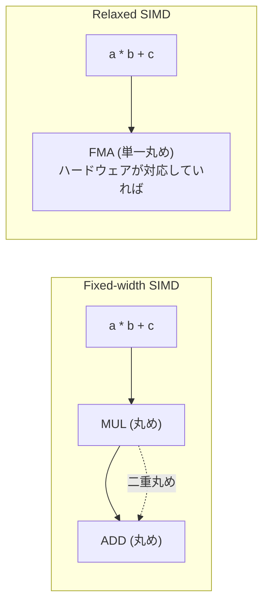

[[wasm-simd|WebAssembly SIMD]] の厳密な決定性要件を緩和し、ハードウェア固有の高速命令を活用可能にする拡張提案。2024年7月に Phase 4 (Finished Proposal) に到達。WebAssembly 3.0 仕様の一部。

## 動機: なぜ「緩和」が必要か

Fixed-width SIMD は全プラットフォームでビット一致する結果を保証する。しかしこの決定性のために、ハードウェアが1命令で実行できる操作を複数命令でエミュレーションする必要がある場面がある:



FMA (Fused Multiply-Add) の例: ハードウェア FMA は乗算と加算を1回の丸めで実行するため、二重丸めより精度が高く高速。しかし結果が異なるため Fixed-width SIMD では使えなかった。

## 非決定性の扱い

設計原則: 「各ランタイム環境は各演算子に対してグローバルに固定された射影を選択する」

- 同一ランタイム内では同じ入力に対して常に同じ結果
- 異なるランタイム (Chrome vs Firefox) 間では結果が異なりうる
- ビット再現性が必要なら Fixed-width SIMD の命令を使う

## 追加命令

### FMA (Fused Multiply-Add)

| 命令 | 演算 |
|---|---|
| `f32x4.relaxed_madd(a, b, c)` | a * b + c |
| `f32x4.relaxed_nmadd(a, b, c)` | -(a * b) + c |
| `f64x2.relaxed_madd(a, b, c)` | a * b + c |
| `f64x2.relaxed_nmadd(a, b, c)` | -(a * b) + c |

非決定性: 二重丸め or 単一丸め (ハードウェア FMA)。ML推論、物理シミュレーション、信号処理で特に有用。

### Integer Dot Product

| 命令 | 説明 |
|---|---|
| `i16x8.relaxed_dot_i8x16_i7x16_s` | INT8 ペアワイズ乗算 → INT16 加算 |
| `i32x4.relaxed_dot_i8x16_i7x16_add_s` | 上記 + INT32 アキュムレータ加算 |

ML推論 (INT8 量子化モデル) の行列演算で特に有用。x86 の `VPDPBUSD` (VNNI) に直接マッピング可能。

### Relaxed Swizzle

| 命令 | 説明 |
|---|---|
| `i8x16.relaxed_swizzle(a, s)` | 範囲外インデックスの結果が実装定義 (0 or モジュロラップ) |

Fixed-width の `i8x16.swizzle` は範囲外=0 を保証するために追加命令が必要な場合がある。relaxed 版はハードウェア命令をそのまま使える。

### Relaxed Float-to-Int

| 命令 | 説明 |
|---|---|
| `i32x4.relaxed_trunc_f32x4_s/u` | NaN 入力で 0 or INT32_MAX/UINT32_MAX (実装定義) |
| `i32x4.relaxed_trunc_f64x2_s/u_zero` | 同上 (f64 版) |

Fixed-width 版は NaN 入力で必ず 0 を返すことを保証するが、そのチェックにコストがかかる。

### Relaxed Lane Select

| 命令 | 説明 |
|---|---|
| `i8x16/i16x8/i32x4/i64x2.relaxed_laneselect(a, b, m)` | マスクビット混在時の挙動が実装定義 |

x86 の `PBLENDVB` (バイト単位) と ARM の `BSL` (ビット単位) のセマンティクス差を吸収。

### Relaxed Min/Max

| 命令 | 説明 |
|---|---|
| `f32x4.relaxed_min/max` | NaN 入力時や -0 vs +0 でどちらを返すか実装定義 |
| `f64x2.relaxed_min/max` | 同上 |

Fixed-width の `min/max` (NaN 伝播) は x86 で 7-10 命令かかるが、relaxed 版は 1 命令で済む。

### Relaxed Q15 乗算

| 命令 | 説明 |
|---|---|
| `i16x8.relaxed_q15mulr_s` | 両入力が INT16_MIN の場合のオーバーフロー処理が実装定義 |

## ブラウザ対応状況

| ブラウザ | 状況 |
|---|---|
| Chrome | 出荷済 (デフォルト有効) |
| Edge | 出荷済 (Chromium 追従) |
| Firefox | 145 でデフォルト有効化 (2025) |
| Safari | フラグ付きで利用可能 |

## 言語での使い方

### Rust

```rust
use std::arch::wasm32::*;

#[target_feature(enable = "simd128,relaxed-simd")]
pub unsafe fn fused_multiply_add(
    a: &[f32; 4], b: &[f32; 4], c: &[f32; 4]
) -> [f32; 4] {
    let va = v128_load(a.as_ptr() as *const v128);
    let vb = v128_load(b.as_ptr() as *const v128);
    let vc = v128_load(c.as_ptr() as *const v128);
    let result = f32x4_relaxed_madd(va, vb, vc);
    let mut out = [0.0f32; 4];
    v128_store(out.as_mut_ptr() as *mut v128, result);
    out
}
```

### C/C++ (Emscripten)

```c
#include <wasm_simd128.h>
// emcc -msimd128 -mrelaxed-simd -O2

v128_t fma(v128_t a, v128_t b, v128_t c) {
    return wasm_f32x4_relaxed_madd(a, b, c);
}
```

プリプロセッサ検出: `#ifdef __wasm_relaxed_simd__`

## 押さえどころ（カード化候補）

- Relaxed SIMD の動機 → Fixed-width SIMD はビット一致を保証するが、そのためにハードウェア FMA 等の高速命令を使えない。決定性を緩和することで 1命令実行を可能にする
- 非決定性の保証 → 同一ランタイム内では同じ入力に同じ結果。異なるランタイム間では結果が異なりうる。ビット再現性が必要なら Fixed-width を使う
- FMA の二重丸め vs 単一丸め → Fixed-width は MUL → ADD で二重丸め。Relaxed はハードウェア FMA 対応なら単一丸め (高精度)。ML推論等で有用
- INT8 Dot Product の用途 → ML推論の INT8 量子化モデルの行列演算。x86 VNNI 命令に直接マッピング
- relaxed_min/max vs min/max → Fixed-width の min/max は NaN 伝播保証のため x86 で 7-10 命令。relaxed 版は NaN 時の挙動を実装定義にして 1 命令に
- Relaxed SIMD の現状 → Phase 4 完了 (2024-07)。Chrome/Edge は出荷済、Firefox は 145 でデフォルト有効。Safari はフラグ付き

## Links

- [WebAssembly/relaxed-simd (GitHub)](https://github.com/WebAssembly/relaxed-simd)
- [Relaxed SIMD Overview](https://github.com/WebAssembly/relaxed-simd/blob/main/proposals/relaxed-simd/Overview.md)

## 関連

- [[wasm-simd]] — Relaxed SIMD のベースとなる 128-bit Fixed-width SIMD 仕様
